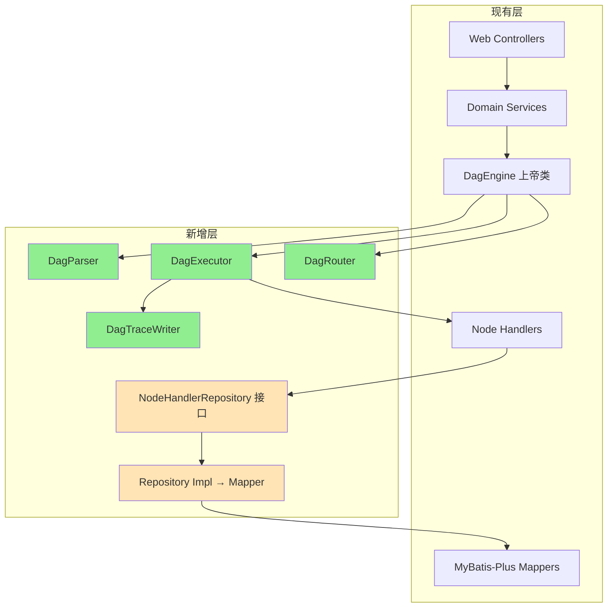

# Marketing Canvas 棕地架构增强文档

## Introduction

本文档基于对 Marketing Canvas (营销画布) 现有代码库的深度分析，提供架构增强的系统性蓝图。项目是一个基于 DAG 的可视化营销活动执行引擎，包含 Java 21 后端和 React 18 前端。

**与现有架构的关系：**
本文档补充现有项目架构，定义新组件如何与现有系统集成。当新旧模式冲突时，本文档提供一致性指导。

### Existing Project Analysis

**Current Project State:**

- **Primary Purpose:** 可视化拖拽式 DAG 营销活动执行引擎 — 支持事件/MQ/定时/行为等多种触发，65+ 节点类型，4车道隔离执行
- **Current Tech Stack:** Java 21 + Spring Boot 3.2.5 (WebFlux) + MyBatis-Plus 3.5.7 + React 18 + @xyflow/react
- **Architecture Style:** 单体应用 + 插件式 NodeHandler + LMAX Disruptor 事件分发 + L1(Caffeine)+L2(Redis) 分层缓存
- **Deployment Method:** Docker Compose 本地开发，无正式 CI/CD 流水线

**Available Documentation:**

- CLAUDE.md — 构建命令、架构概述、已知陷阱
- docs/optimization/ — 营销平台能力缺项分析(148项)、架构深度审查(15个技术选型问题)、技术选型白皮书
- 89 个 Flyway 迁移文件隐含了完整的数据库演进历史

**Identified Constraints:**

- WebFlux (非阻塞) + MyBatis-Plus (阻塞) 互锁：需 `Schedulers.boundedElastic()` 桥接
- 65+ NodeHandler 直接注入 Mapper：引擎层与持久化层耦合
- 7 处 @Lazy 循环依赖：DagEngine ↔ CanvasExecutionService 等
- DagEngine 1540行 + CanvasExecutionService 1407行：双上帝类
- 前端 canvas-editor 2085行：单体组件，20+ useState
- 无正式 PRD、架构文档、CI/CD 流水线

### Change Log

| Change | Date | Version | Description | Author |
| ------ | ---- | ------- | ----------- | ------ |
| Initial | 2026-05-31 | 1.0 | 基于 architect-checklist 综合验证报告 | BMad Master |

---

## Enhancement Scope and Integration Strategy

### Enhancement Overview

**Enhancement Type:** 棕地架构重构 + 安全加固 + 可观测性增强
**Scope:** 后端架构分层修正、前端组件拆分、安全漏洞修复、DevOps 基础建设
**Integration Impact:** 高 — 涉及核心引擎层重构，需增量迁移策略

### Integration Approach

**Code Integration Strategy:** 增量重构 — 新代码遵循新分层规范，旧代码通过适配层渐进迁移
**Database Integration:** 仅增量变更，不修改现有迁移文件
**API Integration:** 现有 API 契约不变，内部实现重构
**UI Integration:** 前端组件拆分不影响用户可见行为

### Compatibility Requirements

- **Existing API Compatibility:** 所有 REST 端点签名不变
- **Database Schema Compatibility:** 仅通过新 Flyway 迁移增量修改
- **UI/UX Consistency:** 用户交互流程不变
- **Performance Impact:** 重构期间性能不低于当前水平

---

## Tech Stack Alignment

### Existing Technology Stack

| Category | Current Technology | Version | Usage in Enhancement | Notes |
|:---------|:-------------------|:--------|:---------------------|:------|
| **Language (Backend)** | Java | 21 | 保持 | 虚拟线程 + record pattern |
| **Language (Frontend)** | TypeScript | ^5.4.5 | 保持 | strict mode |
| **Framework (Backend)** | Spring Boot (WebFlux) | 3.2.5 | 评估迁移至 Spring MVC | WebFlux+MyBatis-Plus 互锁是核心矛盾 |
| **Framework (Frontend)** | React | ^18.3.1 | 保持 | |
| **ORM** | MyBatis-Plus | 3.5.7 | 保持，引入 Repository 抽象 | |
| **UI Library** | Ant Design | ^5.17.0 | 保持 | |
| **DAG Editor** | @xyflow/react | ^12.3.6 | 保持 | |
| **Database** | MySQL | 8.0 | 保持 | |
| **Cache** | Caffeine + Redis | - | 保持 | canvas-cache-sdk 已完善 |
| **Messaging** | RocketMQ | 2.3.1-alibaba | 保持 | |
| **High-throughput** | LMAX Disruptor | 3.4.4 | 评估移除 | 与 WebFlux 事件循环冲突 |
| **Migration** | Flyway | (managed) | 保持 | 89个迁移文件 |
| **Metrics** | Micrometer + Prometheus | (managed) | 增强：添加分布式追踪 | |
| **Auth** | JWT (jjwt) | 0.12.6 | 保持 | |

### New Technology Additions

| Technology | Version | Purpose | Rationale | Integration Method |
|:-----------|:--------|:--------|:----------|:-------------------|
| Micrometer Tracing + Zipkin/Jaeger | 1.x | 分布式链路追踪 | 当前无链路关联，生产故障排查困难 | Spring Boot starter 自动配置 |
| Jasypt 或 HashiCorp Vault | - | 敏感配置加密 | data_source_config.password 明文存储 | Spring 环境变量后处理器 |
| Zustand | ^5.x | 前端状态管理 | canvas-editor 20+ useState 管理困难 | npm install + store 模式 |
| React Error Boundary | - | 前端错误边界 | 当前零 ErrorBoundary，渲染错误白屏 | 自定义组件 |

---

## Data Models and Schema Changes

### New Data Models

### ExecutionSpan (分布式追踪)

**Purpose:** 存储分布式追踪 span 数据，关联执行链路
**Integration:** 与 canvas_execution 通过 execution_id 关联

**Key Attributes:**

- trace_id: VARCHAR(32) — 全局追踪ID
- span_id: VARCHAR(16) — 当前 span ID
- parent_span_id: VARCHAR(16) — 父 span ID
- execution_id: VARCHAR(36) — 关联画布执行ID
- node_id: VARCHAR(64) — 关联节点ID
- operation_name: VARCHAR(128) — 操作名 (handler type key)
- start_time_ms: BIGINT — 开始时间
- duration_ms: INT — 持续时间
- status_code: SMALLINT — 状态码
- tags: JSON — 自定义标签

**Relationships:**

- **With Existing:** canvas_execution.id = execution_span.execution_id (N:1)
- **With New:** 无

### DataSourceCredential (加密凭证)

**Purpose:** 替代 data_source_config 中的明文密码
**Integration:** data_source_config.password 字段迁移为加密引用

**Key Attributes:**

- id: BIGINT AUTO_INCREMENT
- data_source_id: BIGINT — 关联 data_source_config.id
- encrypted_username: TEXT — Jasypt/Vault 加密后的用户名
- encrypted_password: TEXT — Jasypt/Vault 加密后的密码
- encryption_type: VARCHAR(32) — 加密类型 (JASYPT/VAULT)
- created_at: DATETIME
- updated_at: DATETIME

**Relationships:**

- **With Existing:** data_source_config.id = data_source_credential.data_source_id (1:1)
- **With New:** 无

### Schema Integration Strategy

**Database Changes Required:**

- **New Tables:** execution_span, data_source_credential
- **Modified Tables:** data_source_config (password 字段标记 deprecated)
- **New Indexes:** execution_span (trace_id, execution_id), data_source_credential (data_source_id)
- **Migration Strategy:** 增量 Flyway 迁移 (V91+)，data_source_config.password 保留但标记为 deprecated，现有数据批量加密迁移

**Backward Compatibility:**

- data_source_config.password 列保留但不再写入新记录
- 读取优先从 data_source_credential 解密，fallback 到明文列（过渡期）
- 过渡期结束后通过后续迁移删除明文列

---

## Component Architecture

### New Components

### NodeHandlerRepository (节点处理器仓储层)

**Responsibility:** 抽象 NodeHandler 的持久化操作，消除 Handler 对 Mapper 的直接依赖
**Integration Points:** 所有 14 个直接注入 Mapper 的 Handler

**Key Interfaces:**

```java
public interface NodeExecutionRepository {
    Mono<Void> saveTrace(CanvasExecutionTraceDO trace);
    Mono<Void> saveDlq(CanvasExecutionDlqDO dlq);
    Mono<CanvasExecutionDlqDO> findDlqById(Long id);
}

public interface NodeBusinessRepository {
    Mono<Void> createTask(CreateTaskDO task);
    Mono<Void> trackEvent(TrackEventDO event);
    Mono<Void> updateProfile(UpdateProfileDO profile);
    Mono<Void> recordPoints(PointsOperationDO operation);
    Mono<Void> recordTagOperation(TagOperationDO operation);
}
```

**Dependencies:**

- **Existing Components:** MyBatis-Plus Mapper (实现层)
- **New Components:** NodeHandler (仅依赖接口)

**Technology Stack:** Spring WebFlux + MyBatis-Plus (实现层自动包装 boundedElastic)

### DagEngineDecomposer (DAG引擎拆分方案)

**Responsibility:** 将 DagEngine 1540行拆分为 4 个职责单一的组件
**Integration Points:** DagEngine 现有所有调用方

**拆分方案：**

| 组件 | 职责 | 预估行数 |
|------|------|----------|
| DagParser | 图解析、拓扑排序、可达性分析 | ~200 |
| DagExecutor | 节点执行6阶段流水线、Handler调度 | ~400 |
| DagRouter | 下游触发、优先级路由、分支跳过标记 | ~350 |
| DagTraceWriter | 执行追踪写入、DLQ写入、批量缓冲 | ~200 |

**Dependencies:**

- **Existing Components:** HandlerRegistry, ExecutionContext, NodeGate
- **New Components:** 上述4组件互相依赖通过接口

**Technology Stack:** Spring WebFlux + 虚拟线程

### CanvasEditorStore (前端画布编辑器状态管理)

**Responsibility:** 替代 canvas-editor 中的 20+ useState/useRef，提供统一状态管理
**Integration Points:** canvas-editor/index.tsx 的所有状态操作

**Key Interfaces:**

```typescript
interface CanvasEditorStore {
  // Graph state
  nodes: CanvasNode[];
  edges: Edge[];
  selectedNodeId: string | null;

  // Save state
  isDirty: boolean;
  isSaving: boolean;
  editVersion: number;

  // Actions
  addNode: (type: string, position: XYPosition) => void;
  deleteNode: (id: string) => void;
  updateNodeConfig: (id: string, config: Record<string, unknown>) => void;
  save: () => Promise<void>;
  undo: () => void;
  redo: () => void;
}
```

**Dependencies:**

- **Existing Components:** @xyflow/react (useNodesState/useEdgesState)
- **New Components:** Zustand store

**Technology Stack:** Zustand + Immer (不可变状态更新)

### ErrorBoundaryShell (前端错误边界)

**Responsibility:** 全局 + 局部错误边界，防止渲染错误白屏
**Integration Points:** App.tsx 路由层 + CanvasEditor 组件层

**Key Interfaces:**

- GlobalErrorBoundary — 包裹路由出口，捕获未预期错误
- CanvasEditorErrorBoundary — 包裹画布编辑器，捕获编辑器特定错误并提供重置

**Dependencies:**

- **Existing Components:** React.lazy Suspense fallback
- **New Components:** 无

**Technology Stack:** React Error Boundary (原生 API)

### Component Interaction Diagram



---

## API Design and Integration

### New API Endpoints

本次重构不新增外部 API 端点。所有变更限于内部架构重组。

**API Integration Strategy:** 内部重构，API 契约不变
**Authentication:** 保持现有 JWT + RBAC
**Versioning:** 无需版本变更

---

## External API Integration

无新增外部 API 集成。

---

## Source Tree Integration

### Existing Project Structure (Backend)

```plaintext
backend/canvas-engine/src/main/java/org/chovy/canvas/
├── auth/                    # 认证
├── common/                  # 通用枚举、工具
├── config/                  # Spring 配置
├── dal/                     # 数据访问层 (Mapper + DO)
│   ├── dataobject/
│   └── mapper/
├── domain/                  # 领域服务
├── dto/                     # 数据传输对象
├── engine/                  # 核心引擎
│   ├── audience/
│   ├── context/
│   ├── dag/
│   ├── delivery/
│   ├── disruptor/
│   ├── handler/             # Handler 接口 + 注册表
│   ├── handlers/            # 65+ Handler 实现
│   ├── lane/
│   ├── policy/
│   ├── request/
│   ├── rule/
│   ├── schedule/
│   ├── scheduler/           # DagEngine (1540行)
│   ├── trigger/
│   └── wait/
├── infrastructure/          # 基基础设施
├── perf/
├── query/
├── service/
└── web/                     # REST 控制器
```

### New File Organization

```plaintext
backend/canvas-engine/src/main/java/org/chovy/canvas/
├── engine/
│   ├── handler/
│   │   ├── NodeHandler.java          # 现有
│   │   ├── HandlerRegistry.java      # 现有
│   │   └── repository/               # 【新增】Handler 仓储抽象
│   │       ├── NodeExecutionRepository.java
│   │       ├── NodeBusinessRepository.java
│   │       └── impl/
│   │           ├── NodeExecutionRepositoryImpl.java
│   │           └── NodeBusinessRepositoryImpl.java
│   ├── scheduler/
│   │   ├── DagEngine.java            # 现有，逐步瘦身
│   │   ├── DagParser.java            # 现有，增强
│   │   ├── DagExecutor.java          # 【新增】从 DagEngine 抽取
│   │   ├── DagRouter.java            # 【新增】从 DagEngine 抽取
│   │   └── DagTraceWriter.java       # 【新增】从 DagEngine 抽取
│   └── tracing/                      # 【新增】分布式追踪
│       ├── EngineTracingConfig.java
│       └── TraceContext.java
├── config/
│   └── TracingConfig.java            # 【新增】Micrometer Tracing 配置
└── dal/
    └── mapper/
        └── ExecutionSpanMapper.java  # 【新增】追踪数据持久化
```

### Frontend New File Organization

```plaintext
frontend/src/
├── components/
│   ├── canvas/
│   │   └── ...                        # 现有
│   ├── error-boundaries/              # 【新增】
│   │   ├── GlobalErrorBoundary.tsx
│   │   └── CanvasEditorErrorBoundary.tsx
│   └── config-panel/
│       └── ...                        # 现有
├── stores/                            # 【新增】Zustand 状态管理
│   ├── canvasEditorStore.ts
│   └── notificationStore.ts
└── pages/
    └── canvas-editor/
        ├── index.tsx                  # 现有，逐步瘦身
        ├── useCanvasGraph.ts          # 【新增】图操作 hook
        ├── useCanvasSave.ts           # 【新增】保存逻辑 hook
        └── useCanvasHistory.ts        # 【新增】undo/redo hook
```

### Integration Guidelines

- **File Naming:** 遵循现有 Java camelCase + TypeScript camelCase 约定
- **Folder Organization:** 新包/目录与现有结构对齐，不创建新的顶层包
- **Import/Export Patterns:** Java 保持 Spring 组件扫描自动发现；前端保持 barrel export 模式

---

## Infrastructure and Deployment Integration

### Existing Infrastructure

**Current Deployment:** Docker Compose 本地开发 (MySQL + Redis + RocketMQ + WireMock)
**Infrastructure Tools:** 无 CI/CD、无 IaC、无环境管理
**Environments:** 仅 local development

### Enhancement Deployment Strategy

**Deployment Approach:** 增量式 — 每个重构步骤独立可部署
**Infrastructure Changes:**

1. 添加 Jaeger/Zipkin 容器到 docker-compose
2. 引入 GitHub Actions CI 流水线 (build + test + lint)
3. 添加 staging 环境 docker-compose.staging.yml

**Pipeline Integration:**

```yaml
# .github/workflows/ci.yml (提议)
name: CI
on: [push, pull_request]
jobs:
  backend:
    runs-on: ubuntu-latest
    steps:
      - uses: actions/checkout@v4
      - run: cd backend && mvn clean verify
  frontend:
    runs-on: ubuntu-latest
    steps:
      - uses: actions/checkout@v4
      - run: cd frontend && npm ci && npm run build && npm run test
```

### Rollback Strategy

**Rollback Method:** 每个重构步骤保持向后兼容，可独立回滚
**Risk Mitigation:** 特性开关 (Feature Flag) 控制新架构组件的激活
**Monitoring:** Micrometer 指标对比重构前后延迟和错误率

---

## Coding Standards and Conventions

### Existing Standards Compliance

**Code Style:** Java — Lombok + Spring 注解驱动；TypeScript — strict mode + antd 组件
**Linting Rules:** 前端有 ESLint (Vite 默认)；后端无 Checkstyle/SpotBugs
**Testing Patterns:** 后端 112 测试 (WebTestClient + Unit)；前端 30 测试 (仅纯函数)
**Documentation Style:** 代码注释中文为主，CLAUDE.md 英文

### Enhancement-Specific Standards

- **Repository 层规范:** Handler 严禁直接注入 Mapper，必须通过 Repository 接口
- **循环依赖零容忍:** 新代码不允许引入 @Lazy，现有 @Lazy 在重构中消除
- **Error Boundary 必备:** 每个顶层路由页面必须包裹 ErrorBoundary
- **组件规模上限:** React 组件不超过 500 行；Java 类不超过 500 行

### Critical Integration Rules

- **Existing API Compatibility:** 所有 REST 端点签名不变
- **Database Integration:** 仅通过 Flyway 增量迁移，不修改现有迁移文件
- **Error Handling:** Repository 层统一将 Mapper 异常包装为 Mono.error()，Handler 层不捕获底层异常
- **Logging Consistency:** 使用 SLF4J MDC 注入 trace_id，所有日志行可追踪

---

## Testing Strategy

### Integration with Existing Tests

**Existing Test Framework:** 后端 JUnit 5 + WebTestClient + Mockito；前端 Vitest
**Test Organization:** 后端 co-located (src/test/)；前端 co-located (.test.ts)
**Coverage Requirements:** 无覆盖率门控

### New Testing Requirements

#### Unit Tests for New Components

- **Framework:** JUnit 5 + Mockito (后端)，Vitest + React Testing Library (前端)
- **Location:** co-located with source
- **Coverage Target:** 新代码 ≥ 80%
- **Integration with Existing:** Repository 实现使用 @DataJpaTest 或 @SpringBootTest

#### Integration Tests

- **Scope:** Repository → Mapper → DB 全链路；Zustand store → React 组件交互
- **Existing System Verification:** 每个 PR 运行全量测试，确保无回归
- **New Feature Testing:** DagExecutor/DagRouter/DagTraceWriter 独立单元测试 + 集成测试

#### Regression Testing

- **Existing Feature Verification:** DagEngine 重构后，所有现有 DagEngine*Test 必须通过
- **Automated Regression Suite:** CI 流水线自动运行 mvn verify + npm test
- **Manual Testing Requirements:** 画布编辑器 UI 交互（拖拽、连线、保存、发布）需手动验证

---

## Security Integration

### Existing Security Measures

**Authentication:** JWT + Redis 黑名单 + BCrypt + 暴力破解防护 (5次锁定15分钟)
**Authorization:** RBAC 4角色 + 多租户隔离 + SecurityConfig 路由规则
**Data Protection:** DataMaskingUtil (手机号/身份证脱敏)、SSRF 防护 (OutboundUrlValidator)、HMAC 事件上报签名
**Security Tools:** Groovy 沙箱 (import 白名单 + 禁止反射 + 5s超时 + 64KB 输出限制)

### Enhancement Security Requirements

**New Security Measures:**

1. **data_source_config.password 加密** — Jasypt 对称加密或 Vault 动态凭证
2. **公开端点认证增强** — `/canvas/execute/direct/*` 添加 API Key 认证
3. **CORS 收紧** — 移除 wildcard `*`，配置具体域名白名单
4. **Redis/MySQL 密码** — 生产环境必须配置密码

**Integration Points:**

- DataSourceConfigService 迁移到加密凭证读取
- SecurityConfig 添加 API Key 过滤器
- application.yml CORS 配置变更

**Compliance Requirements:**

- 个保法 (PIPL): data_source_config 加密、日志脱敏增强
- GDPR (如有海外用户): marketing_consent 表已有框架，需验证完整性

### Security Testing

**Existing Security Tests:** JwtAuthFilterTest, SecurityConfigRoleTest, SysUserServiceTest
**New Security Test Requirements:**

- DataSourceCredential 加密/解密单元测试
- API Key 认证过滤器测试
- CORS 配置集成测试

---

## Risk Assessment and Mitigation

### Technical Risks

**Risk:** DagEngine 拆分引入回归
**Impact:** HIGH
**Likelihood:** MEDIUM
**Mitigation:** 分4步拆分，每步独立测试；保留原 DagEngine 作为 Facade 代理到新组件，逐步切换

**Risk:** WebFlux → Spring MVC 迁移影响非阻塞性能
**Impact:** HIGH
**Likelihood:** LOW (评估阶段，不立即执行)
**Mitigation:** 先做 A/B 压测对比；如果迁移，逐个 Controller 切换

**Risk:** Handler Repository 抽象引入额外间接层
**Impact:** LOW
**Likelihood:** LOW
**Mitigation:** Repository 实现直接委托 Mapper，无额外逻辑，性能损耗可忽略

### Operational Risks

**Risk:** 分布式追踪增加延迟和存储
**Impact:** MEDIUM
**Likelihood:** LOW
**Mitigation:** 采样率可配置 (默认 10%)；追踪数据 TTL 7天自动清理

**Risk:** 前端状态管理迁移 (useState → Zustand) 引入 UI bug
**Impact:** MEDIUM
**Likelihood:** MEDIUM
**Mitigation:** 逐模块迁移，每次迁移一个 store slice，手动验证 UI 交互

### Monitoring and Alerting

**Enhanced Monitoring:**

- Micrometer Tracing span 数据 → Jaeger UI 可视化
- Repository 层调用延迟直方图
- DagEngine 拆分后各组件独立计时指标

**New Alerts:**

- boundedElastic 池使用率 > 80% 告警
- Repository 调用延迟 p99 > 500ms 告警
- 前端 ErrorBoundary 捕获错误上报到后端 /api/errors

**Performance Monitoring:**

- 重构前后 DagEngine.execute() 延迟对比
- Handler 执行时间分位图 (p50/p95/p99)
- 前端 FCP/LCP 指标

---

## Checklist Results Report

基于 architect-checklist 综合验证，总体通过率 **38%**，详见 `docs/architect-checklist-report.md`。

### 关键发现摘要

| 严重度 | 数量 | 代表性问题 |
|--------|------|-----------|
| CRITICAL | 3 | WebFlux+MyBatis-Plus互锁、Handler直接注入Mapper、数据源密码明文 |
| HIGH | 5 | 7处@Lazy循环依赖、双上帝类、无分布式追踪、无CI/CD、前端零ErrorBoundary |
| MEDIUM | 8 | 无正式PRD、无架构文档、前端无组件测试、CORS wildcard等 |

---

## Next Steps

### Story Manager Handoff

建议按以下优先级创建 Epic 和 Story：

**Epic 1: 安全加固 (P0, 1-2周)**
- Story 1.1: data_source_config.password 加密迁移
- Story 1.2: 公开端点添加 API Key 认证
- Story 1.3: CORS 配置收紧 + Redis/MySQL 密码配置

**Epic 2: Handler 分层重构 (P0, 2-3周)**
- Story 2.1: 创建 NodeExecutionRepository + NodeBusinessRepository 接口
- Story 2.2: 逐个迁移 14 个 Handler 从 Mapper → Repository
- Story 2.3: DagEngine 移除 dlqMapper 直接依赖

**Epic 3: DagEngine 拆分 (P1, 3-4周)**
- Story 3.1: 抽取 DagTraceWriter
- Story 3.2: 抽取 DagRouter
- Story 3.3: 抽取 DagExecutor
- Story 3.4: DagEngine 瘦身为 Facade

**Epic 4: 可观测性增强 (P1, 1-2周)**
- Story 4.1: 引入 Micrometer Tracing + Jaeger
- Story 4.2: Repository 层指标埋点
- Story 4.3: 前端 ErrorBoundary + 错误上报

**Epic 5: 前端重构 (P2, 2-3周)**
- Story 5.1: 引入 Zustand + canvasEditorStore
- Story 5.2: canvas-editor 拆分为 hooks + 子组件
- Story 5.3: config-panel 拆分 (1414行 → 多个子组件)

**Epic 6: DevOps 基础建设 (P2, 1-2周)**
- Story 6.1: GitHub Actions CI 流水线
- Story 6.2: Staging 环境 docker-compose
- Story 6.3: 生产部署文档

### Developer Handoff

**关键约束:**

1. **所有新 Handler 必须通过 Repository 接口访问数据**，严禁直接注入 Mapper
2. **新代码不允许引入 @Lazy** — 如果发现循环依赖，说明架构设计有问题
3. **DagEngine 拆分采用 Facade 模式** — 原有调用方无需修改，DagEngine 内部委托到新组件
4. **每个重构步骤必须全量测试通过** — `mvn verify` + `npm test` 绿灯才能提交
5. **前端组件上限 500 行** — 超过必须拆分为 hooks + 子组件
6. **安全修复优先于功能开发** — Epic 1 (安全加固) 必须最先完成
