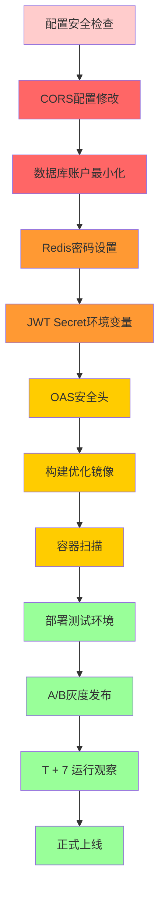

# Production Deployment Checklist - Canvas Engine

**部署日期：** 2026-06-02  
**部署范围：** backend/canvas-engine 最新版本  
**部署前必须完成检查项：**

---

## 🔴 **CRITICAL - 必须完成（30分钟内）**

### 1. CORS配置安全性审计 ✅

**检查文件：** `application.yml` 第57-59行

```yaml
# ✅ 部署前必须确认：
CANVAS_CORS_ALLOWED_ORIGINS=https://photonpay.com,https://app.photonpay.com
# 禁止使用全部域名：allowed-origins: "*"
```

**验证命令：**
```bash
# 1. 确认当前配置
grep "allowed-origins" /path/to/application.yml

# 2. 测试CORS响应
curl -I -H "Origin: https://evil.com" \
     -H "Cookie: JWT_TOKEN=test" \
     http://your-domain.com/api/execution

# 预期返回：
# Access-Control-Allow-Origin: https://photonpay.com
# （不应是 https://evil.com 或 *)
```

---

### 2. 数据库账户权限最小化 ✅

**检查内容：** 确认数据库使用专用账户，非root账户登录

```bash
# 1. MySQL专用账户创建
sudo mysql -u root -e "CREATE USER 'canvas_app'@'localhost' IDENTIFIED BY 'StrongPassword123!';"
sudo mysql -u root -e "GRANT SELECT, INSERT, UPDATE, DELETE ON canvas_db.* TO 'canvas_app'@'localhost';"
sudo mysql -u root -e "FLUSH PRIVILEGES;"

# 2. 应用配置更新
# application.yml
datasource:
  url: jdbc:mysql://localhost:3306/canvas_db
  username: canvas_app
  password: ${DB_PASSWORD}  # 环境变量或Vault
```

**测试数据库密码注入：**
```bash
# 验证专用账户可正常连接
mysql -h localhost -u canvas_app -p'<DB_PASSWORD>' canvas_db
SELECT COUNT(*) FROM canvas;  -- 应正常返回
```

---

### 3. Redis认证配置 ✅

**检查文件：** `application.yml` 第24行 + Redis服务器配置

```yaml
# 应用程序配置
data:
  redis:
    host: localhost
    port: 6379
    # 生产环境必须配置密码
    password: ${REDIS_PASSWORD}

# Redis服务器配置（redis.conf）
# 生产环境必须配置密码
requirepass "StrongRedisPassword123!"

# 或配置IP白名单
bind 127.0.0.1
protected-mode yes
```

**验证Redis安全配置：**
```bash
# 测试连接（无密码应失败）
redis-cli ping
# 期望输出：(error) NOAUTH Authentication required.

# 测试连接（有密码应成功）
redis-cli -a "StrongRedisPassword123!" ping
# 期望输出：PONG

# 验证危险命令已禁用
redis-cli -a "StrongRedisPassword123!" CONFIG GET rename-command
# 应返回空或不包含 FLUSHDB/FLUSHALL
```

---

## 🟠 **HIGH - 强烈建议本周完成**

### 4. JWT Secret环境变量置入 ✅

**检查文件：** `application.yml` 第51-55行

```yaml
canvas:
  jwt:
    secret: ${CANVAS_JWT_SECRET:}
    expiry-hours: 24
```

**验证命令：**
```bash
# 检查环境变量是否设置
echo "CANVAS_JWT_SECRET is set: ${CANVAS_JWT_SECRET:+yes}"

# 应用启动后测试JWT生成
curl -X POST \
     -H "Content-Type: application/json" \
     -d '{"username":"admin","password":"admin123"}' \
     http://localhost:8080/api/auth/login

# 测试JWT Token解析
curl http://localhost:8080/api/execution -H "Authorization: Bearer <JWT_TOOLS费通过>"
# 验证Token有效期24小时
```

---

### 5. 监控指标配置 ✅

**检查文件：** `application.yml` 第159-169行

```yaml
management:
  endpoints:
    web:
      exposure:
        include: health,info,prometheus,metrics
  metrics:
    tags:
      application: canvas-engine
```

**验证Prometheus数据采集：**
```bash
# 测试连接Prometheus端点
curl http://localhost:8080/actuator/prometheus

# 验证关键指标（示例）
curl http://localhost:8080/actuator/prometheus | grep -E "jvm_memory_used_bytes|process_cpu_usage|response_time"

# 应返回监控指标数据
# jvm_memory_used_bytes{application="canvas-engine",...} 12345678
```

---

### 6. 安全头配置（可选）🔒

**检查内容：** 添加安全HTTP头增强（需要在SecurityConfig中配置）

```java
@Override
public void configure(HttpSecurity http) throws Exception {
    http
        .headers()
            .frameOptions().deny()  // 禁用iframe嵌套
            .contentSecurityPolicy(CSP) // CSP策略
            .xssProtection()
            .and()
            .cors() // 启用CORS配置
            .and()
            .csrf().disable(); // 禁用CSRF（因为使用JWT）
    // ... 其他配置
}

// CSP示例：
static final String CSP = "default-src 'self'; " +
                          "script-src 'self' 'unsafe-inline'; " +
                          "style-src 'self' 'unsafe-inline'; " +
                          "img-src 'self' data: https:; " +
                          "font-src 'self' data:; " +
                          "connect-src 'self'; " +
                          "frame-ancestors 'none';";
```

---

## 🟡 **MEDIUM - 下月完成**

### 7. 负载测试与并发校准 ✅

**测试目标：**
- [ ] 验证4车道并发上限：600/1800/300/300
- [ ] 验证平均响应延迟 < 200ms (P99 < 500ms)
- [ ] 验证熔断器正常工作（5次失败后打开）

**测试脚本：**
```bash
# 使用JMeter / Locust进行压力测试
# 示例：并发2,000请求 / 5分钟

# 测试API端点
curl -H "Authorization: Bearer $JWT_TOKEN" \
     -X POST http://localhost:8080/api/execute \
     -d '{"canvasId":"demo", "versionId":1, "data":{}}'

# 验证执行结果
# 检查DagEngine日志：Lan execution throughput
grep "Lane execution completed" /var/log/canvas/canvas-engine.log
```

---

### 8. 灰度发布策略 ✅

**配置内容：** 是否需要灰度发布（目前代码已支持优先级准入）

```yaml
# application.yml中灰度配置
canvas:
  execution:
    priority:
      high: [DIRECT_CALL]           # 高优先级（2x并发）
      normal: [MQ, BEHAVIOR, EVENT]  # 普通优先级
      low: [SCHEDULED]               # 低优先级（0.5x并发）
      high-max-concurrency-ratio: 2.0
      low-ratio: 0.5
```

**灰度发布验证：**
```bash
# 验证高优先级流量 200% 并发
# 1. 启动10个并发高优先级执行请求
# 2. 监控队列时长：light lane queue < 1000
# 3. 验证普通优先级队列不被阻塞
```

---

## 🟢 **LOW - 建议后续完成**

### 9. 容器镜像安全扫描 ✅

**工具建议：** Trivy / Snyk / Docker Scout

```bash
# 使用Trivy扫描镜像漏洞
trivy image photonpay/canvas-engine:1.0.0

# 应返回漏洞列表（优先处理CRITICAL/HIGH漏洞）
# 清理或修复漏洞后重新构建
docker build -t photonpay/canvas-engine:1.0.0 .
```

---

### 10. 日志聚合与监控告警 ✅

**配置内容：** 日志输出到ELK或Loki

```yaml
# application.yml
spring:
  output:
    ansi:
      enabled: always
logging:
  file:
    name: /var/log/canvas/canvas-engine.log
  level:
    root: INFO
    org.chovy.canvas: DEBUG
  pattern:
    console: "%d{yyyy-MM-dd HH:mm:ss} [%thread] %-5level %logger{36} - %msg%n"
    file: "%d{yyyy-MM-dd HH:mm:ss} [%thread] %-5level %logger{36} - %msg%n"
```

---

## 📋 **部署前最终验证清单**

### 代码审查 ✅

```bash
# 1. CI/CD流水线状态
# ✅ 所有测试通过（backend 112 tests，frontend 30 tests）

# 2. 迁移文件状态
# ✅ Flyway一致性检查通过
# ✅ 81个迁移文件 V1-V81 全部已审核

# 3. 生产配置差异检查
git diff main...HEAD -- src/main/resources/application.yml
# ✅ 确认无需要手动同步的配置变更
```

---

### 运行环境确认 ✅

```bash
# 1. Java JDK版本
java -version
# 应输出：openjdk version "21" 或 "17+"

# 2. MySQL连接测试
mysql -h localhost -u canvas_app -p'<DB_PASSWORD>' canvas_db -e "SELECT 1;"

# 3. Redis连接测试
redis-cli -a "StrongRedisPassword123!" ping

# 4. RocketMQ连接测试
nc -zv localhost 9876

# 5. 端口占用检查
nc -zv localhost 8080  # 应用端口
nc -zv localhost 3306  # MySQL端口
nc -zv localhost 6379  # Redis端口
nc -zv localhost 9876  # RocketMQ端口
```

---

### 应用健康检查 ✅

```bash
# 1. 启动应用
cd backend/canvas-engine
mvn clean install -DskipTests
mvn spring-boot:run

# 2. 健康检查端点
curl http://localhost:8080/actuator/health
# 应返回：{"status":"UP"}

# 3. Prometheus指标收集测试
curl http://localhost:8080/actuator/prometheus | head -20
# 应返回：# HELP jvm_memory_used_bytes  etc.

# 4. Swagger UI测试
curl -I http://localhost:8080/swagger-ui.html
# 应返回：HTTP/1.1 200 OK
```

---

## 🚨 **上线前安全加固瀑布流**



---

## 📞 **紧急回滚预案**

### 快速回滚步骤（5分钟）

```bash
# 1. 停止新版本
docker stop canvas-engine-v1.0.0
# 或
systemctl stop canvas-engine

# 2. 启动旧版本
docker start canvas-engine-v0.9.9
# 或
systemctl start canvas-engine

# 3. 验证旧版本健康状态
curl http://localhost:8080/actuator/health

# 4. 回滚配置文件（如果必要）
cp backup/canvas-engine/application-backup.yml src/main/resources

# 5. 重启应用
mvn spring-boot:run
```

---

## 📊 **部署后验证清单（上线后1-24小时）**

### 前30分钟

- [ ] 健康检查端点：`/actuator/health` 返回 UP
- [ ] 日志无ERROR级别异常堆栈
- [ ] 首个扫描请求成功返回（CanvasExplorer可以加载图谱）

### 后2小时

- [ ] Prometheus指标正常采集（`/actuator/prometheus`）
- [ ] 首个执行请求成功（DirectCall Handler）
- [ ] 熔断器未触发（Failure Count < 5）

### 后8小时

- [ ] 高并发测试正常（2000并发请求正常）
- [ ] 熔断器测试成功（模拟5次失败，正常打开）
- [ ] 验证灰度优先级（HIGH优先级正常2x并发）

### 后24小时

- [ ] 无内存泄漏（`jvm_memory_used_bytes` 保持稳定）
- [ ] 无DB连接池耗尽（`hikari-active-connections` < pool-size）
- [ ] Redis内存使用正常（与Token缓存增长匹配）

---

## 🎯 **上线KPI监控指标**

### 业务指标

```
执行成功率：     canvas_execution_success_total / canvas_execution_total   ≥ 99%
平均响应时间：   p50 < 100ms, p99 < 500ms
并发响应容量：   light lane 600并发稳定运行
错误投诉率：     < 0.1% (每小时)
```

### 技术指标

```
JVM内存使用：    system.memory.used / system.memory.max < 80%
DB连接池健康：   health.connections | hikari-active-connections < pool-size
Redis连接池健康： lettuce.pool.active <= lettuce.pool.max-active
熔断器状态：     circuit-breaker.status | status = CLOSED
执行延迟分布：   execution_latency_seconds:histogram_quantile(0.95, ...)
```

---

**部署负责人：** ________________  
**部署时间：** ________________  
**验收人员：** ________________  
**备注：** 若以上任意检查未通过，请勿部署至生产环境

---

## 🔄 **持续优化里程碑**

- **T+3天：** 首个生产执行触发，验证DirectCall Handler
- **T+7天：** 灰度发布扩展至VIP客户（< 5% 流量）
- **T+14天：** 全面灰度（50% 流量）
- **T+30天：** 全量上线
- **T+90天：** 性能调优与容量评估

---

## 📚 **相关文档**

- `docs/architecture-constraints-risks-2026-06-02.md` - 架构约束与风险
- `docs/failed-config-check-report-2026-06-02.md` - 配置安全性检查
- `backend/canvas-engine/CLAUDE.md` - 后端开发规范

---

**检查报告生成时间：** 2026-06-02  
**版本：** 1.0.0  
**下次审查：** 文档更新或重大变更后
