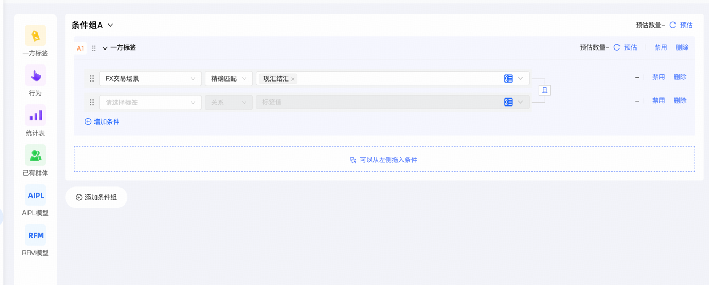

## 优化点一
画布没有删除功能, 如果错误创建没办法处理
## 优化点二
前端页面在画布编辑的时候, 如果点击保存, 那么再次修改的时候, 没有动态识别内容变化, 按钮还是已保存
## 优化点三
接口返回大部分为Map, 但是键大部分是魔法字符，其实这样不容易维护, 也不容易知道返回的字段的具体的含义
## 优化点四
org.chovy.canvas.engine.trigger.TriggerPreCheckService.check 中定义一系列限制检查, 但是页面上没有对应的页面进行配置
## 优化点五 
现在画布是控制并发的手段之一是超过指定数值直接跳过, 但是这里是不是可以引入消息队列, 先把请求放到消息队列里。评估是否可以先通过消息队列削峰, 然后再通过本地队列进行控制。另外这里设计队列的时候是否也可以考虑针对事件的优先级就行不同的处理, 保证不同的触达准确率
## 优化点六
MQ_TRIGGER 消息触发逻辑实现了，但是实际上并没有消费入口。此处的消费入口的topic以及分区配置可以头脑风暴一下, 尽量做到能够承载大量的事件处理, 某一些事件处理是否会比较耗时, 阻塞后续事件的处理, 此处是否需要考虑？
## 优化点七
画布发布的版本管理有bug, 因为现在判断只是通过画布维度作为幂等键, 但是实际上如果两个人同时修改的话，一个人先提交的话，后面一个人再提交的话, 会导致先提交的人的画布被覆盖, 所以这里前后端要配合一起修改, 如果已经修改要配合后端的检测进行提示, 询问是否需要刷新
## 优化点八
是否可以实现一个公共包, 公共包中处理了多级缓存的生命周期能力, 作为整个项目的公共能力, 比如说增加缓存时候，多级缓存如何进行管理, 删除缓存的时候如何管理？本地缓存是不是可以向Redis订阅进行续期。
## 优化点九
现在只是定义了标签, 但是缺少了标签背后人群圈选的功能, 这个是否可以可以通过规则引擎对指定的人群进行筛选, 同时上线一个配置相关的页面, 这里可以进行头脑风暴一下, 看看UI应该如何设计以及选型应该如何确定。这里交互界面可以参考下图

## 优化点十
针对定时任务对离线人群筛选的内容, 如果同时唤起的话, 需要给每一个用户一个随机过期时间, 避免同一时间大量用户被触发, 导致系统崩溃
## 优化点十一
现在画布有版本的概念, 但是没有很好利用起来, 比如说针对画布的灰度发布, 可以根据版本号进行灰度发布, 而不是根据画布ID进行灰度发布。所以这里可以提供一个灰度发布的接口, 接口中包含画布ID, 版本号, 灰度发布人群等信息, 同时在画画布的灰度发布页面, 提供一个灰度发布的按钮, 点击后调用灰度发布的接口, 实现灰度发布。这里可以增加一个
## 优化点十二
增加一个对下游调用的速率控制配置, 避免瞬间流量让下游崩溃, 这里是否可以考虑使用Redis的限流功能

