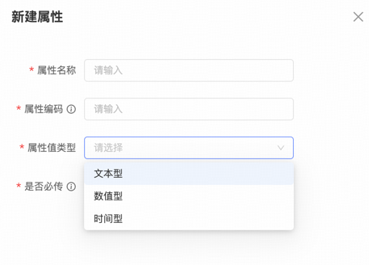
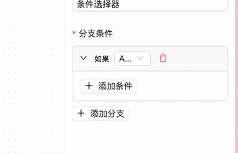
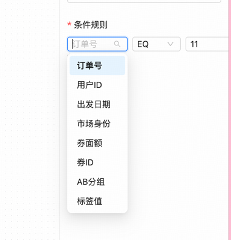

## 优化点一
增加事件配置概念：事件配置包括事件事件名称、事件编码以及时间属性列表配置。因为从业务的角度来看，业务直调一般也是因为事件发生然后再触发后续的业务逻辑，而且有事件的概念后续也可以区分不同的来源，对事件进行分析以及统计，但是如果只是直接开放调用的话，其实不容易进行追踪以及管理。
属性的类型的话可以简单设置为文本，数值以及时间三大类。因为有了事件概念之后，后续的直调逻辑应该调整为事件触发方式，先配置事件，然后上报事件，接着对事件进行解析以及处理，处理的过程包括存储以及触发对应的画布逻辑。

## 优化点二
SCHEDULED_TRIGGER 这个节点前端界面定时触发或者周期触发，不能有一个时间框给用户选择的吗？现在填写到底应该填什么格式的时间是未知的，所以还是有界面选择比较合适

## 优化点三

SELECTOR 这个选择器配置界面不太友好，用户使用心智较高

## 优化点四

这里的变量下拉为什么是写死的，而且不是从上下文中获取的？