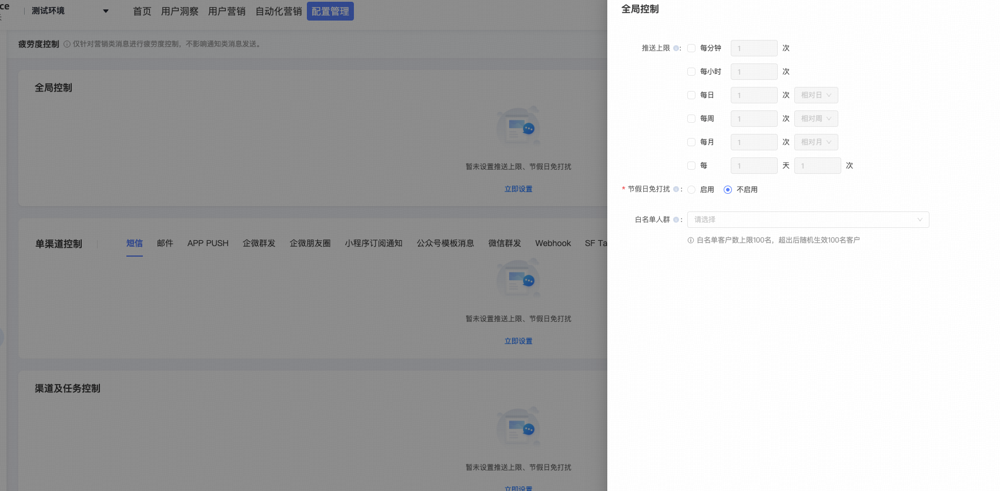
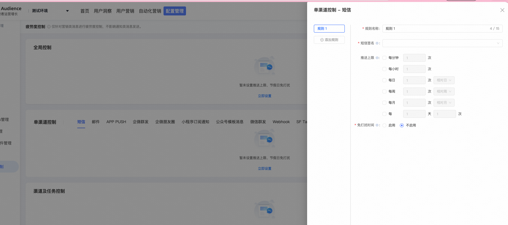
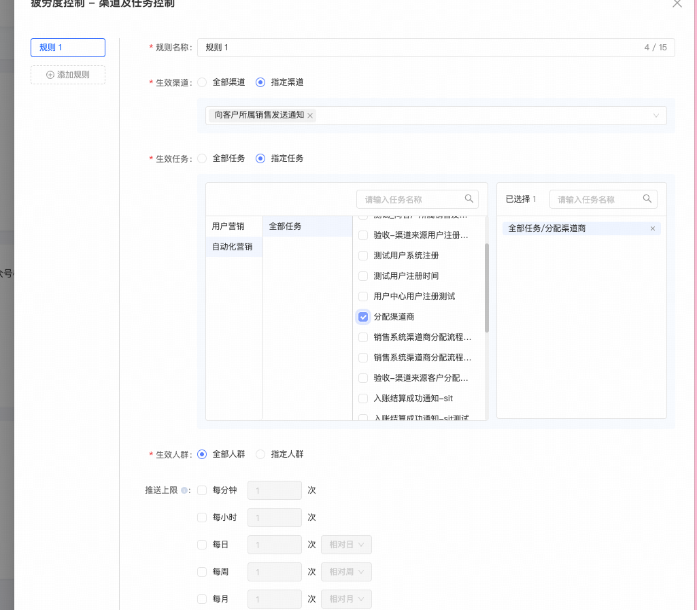
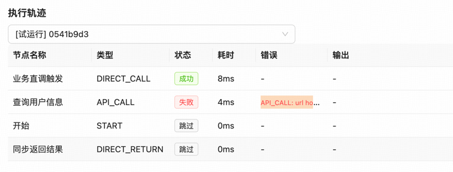

## 优化点一
增加疲劳度控制能力。分为三个控制维度：
全局控制，据图如下所示

单渠道控制方式，例如：短信、邮件、APP PUSH等

渠道及任务控制

## 优化点二
画布查询列表接口，每次从指定画布中返回的时候，都会默认返回到第一个页，而不是当前页。
## 优化点三
画布列表页面增加一个分组的功能，保存的时候可以选择保存到哪个分组。
## 优化点四
画布列表页面增加一个对各个画布状态的统计以及筛选功能。另外如果要对页面的画布进行筛选的话，推荐什么字段筛选？
## 优化点五
执行轨迹部分，错误信息展示不完全，可以提供一个下载完整的错误信息的功能或者悬浮完整展示的功能吗？

## 优化点六
DIRECT_RETURN 这个节点不能后续拼接结束节点，现在的规范应该是每个画布都应该都开始以及结束节点，没有任何业务含义，只是作为规范占位存在
## 优化点七
现在保存画布之后不会自动刷新，要手动刷新之后才能展示最新的画布，交互不太友好

