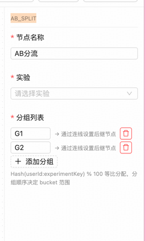
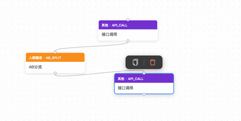
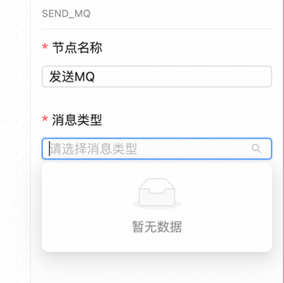
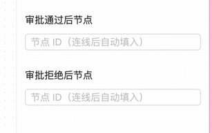
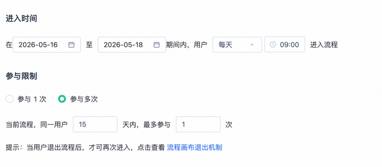

## 优化点一
TAGGER_OFFLINE 这个节点的标签是否可以作为一个配置项进行配置，至于配置之后筛选数据方式可以先待定，但是肯定不能写死在组件里，毕竟不同的用户可能会有不同的数据源以及标签体系，如果这个标签可以配置化的话，用户就可以根据自己的实际情况来进行配置，这样使用起来也会更加灵活一些
## 优化点二
AB_SPLIT 配置界面上写着通过连线设置后续节点，但是实际上后续节点对应的具体是哪一个根本就分不清，而且一点说明都没有。要么最初级的应该是连线上有说明吧，或者有没有其他方案也可以探讨一下。而且配置页面中分组根本就不能直观知道是配置的什么？→ 通过连线设置后继节点
不是很突兀吗？UI需要头脑风暴一下

## 优化点三
DELAY 这个节点的UI头脑风暴一下，重新设计一下，可以把单位以及配置的时间放在一起吧？有其他的方案也可以的
## 优化点四
SEND_MQ  这个节点没有闭环吧，具体消息的类型现在是没有办法配置的，页面上没有配置的入口，这里消息发送可以是动态的吗？动态配置消息主题以及内容之类的，参考API配置部分

## 优化点五
MANUAL_APPROVAL 这个节点界面提示链接之后可以是自动填充，但是实际上没有有做到。这里应该是和AB_SPLIT 一样的体验问题，这里头脑风暴一下

## 优化点六
TAGGER_OFFLINE 以及 TAGGER_REALTIME 可以进行合并成一个组件，通过选择标签是在线以及离线进行区分，没必要用两个组件增加用户的学习成本。而且这里为什么还有后继结点的配置。不是要求优化这个点
## 优化点七
BEHAVIOR_IN_APP 这个节点是否也可以和DIRECT_CALL进行合并成一个组件？合并之后行为事件的组件是否合理？合理的话就处理
## 优化点八
SCHEDULED_TRIGGER 定时任务设置的界面参照下图，前端解析完成之后传给后端一个 cron 表达式。另外这个定时触发更多像整个旅程的整体属性吧，一般来说某个节点用到定时的场景有哪些？如果没有的话，就改造成旅程的属性，这样旅程就有实时以及定时触发的逻辑了

## 优化点九
整个画布没有command + A(Mac)情况下全选，然后删除的功能。可以的话加上一个重做的按钮，一键清除所有的节点，但是这个功能需要加一个二次确认，防止误操作
## 优化点十
MQ_TRIGGER 这个节点配置下拉款现在是写死的，这里可以让客户进行自我定义配置，加一个配置页面，并且联动。配置页面上最后说明配置之后怎么和这个节点进行联动使用，用户在配置好之后就可以直接在这个节点上选择已经配置好的MQ事件了，这样就不需要每次都去修改代码了