# 营销画布技术设计文档

> 版本：v1.0  
> 信息来源：原文技术方案 + 实际系统截图  
> 状态：待评审

---

## 一、系统概述

### 1.1 背景

旧系统（Apollo 配置）存在以下问题：
- 不支持流程分叉
- 组件低内聚高耦合，复用性差
- 无可视化流程展示，排查困难
- 不支持多阶段、多分支的动态编排

### 1.2 目标

引入画布配置形式，通过可视化、拖拽式界面将复杂营销流程直观呈现。将活动抽象为独立节点，运营人员通过连线自由编排用户流转路径，实现"所画即所得"。

### 1.3 核心设计原则

- **配置与执行分离**：配置服务负责存储与版本管理，执行引擎负责运行时调度
- **有向无环图（DAG）**：画布本质是 DAG，不支持循环流程
- **异步非阻塞**：执行引擎基于 Spring Reactor 实现，不阻塞线程
- **防资损**：只要已发放权益或已触达用户，即使后续节点失败，整体判定为成功
- **节点可插拔**：节点类型通过注册表管理，新增节点只需实现 Handler + 注册元数据，无需改动引擎核心
- **Schema 驱动**：节点配置表单、上下文字段均来自后端注册表，前端动态渲染，不为每种类型写 if-else

---

## 二、整体架构

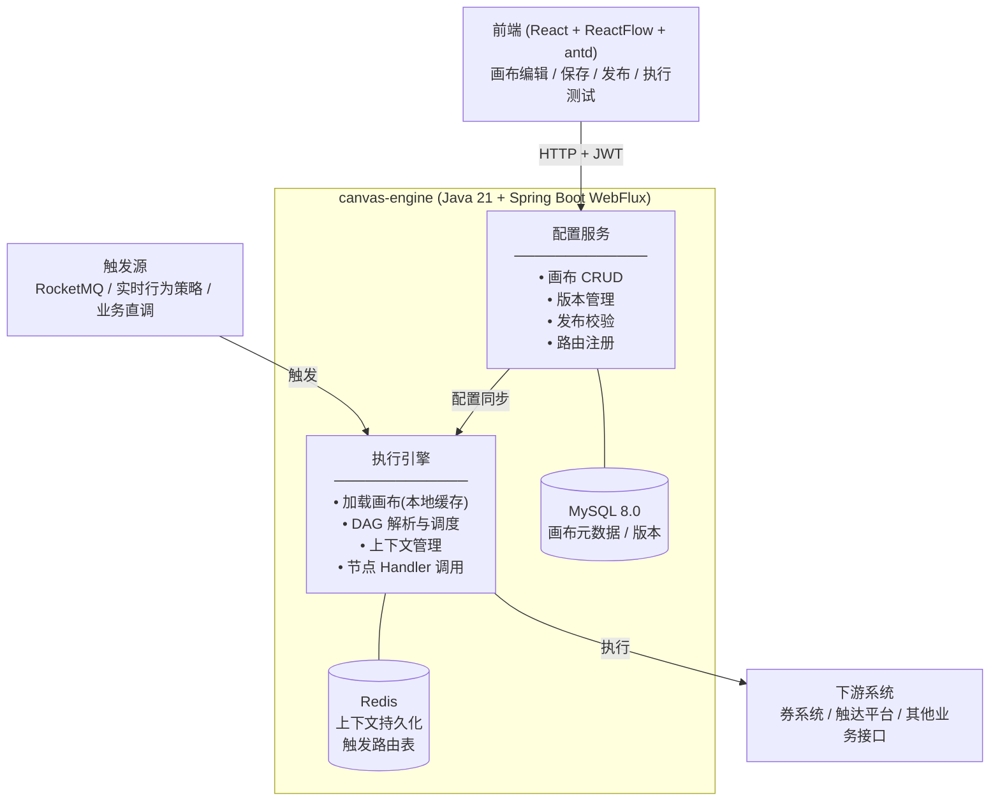
```mermaid
graph TB
    FE["前端 (React + ReactFlow + antd)\n画布编辑 / 保存 / 发布 / 执行测试"]

    subgraph BE["canvas-engine (Java 21 + Spring Boot WebFlux)"]
        CS["配置服务\n─────────────\n• 画布 CRUD\n• 版本管理\n• 发布校验\n• 路由注册"]
        EE["执行引擎\n─────────────\n• 加载画布(本地缓存)\n• DAG 解析与调度\n• 上下文管理\n• 节点 Handler 调用"]
        MySQL[("MySQL 8.0\n画布元数据 / 版本")]
        Redis[("Redis\n上下文持久化\n触发路由表")]
        CS -->|配置同步| EE
        CS --- MySQL
        EE --- Redis
    end

    TRIGGER["触发源\nRocketMQ / 实时行为策略 / 业务直调"]
    DS["下游系统\n券系统 / 触达平台 / 其他业务接口"]

    FE -->|HTTP + JWT| CS
    TRIGGER -->|触发| EE
    EE -->|执行| DS
```

### 2.1 两层架构：通用层 + 集成层

系统分为两个层次，两层职责清晰，集成层可按需替换或扩展：

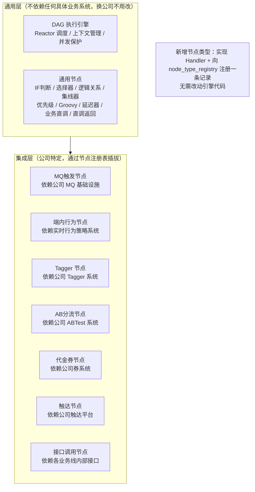
```mermaid
graph TB
    subgraph GENERIC["通用层（不依赖任何具体业务系统，换公司不用改）"]
        ENGINE["DAG 执行引擎<br/>Reactor 调度 / 上下文管理 / 并发保护"]
        GNODES["通用节点<br/>IF判断 / 选择器 / 逻辑关系 / 集线器<br/>优先级 / Groovy / 延迟器 / 业务直调 / 直调返回"]
    end

    subgraph INTEGRATION["集成层（公司特定，通过节点注册表插拔）"]
        MQ["MQ触发节点<br/>依赖公司 MQ 基础设施"]
        BEHAVIOR["端内行为节点<br/>依赖实时行为策略系统"]
        TAGGER["Tagger 节点<br/>依赖公司 Tagger 系统"]
        AB["AB分流节点<br/>依赖公司 ABTest 系统"]
        COUPON["代金券节点<br/>依赖公司券系统"]
        REACH["触达节点<br/>依赖公司触达平台"]
        API["接口调用节点<br/>依赖各业务线内部接口"]
    end

    GENERIC --> INTEGRATION
    note1["新增节点类型：实现 Handler + 向 node_type_registry 注册一条记录<br/>无需改动引擎代码"]
```

| 层次 | 特点 | 扩展方式 |
|------|------|---------|
| 通用层 | 无业务耦合，逻辑完全通用 | 一般不扩展 |
| 集成层 | 依赖公司内部系统，是业务耦合点 | 新增节点类型：实现 Handler + 注册元数据 |

---

## 三、画布数据模型

### 3.1 画布 JSON 格式

采用**节点中心式**存储，连接关系内嵌在每个节点的 config 中，不维护独立的 edges 数组。

理由：IF判断有 successNodeId/failNodeId，条件选择器每个分支有独立 nextNodeId，这些分支信息天然属于节点 config，强行拆成 edges 反而增加复杂度。

**顶层结构：**

```json
{
  "nodes": [
    {
      "id": "node_001",
      "type": "MQ_TRIGGER",
      "name": "机票订单支付",
      "x": 120,
      "y": 80,
      "config": { "topicKey": "flight_order_status_change", "nextNodeId": "node_002" }
    },
    {
      "id": "node_002",
      "type": "IF_CONDITION",
      "name": "新用户判断",
      "x": 120,
      "y": 240,
      "config": { "rules": [...], "successNodeId": "node_003", "failNodeId": "node_004" }
    }
  ]
}
```

**字段说明：**

| 字段 | 类型 | 说明 |
|------|------|------|
| id | String | 节点唯一标识，前端生成的短 hex 串（如 ed858f0bef1c） |
| type | String | 节点类型枚举，见第四章 |
| name | String | 节点显示名称，运营人员填写 |
| x | Number | 画布坐标 X（前端保存时写入，后端原样存储，不参与执行逻辑） |
| y | Number | 画布坐标 Y（同上） |
| config | Object | 各节点类型的专属配置，结构见第四章 |

---

### 3.2 数据库设计

```sql
-- 画布主表
CREATE TABLE canvas (
  id                   BIGINT PRIMARY KEY AUTO_INCREMENT,
  name                 VARCHAR(100)  NOT NULL COMMENT '画布名称',
  description          VARCHAR(500)  COMMENT '描述',
  status               TINYINT       NOT NULL DEFAULT 0 COMMENT '0草稿 1已发布 2已下线',
  published_version_id BIGINT        COMMENT '当前生效版本ID',
  created_by           VARCHAR(64),
  created_at           DATETIME,
  updated_at           DATETIME
);

-- 版本快照（每次发布生成一条）
CREATE TABLE canvas_version (
  id          BIGINT      PRIMARY KEY AUTO_INCREMENT,
  canvas_id   BIGINT      NOT NULL,
  version     INT         NOT NULL COMMENT '版本号，从1递增',
  graph_json  MEDIUMTEXT  NOT NULL COMMENT '完整画布JSON',
  status      TINYINT     NOT NULL COMMENT '0草稿 1已发布',
  created_by  VARCHAR(64),
  created_at  DATETIME,
  INDEX idx_canvas_id (canvas_id)
);

-- 执行记录
CREATE TABLE canvas_execution (
  id           VARCHAR(64)  PRIMARY KEY COMMENT 'UUID',
  canvas_id    BIGINT       NOT NULL,
  version_id   BIGINT       NOT NULL,
  user_id      VARCHAR(64),
  trigger_type VARCHAR(32)  COMMENT 'MQ/DIRECT_CALL/BEHAVIOR',
  status       TINYINT      COMMENT '0执行中 1暂停 2成功 3失败',
  result       TEXT         COMMENT '执行结果JSON',
  created_at   DATETIME,
  updated_at   DATETIME,
  INDEX idx_canvas_user (canvas_id, user_id)
);

-- 节点执行轨迹（调试用）
CREATE TABLE canvas_execution_trace (
  id           BIGINT      PRIMARY KEY AUTO_INCREMENT,
  execution_id VARCHAR(64) NOT NULL,
  node_id      VARCHAR(64) NOT NULL,
  node_type    VARCHAR(32),
  node_name    VARCHAR(100),
  status       TINYINT     COMMENT '0执行中 1成功 2失败 3跳过',
  input_data   TEXT,
  output_data  TEXT,
  error_msg    VARCHAR(500),
  started_at   DATETIME,
  finished_at  DATETIME,
  INDEX idx_execution_id (execution_id)
);

-- 全局上下文字段注册表
CREATE TABLE context_field (
  id              BIGINT      PRIMARY KEY AUTO_INCREMENT,
  field_key       VARCHAR(64) NOT NULL COMMENT '字段标识，如 orderId',
  field_name      VARCHAR(64) NOT NULL COMMENT '显示名称，如 订单号',
  data_type       VARCHAR(16) NOT NULL COMMENT 'STRING/NUMBER/BOOLEAN/LIST',
  source_node_type VARCHAR(32) COMMENT '由哪类节点产出',
  description     VARCHAR(200),
  UNIQUE KEY uk_field_key (field_key)
);

-- 节点类型注册表（插件化核心，集成层节点在此注册）
CREATE TABLE node_type_registry (
  type_key        VARCHAR(64)   PRIMARY KEY COMMENT 'MQ_TRIGGER / TAGGER_OFFLINE 等',
  type_name       VARCHAR(64)   NOT NULL    COMMENT '显示名称：MQ消息 / Tagger离线标签',
  category        VARCHAR(32)   NOT NULL    COMMENT '行为策略/逻辑分支/人群圈选/权益发放/用户触达/其他',
  handler_class   VARCHAR(200)  NOT NULL    COMMENT 'Handler 全限定类名',
  config_schema   TEXT          NOT NULL    COMMENT '前端表单字段 Schema（JSON数组）',
  output_schema   TEXT                      COMMENT '该节点产出的上下文字段定义（JSON数组）',
  is_trigger      TINYINT       DEFAULT 0   COMMENT '1=触发器节点（无入边）',
  is_terminal     TINYINT       DEFAULT 0   COMMENT '1=终止节点（无出边，如直调返回）',
  description     VARCHAR(500),
  enabled         TINYINT       DEFAULT 1
);
```

`config_schema` 示例（驱动前端动态渲染表单，无需为每种节点写 if-else）：

```json
[
  { "key": "topicKey",       "label": "消息主题",   "type": "select",
    "dataSource": "/meta/mq-topics",  "required": true },
  { "key": "validateResult", "label": "校验结果",   "type": "toggle" },
  { "key": "validateRules",  "label": "校验规则",   "type": "condition-rule-list",
    "visible": "validateResult == true" }
]
```

`output_schema` 示例（声明该节点执行后向上下文写入哪些字段）：

```json
[
  { "fieldKey": "orderId",   "fieldName": "订单号",  "dataType": "STRING" },
  { "fieldKey": "orderStatus","fieldName": "订单状态","dataType": "STRING" }
]
```

---

### 3.3 数据库索引设计

在建表 DDL 基础上，以下查询场景需要额外关注索引覆盖：

| 表 | 查询场景 | 推荐索引 |
|----|---------|---------|
| `canvas` | 按状态分页列表 | `(status, created_at)` |
| `canvas` | 按创建人查询 | `(created_by, status)` |
| `canvas_version` | 按 canvas_id 拉取版本列表 | `(canvas_id, version DESC)` |
| `canvas_execution` | 按画布+用户查执行记录 | `(canvas_id, user_id, created_at)` |
| `canvas_execution` | 按状态查挂起/超时记录 | `(status, created_at)` |
| `canvas_execution_trace` | 按 execution_id 拉全部节点轨迹 | `(execution_id, started_at)` |
| `canvas_user_quota` | 按画布+用户+日期查当日用量 | 已是联合主键，覆盖 |
| `canvas_audit_log` | 按画布查操作历史 | `(canvas_id, created_at DESC)` |
| `canvas_execution_stats` | 按画布+日期查统计 | `(canvas_id, stat_date DESC)` |
| `node_type_registry` | 按类别查节点类型 | `(category, enabled)` |

**分区表的索引注意事项**：`canvas_execution` 和 `canvas_execution_trace` 按月分区后，`created_at` 上的范围查询会自动裁剪分区，全局索引效果有限。优先使用分区裁剪 + 局部索引。

---

## 四、节点类型规范

### 4.0 设计哲学：两层节点

> **说明**：两层节点的分层概念和"基础积木"命名为设计补充，非原文术语。  
> 有原文依据的部分：Groovy 是"承载个性化业务诉求的关键组件"（原文）、子流程嵌套可复用（原文 5.2 节）、API调用/发送MQ 作为独立节点存在（原文截图确认）。

营销画布的节点分为两层，两层可以混合使用：

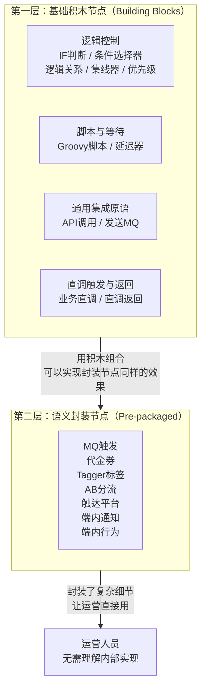
```mermaid
graph TB
    subgraph L1["第一层：基础积木节点（Building Blocks）"]
        B1["逻辑控制<br/>IF判断 / 条件选择器<br/>逻辑关系 / 集线器 / 优先级"]
        B2["脚本与等待<br/>Groovy脚本 / 延迟器"]
        B3["通用集成原语<br/>API调用 / 发送MQ"]
        B4["直调触发与返回<br/>业务直调 / 直调返回"]
    end

    subgraph L2["第二层：语义封装节点（Pre-packaged）"]
        P1["MQ触发<br/>代金券<br/>Tagger标签<br/>AB分流<br/>触达平台<br/>端内通知<br/>端内行为"]
    end

    L1 -->|"用积木组合<br/>可以实现封装节点同样的效果"| L2
    L2 -->|"封装了复杂细节<br/>让运营直接用"| note1["运营人员<br/>无需理解内部实现"]
```

**什么时候用哪层：**

| 场景 | 推荐使用 |
|------|---------|
| 平台已封装好的常见场景（发券、触达、监听MQ） | 第二层语义封装节点，开箱即用 |
| 平台未封装、需要调自定义接口 | 第一层 API调用 节点 |
| 需要处理复杂业务逻辑 | 第一层 Groovy 节点 |
| 需要将自己搭建的流程复用 | 子流程封装（见 4.0.2） |

---

### 4.0.1 基础积木节点详解

以下节点是**平台通用能力**，不依赖任何公司内部系统，可以在任何场景下自由组合使用。

#### 逻辑控制类

| 节点 | 作用 | 典型用途 |
|------|------|---------|
| **IF判断** | 一个条件 → 两条路（成功/失败） | 判断用户是否满足某条件 |
| **条件选择器** | 多个条件 → 多条路，按顺序匹配 | 根据不同用户属性走不同分支 |
| **逻辑关系** | 等待多个上游节点，AND/OR 组合 | 多个事件都发生才继续 |
| **集线器** | 等待所有上游节点完成再继续 | 并行分支汇合 |
| **优先级** | 按顺序尝试子节点，成功即止 | 降级发券（A券发失败就发B券） |

#### 执行类

| 节点 | 作用 | 典型用途 |
|------|------|---------|
| **Groovy脚本** | 写代码处理任意业务逻辑 | 计算时间差、格式转换、复杂条件判断 |
| **延迟器** | 等待一段时间再继续 | 下单后30分钟未支付再发券 |

#### 通用集成原语

| 节点 | 作用 | 典型用途 |
|------|------|---------|
| **API调用** | 调任意内部 HTTP 接口，可校验返回结果 | 调券系统/查询用户信息/任意业务接口 |
| **发送MQ** | 发任意 MQ 消息 | 通知下游系统/触发其他业务流程 |

#### 触发与返回

| 节点 | 作用 | 典型用途 |
|------|------|---------|
| **业务直调** | 定义外部系统调用本画布的入参 | 业务方主动触发活动 |
| **直调返回** | 定义同步返回给调用方的数据 | 配合业务直调使用 |

---

### 4.0.2 用基础积木替代封装节点（示例）

封装节点本质上都是基础积木的组合。以下示例说明两种方式等效：

**示例：发代金券**

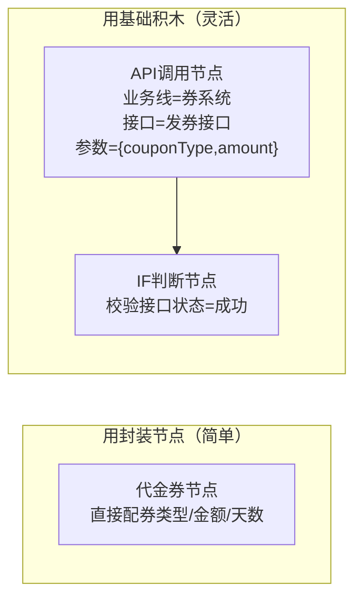
```mermaid
flowchart LR
    subgraph 封装方式["用封装节点（简单）"]
        E1["代金券节点<br/>直接配券类型/金额/天数"]
    end

    subgraph 积木方式["用基础积木（灵活）"]
        B1["API调用节点<br/>业务线=券系统<br/>接口=发券接口<br/>参数={couponType,amount}"] -->
        B2["IF判断节点<br/>校验接口状态=成功"]
    end
```

**示例：监听 MQ 并校验**

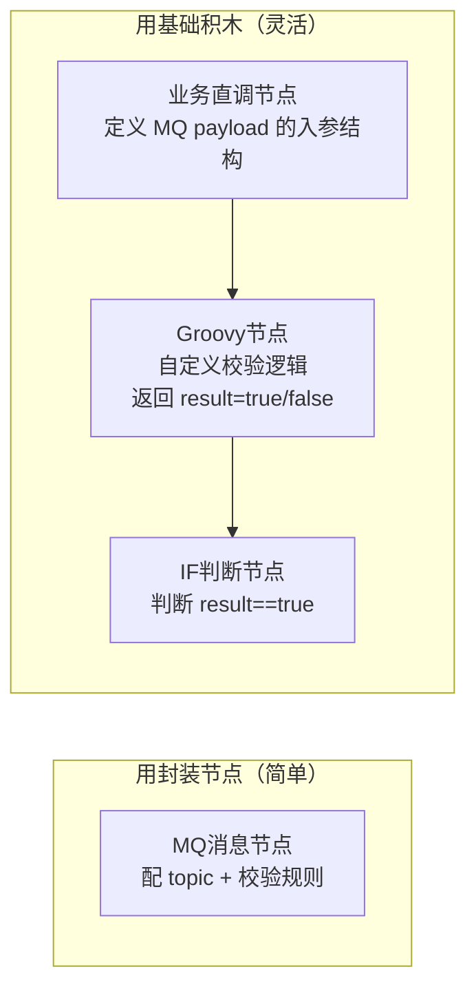
```mermaid
flowchart LR
    subgraph 封装方式["用封装节点（简单）"]
        E1["MQ消息节点<br/>配 topic + 校验规则"]
    end

    subgraph 积木方式["用基础积木（灵活）"]
        B1["业务直调节点<br/>定义 MQ payload 的入参结构"] -->
        B2["Groovy节点<br/>自定义校验逻辑<br/>返回 result=true/false"] -->
        B3["IF判断节点<br/>判断 result==true"]
    end
```

**什么时候选积木方式：**
- 平台没有封装对应的集成节点
- 需要更灵活的校验逻辑（封装节点只支持简单规则）
- 需要组合多个接口调用

---

### 4.0.3 子流程：把积木封装成新节点

当一组基础积木被反复使用时，可以封装为**子流程**，作为一个新节点在其他画布复用：

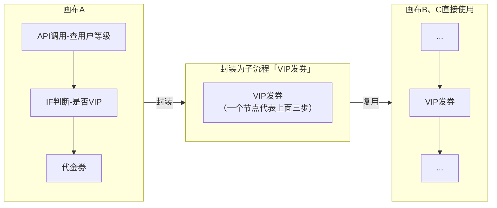
```mermaid
flowchart LR
    subgraph 原始画布["画布A"]
        N1["API调用-查用户等级"] --> N2["IF判断-是否VIP"] --> N3["代金券"]
    end

    subgraph 子流程["封装为子流程「VIP发券」"]
        S1["VIP发券<br/>（一个节点代表上面三步）"]
    end

    subgraph 复用["画布B、C直接使用"]
        R1["..."] --> S2["VIP发券"] --> R2["..."]
    end

    原始画布 -->|封装| 子流程
    子流程 -->|复用| 复用
```

原文中提到的子流程有三种形态：
- **工作流**：最完整的子流程，包含完整触发→执行链路
- **策略表格**：多维度策略配置（行=策略因子，列=策略组合）
- **数据表格**：文案/配置数据管理（行=属性，列=业务key）

---

### 节点分类总览

| 分类 | 节点 | 层次 |
|------|------|------|
| **逻辑控制** | IF判断 / 条件选择器 / 逻辑关系 / 集线器 / 优先级 | 基础积木 |
| **执行** | Groovy脚本 / 延迟器 | 基础积木 |
| **通用集成** | API调用 / 发送MQ | 基础积木 |
| **触发与返回** | 业务直调 / 直调返回 | 基础积木 |
| **行为策略触发** | 端内用户行为 / MQ消息 / Tagger实时标签 | 语义封装 |
| **人群圈选** | AB分流 / Tagger离线标签 | 语义封装 |
| **权益发放** | 代金券 | 语义封装 |
| **用户触达** | 端内通知 / 触达平台 | 语义封装 |

---

### 通用值引用结构

所有节点 config 中涉及取值的字段统一使用：

```json
{
  "valueType": "CUSTOM",
  "value": "xxx"
}
```

| valueType | 含义 |
|-----------|------|
| `CUSTOM` | 直接用填写的字面值 |
| `CONTEXT` | 从上下文取值，value 是 field_key |

### 通用条件规则结构

```json
{
  "field": "订单状态",
  "operator": "EQ",
  "value": "出票完成",
  "isCustom": true
}
```

操作符：`EQ` / `NEQ` / `CONTAINS` / `GT` / `LT` / `GTE` / `LTE`

---

### 4.1 行为策略类（语义封装节点）

> 以下 JSON 中的字段值均为**举例**，实际值来自对应的外部系统注册表，前端通过 `/meta/*` 接口动态加载。


#### BEHAVIOR_IN_APP（端内用户行为）

监听用户在 APP 内的操作行为，满足策略时触发活动。策略类型由实时行为策略系统注册，不在画布侧写死。

```json
{
  "name": "浏览机票主流程",
  "strategyRelation": "OR",
  "strategies": [
    {
      "strategyTypeKey": "BROWSE_DURATION",
      "params": {
        "page": "机票主流程页面code",
        "duration": "15",
        "durationUnit": "SECOND"
      }
    },
    {
      "strategyTypeKey": "BROWSE_COUNT",
      "params": {
        "page": "机票主流程页面code",
        "count": "3",
        "timeWindow": "",
        "timeWindowUnit": "SECOND"
      }
    }
  ],
  "nextNodeId": "node_002"
}
```

| 字段 | 说明 |
|------|------|
| strategyRelation | AND（且）/ OR（或） |
| strategyTypeKey | 策略类型 key，来自实时行为策略系统注册表，前端从 `/meta/behavior-strategy-types` 加载 |
| params | 该策略类型的参数，字段 schema 来自 `/meta/behavior-strategy-types/{key}/fields` |

---

#### MQ_TRIGGER（MQ消息）

监听业务 MQ 消息，topic 来自 MQ 注册表，不在画布侧写死。

```json
{
  "name": "机票订单支付",
  "topicKey": "flight_order_status_change",
  "validateResult": true,
  "validateRules": [
    { "field": "订单状态", "operator": "EQ", "value": "出票完成", "isCustom": false }
  ],
  "nextNodeId": "node_002"
}
```

| 字段 | 说明 |
|------|------|
| topicKey | MQ topic 标识，前端从 `/meta/mq-topics` 加载选项 |
| validateResult | 是否开启消息内容校验 |
| validateRules | 通用条件规则结构，全部通过才触发 |

---

#### DIRECT_CALL（业务直调）

业务方调用接口直接触发活动，定义接口接收的入参结构。

```json
{
  "name": "业务直调",
  "inputParams": [
    {
      "name": "cityName",
      "description": "城市",
      "dataType": "STRING",
      "required": true
    }
  ],
  "nextNodeId": "node_002"
}
```

---

#### TAGGER_REALTIME（Tagger实时标签）

监听 Tagger 实时标签 MQ 消息，tagCode 来自 Tagger 系统注册。

```json
{
  "name": "Tagger实时标签",
  "tagCodeKey": "tag_vip_user",
  "nextNodeId": "node_002"
}
```

| 字段 | 说明 |
|------|------|
| tagCodeKey | 标签 code，前端从 `/meta/tagger-tags` 加载选项 |

---

### 4.2 逻辑分支类

#### IF_CONDITION（IF判断）

简单的逻辑判断，支持成功/失败两个分支。

```json
{
  "name": "新用户判断",
  "rules": [
    {
      "field": "市场身份",
      "operator": "EQ",
      "value": "newUser",
      "isCustom": true
    }
  ],
  "successNodeId": "node_coupon",
  "failNodeId": "node_reach"
}
```

执行逻辑：rules 列表中所有条件均满足 → 走 successNodeId，否则走 failNodeId。

---

#### SELECTOR（条件选择器）

连接多个下游分支，按顺序匹配条件，命中则执行对应分支，均不命中则走否则分支。

```json
{
  "name": "机-推荐酒店判断1",
  "branches": [
    {
      "label": "如果",
      "strategyRelation": "AND",
      "conditions": [
        {
          "field": "行程阶段",
          "operator": "CONTAINS",
          "value": "待出行,到达目的地",
          "isCustom": true
        }
      ],
      "nextNodeId": "node_hotel"
    },
    {
      "label": "否则如果",
      "strategyRelation": "AND",
      "conditions": [
        {
          "field": "行程阶段",
          "operator": "CONTAINS",
          "value": "预出行",
          "isCustom": true
        }
      ],
      "nextNodeId": "node_shuttle"
    }
  ],
  "elseNodeId": "node_ticket"
}
```

执行逻辑：按 branches 顺序依次评估，第一个命中的分支生效，均不命中走 elseNodeId。

---

#### LOGIC_RELATION（逻辑关系）

对所有上游节点的执行状态做组合判断，是多阶段执行的核心节点。

```json
{
  "name": "逻辑关系",
  "relation": "AND",
  "nextNodeId": "node_groovy"
}
```

| relation | 说明 |
|----------|------|
| AND（且） | 所有上游节点执行成功时继续 |
| OR（或） | 任意上游节点执行成功时继续 |

执行时涉及并发保护，详见第六章。

---

### 4.3 人群圈选类

#### AB_SPLIT（AB分流）

对用户进行 AB 分流，实验编号和分组来自 ABTest 系统，分组列表动态加载。

```json
{
  "name": "AB分流",
  "experimentKey": "exp_new_user_coupon",
  "groups": [
    { "groupKey": "A", "nextNodeId": "node_hotel" },
    { "groupKey": "B", "nextNodeId": "node_ticket" }
  ]
}
```

| 字段 | 说明 |
|------|------|
| experimentKey | 实验标识，前端从 `/meta/ab-experiments` 加载选项 |
| groupKey | 实验分组 key，前端从 `/meta/ab-experiments/{key}/groups` 动态加载 |

**流量一致性设计：**

同一个用户多次触发同一画布时，应始终落入相同的实验分组，否则可能今天发A券、明天发B券。

方案：**基于 Hash 的确定性分流**

```
bucket = abs(hash(userId + ":" + experimentKey)) % 100
// bucket 0~9 → A 组（10%）
// bucket 10~99 → B 组（90%）
```

- 相同 userId + experimentKey 永远得到相同 bucket
- 不依赖外部状态，无需存储分组结果
- 调整比例时，bucket 边界移动，原来在边界附近的用户可能换组（可接受）

若需要严格保证分组不变（即使调整比例后），则需要将分组结果持久化到 ABTest 系统，由 ABTest 系统返回该用户的确定分组。

---

#### TAGGER_OFFLINE（Tagger离线标签）

请求 Tagger 获取离线标签，标签返回为空时拦截流程。

```json
{
  "name": "Tagger离线标签",
  "tagCodeKey": "tag_offline_high_value",
  "params": {
    "tagValue": "1"
  },
  "nextNodeId": "node_002"
}
```

| 字段 | 说明 |
|------|------|
| tagCodeKey | 标签 code，前端从 `/meta/tagger-offline-tags` 加载 |
| params.tagValue | 期望的标签值，空则只判断有无 |

---

### 4.4 权益发放类

#### COUPON（代金券）

发放各业务线代金券，券类型来自券系统注册表。

```json
{
  "name": "代金券",
  "couponTypeKey": "flight_coupon",
  "params": {
    "srcType": "marketing_canvas",
    "amount": "5",
    "validDays": "30"
  },
  "nextNodeId": null
}
```

| 字段 | 说明 |
|------|------|
| couponTypeKey | 券类型标识，前端从 `/meta/coupon-types` 加载 |
| params | 券参数，字段 schema 来自券类型注册的 config_schema |

---

### 4.5 用户触达类

#### IN_APP_NOTIFY（端内通知）

通过 MQTT 通道向 APP 前端实时推送数据，消息 code 来自消息注册表。

```json
{
  "name": "国际酒店领券弹窗通知",
  "messageCodeKey": "international_hotel_coupon_popup",
  "bizData": [
    { "name": "couponAmount", "valueType": "CONTEXT", "value": "couponAmount" }
  ],
  "nextNodeId": null
}
```

| 字段 | 说明 |
|------|------|
| messageCodeKey | 消息 code，前端从 `/meta/message-codes?type=IN_APP` 加载 |
| bizData | 推送的业务数据，支持自定义值或从上下文取值 |

---

#### REACH_PLATFORM（触达平台）

向触达平台发送 MQ 消息，服务场景来自触达平台注册。

```json
{
  "name": "push急速预订页",
  "serviceSceneKey": "quick_booking_push",
  "bizData": [
    { "name": "amount", "valueType": "CONTEXT", "value": "newUserAmount" }
  ],
  "nextNodeId": null
}
```

| 字段 | 说明 |
|------|------|
| serviceSceneKey | 触达场景标识，前端从 `/meta/reach-scenes` 加载 |

---

#### DIRECT_RETURN（直调返回）

配合 DIRECT_CALL 使用，定义返回给业务方的数据结构，是业务直调流程的终点。

```json
{
  "name": "推荐酒店",
  "buildType": "CUSTOM",
  "data": [
    {
      "name": "biz",
      "valueType": "CUSTOM",
      "value": "hotel"
    },
    {
      "name": "amount",
      "valueType": "CONTEXT",
      "value": "couponAmount"
    }
  ]
}
```

---

### 4.6 其他类

#### API_CALL（接口调用）

请求业务线内部接口，接口来自业务线 API 注册表，参数 schema 动态加载。

```json
{
  "name": "用订单号查是否好坐席",
  "bizLineKey": "TRAIN_TICKET",
  "apiKey": "check_good_seat",
  "params": [
    { "paramKey": "orderId", "valueType": "CONTEXT", "value": "orderId" }
  ],
  "validateResult": true,
  "validateRules": [
    { "field": "接口状态", "operator": "EQ", "value": "true", "isCustom": true }
  ],
  "nextNodeId": "node_next"
}
```

| 字段 | 说明 |
|------|------|
| bizLineKey | 业务线标识，前端从 `/meta/biz-lines` 加载 |
| apiKey | 接口标识，前端从 `/meta/biz-lines/{key}/apis` 加载 |
| params | 参数列表，paramKey 来自接口注册的参数定义，值支持 CUSTOM/CONTEXT |

**validateResult 校验失败时的节点行为：**

| 情况 | 节点状态 | 后续处理 |
|------|---------|---------|
| `validateResult=false` | validateRules 被忽略，直接 SUCCESS | 走 nextNodeId |
| `validateResult=true` 且规则全部通过 | SUCCESS | 走 nextNodeId |
| `validateResult=true` 且有规则不通过 | **FAILED**（业务规则不满足，不可重试） | 走防资损判定，不走 nextNodeId |

API_CALL **不支持分支**——校验失败只能终止流程，无法走到不同分支。如需根据接口返回值分支，在 API_CALL 后接 IF判断 节点，用"上下文获取"引用接口输出字段来判断。

---

#### DELAY（延迟器）

延迟指定时长后继续执行。

```json
{
  "name": "延迟器",
  "duration": 10,
  "unit": "SECOND",
  "nextNodeId": "node_next"
}
```

unit 枚举：SECOND / MINUTE / HOUR

---

#### SEND_MQ（发送MQ）

发出 MQ 消息，消息 code 和参数来自 MQ 消息注册表。

```json
{
  "name": "发送MQ",
  "messageCodeKey": "ivr_project",
  "params": [
    { "paramKey": "planId",        "valueType": "CUSTOM",  "value": "plan_001" },
    { "paramKey": "complaintTag",  "valueType": "CONTEXT", "value": "complaintTag" }
  ],
  "nextNodeId": null
}
```

| 字段 | 说明 |
|------|------|
| messageCodeKey | 消息 code 标识，前端从 `/meta/message-codes?type=MQ` 加载 |
| params | 消息参数，paramKey 来自该消息 code 注册的参数定义 |

---

#### PRIORITY（优先级）

按优先级顺序执行子节点，当子节点成功时不再执行其他子节点。

```json
{
  "name": "优先级",
  "priorities": [
    { "order": 1, "nextNodeId": "node_coupon_a" },
    { "order": 2, "nextNodeId": "node_coupon_b" }
  ],
  "nextNodeId": null
}
```

---

#### GROOVY（Groovy脚本）

编写 Groovy 代码处理输入变量生成返回值，承载个性化业务诉求。

```json
{
  "name": "识别当日下单当日出行",
  "inputParams": [
    {
      "name": "depDate",
      "valueType": "CONTEXT",
      "value": "departureDate"
    }
  ],
  "code": "def depDate = parseDateTime(input.depDate, defaultAllFormatter)\ndef sixteenHoursBeforeDep = depDate.minusHours(16)\nreturn [\n    result: LocalDateTime.now().isAfter(sixteenHoursBeforeDep)\n]",
  "outputParams": [
    { "name": "result", "dataType": "BOOLEAN" }
  ],
  "validateResult": false,
  "validateRules": [],
  "nextNodeId": "node_hub"
}
```

执行规则：
- 通过 `input.xxx` 访问输入参数
- 返回值为 Map，key 对应 outputParams 中的 name
- 可选开启 validateResult，使用与接口调用相同的规则结构校验输出

**Groovy 脚本 Binding 变量完整列表：**

| 变量名 | 类型 | 说明 |
|--------|------|------|
| `input` | `Map<String, Object>` | 该节点配置的 inputParams（CONTEXT 值已解析为实际值） |
| `userId` | `String` | 当前执行用户 ID |
| `canvasId` | `String` | 当前画布 ID |
| `nodeId` | `String` | 当前节点 ID |
| `executionId` | `String` | 当前执行 ID（= traceId） |
| `ctx` | `ExecutionContext` | 执行上下文（可读，谨慎写） |
| `utils` | `GroovyUtils` | 平台工具方法（见下方） |
| `log` | `Logger` | 日志记录，输出追加到 execution_trace.input_data |

**ctx 的使用规范：**

```groovy
// ✅ 推荐：只通过 input 读取参数，return 输出结果
def depDate = utils.parseDateTime(input.depDate, "yyyy-MM-dd HH:mm:ss")
return [result: LocalDateTime.now().isAfter(depDate)]

// ⚠️ 谨慎：直接读取 ctx（只读，不要写）
def orderId = ctx.getContextValue("orderId")

// ❌ 禁止：直接修改 ctx（引擎会覆盖，且破坏封装）
// ctx.putNodeOutput(nodeId, ...)  // 不要这样做
```

**GroovyUtils 可用方法：**

| 方法 | 说明 | 示例 |
|------|------|------|
| `parseDateTime(str, pattern)` | 字符串解析为 LocalDateTime | `parseDateTime("2026-05-09", "yyyy-MM-dd")` |
| `formatDateTime(dt, pattern)` | LocalDateTime 格式化为字符串 | `formatDateTime(LocalDateTime.now(), "HH:mm")` |
| `formatMoney(amount)` | BigDecimal 格式化为货币字符串 | `formatMoney(100.5)` → `"¥100.50"` |
| `toJson(obj)` | 对象序列化为 JSON 字符串 | — |
| `fromJson(str, Class)` | JSON 字符串反序列化 | — |
| `daysBetween(d1, d2)` | 计算两个日期相差天数 | — |

**返回值规范：**

```groovy
// 最简返回：只声明是否通过校验
return [result: true]

// 带输出的返回：result 用于 validateResult 判断，其他字段作为上下文输出
return [
    result: true,
    isHighValue: amount > 1000,
    discountRate: 0.9
]
// isHighValue、discountRate 会写入 ctx，后续节点可用"上下文获取"引用
```

`println` 输出会追加到 `canvas_execution_trace.input_data` 字段，可在执行轨迹查看，不写应用日志。

---

#### HUB（集线器）

等待所有上游节点**执行完毕**（不论成功或失败），再继续执行下游节点。

```json
{ "name": "集线器", "nextNodeId": "node_next" }
```

**HUB vs LOGIC_RELATION 的精确区别：**

| 对比维度 | HUB（集线器） | LOGIC_RELATION（逻辑关系）|
|---------|------------|------------------------|
| 等待条件 | 所有上游**完成**（SUCCESS + FAILED 都算） | AND：所有上游 **SUCCESS**；OR：任意一个 **SUCCESS** |
| 上游失败时 | 继续执行下游（失败不传播） | AND 模式：整体 FAILED；OR 模式：继续等待 |
| 适用场景 | 并行分支汇合，只需等待完成 | 多路触发的条件判断（如多阶段执行） |
| 典型用法 | 并行接口调用完成后写日志 | 机票MQ + 酒店MQ 都触发后才发券 |

**实现差异**：HUB 的 `checkUpstreamCondition` 只判断"是否都已 done（完成，不论状态）"；LOGIC_RELATION 还需判断各上游节点的 SUCCESS/FAILED 状态。


```json
{
  "name": "集线器",
  "nextNodeId": "node_next"
}
```

---

## 五、上下文数据模型

### 5.1 ExecutionContext 结构

```
ExecutionContext {
  executionId: String          // 本次执行ID（= traceId）
  canvasId: String
  versionId: Long              // 触发时快照的版本，全程锁定
  userId: String               // 用户ID（全局通用数据）
  triggerPayload: Map          // 触发器携带的原始数据
  nodeOutputs: Map<nodeId, Map<fieldKey, value>>  // 各节点产出数据（历史）
  flatContext: Map<fieldKey, value>               // 扁平化快速查找（O(1)）
  nodeStatus: Map<nodeId, NodeStatus>             // 各节点执行状态
  benefitGranted: boolean      // 是否已发放权益（防资损）
  userReached: boolean         // 是否已触达用户（防资损）
  callStack: List<canvasId>    // 子流程调用链（防CANVAS_TRIGGER循环）
}
```

> 完整的 Java 类定义和方法说明见附录 B.2。

### 5.2 值解析规则

运行时遇到任意字段配置，按以下规则解析：

| valueType | 解析方式 |
|-----------|----------|
| CUSTOM | 直接使用 value 字面值 |
| CONTEXT | 以 value 为 field_key，从 ctx.nodeOutputs 中遍历查找，找到第一个有值的节点输出 |

### 5.3 全局字段注册表（context_field）

所有可用于"上下文获取"的字段集中注册，前端下拉选项来源于此表，与画布拓扑无关。

示例数据：

| field_key | field_name | data_type | source_node_type |
|-----------|-----------|-----------|-----------------|
| orderId | 订单号 | STRING | MQ_TRIGGER / API_CALL |
| departureDate | 出发日期 | STRING | MQ_TRIGGER |
| marketIdentity | 市场身份 | STRING | TAGGER_OFFLINE |
| couponAmount | 新客金额 | NUMBER | COUPON |
| abGroup | AB分组 | STRING | AB_SPLIT |

### 5.4 条件评估逻辑

```
evaluate(rule, ctx):
  actualValue = ctx 中查找 rule.field 对应值
  expected    = rule.value

  根据 rule.operator:
    EQ       → actualValue == expected（字符串相等）
    NEQ      → actualValue != expected
    CONTAINS → 见下方详细说明
    GT       → actualValue > expected（数值比较）
    LT       → actualValue < expected
    GTE      → actualValue >= expected
    LTE      → actualValue <= expected
```

### 5.5 上下文变量访问规范

#### CONTAINS 操作符详细说明

CONTAINS 支持两种语义，取决于 expected 是否包含逗号：

```
规则：field="行程阶段"，operator="CONTAINS"，expected="待出行,到达目的地"

语义：expected 是逗号分隔的候选值列表
判定：actualValue（从ctx取到的单个字符串）== 候选值中的任意一个

示例：
  actualValue = "待出行"      → 命中（等于候选值之一）✅
  actualValue = "到达目的地"  → 命中 ✅
  actualValue = "预出行"      → 不命中 ❌

等价于 SQL 的 IN 操作：field IN ("待出行", "到达目的地")
```

当 expected 不包含逗号时，CONTAINS 退化为字符串包含判断（actualValue 中含有 expected 子串）。

**分隔符固定为英文逗号**，值中不允许出现英文逗号（若有逗号需求，使用多条 EQ 规则通过 OR 关系组合）。

**类型强制转换规则**：所有比较均转为字符串后进行，不做数值比较：

```
actualValue = 100（Number）  expected = "100"     → String.valueOf(100) = "100" → 命中 ✅
actualValue = true（Boolean） expected = "true"    → String.valueOf(true) = "true" → 命中 ✅
actualValue = null            expected = "null"    → "null" → 命中（不推荐，建议用 IS_NULL 语义）
actualValue = null            expected = "待出行"  → "null" ≠ "待出行" → 不命中 ✅
```

**各操作符的比较规则（分两类）：**

| 操作符 | 比较方式 | 原因 |
|--------|---------|------|
| `EQ` / `NEQ` / `CONTAINS` | String.valueOf → 字符串比较 | 相等判断不需要数值语义 |
| `GT` / `LT` / `GTE` / `LTE` | 优先 BigDecimal 解析 → 数值比较；解析失败则字典序字符串比较 | 字典序下 "100" < "99"，数值结果完全错误 |

**GT/LT 比较示例：**

```
actualValue = 100（Number），expected = "50"
  → String.valueOf(100) = "100"，BigDecimal("100") = 100
  → BigDecimal比较：100 > 50 → GT 命中 ✅

actualValue = "abc"，expected = "abd"
  → BigDecimal解析失败 → 字典序："abc" < "abd" → LT 命中 ✅

actualValue = "10"，expected = "9"
  → BigDecimal解析：10 > 9 → GT 命中 ✅（若用字典序 "10" < "9"，结果相反 ❌）
```

#### 访问规则：全局扁平命名空间

`getContextValue(fieldKey)` 采用**全局扁平命名空间**——遍历所有节点的输出，找到第一个包含该 fieldKey 的值返回。无作用域隔离（任何节点都能引用任何已执行节点的输出）。

```
查找顺序（后执行优先，triggerPayload 优先级最低）：
1. ctx.nodeOutputs，按节点执行时间降序遍历（最新执行的节点优先）
   → 返回第一个找到的值（节点输出可覆盖触发器同名字段）
2. 若 nodeOutputs 中没有 → 再查 ctx.triggerPayload
3. 都没有 → 返回 null
```

节点输出优先级高于 triggerPayload：若 Groovy 节点输出了与触发器同名的字段，下游取到的是 Groovy 的最新值（允许对触发数据加工覆盖）。

字段不存在时：返回 null，不抛异常
```

**上下文查找性能优化（O(N) → O(1)）**：

上述"降序遍历 nodeOutputs"在节点多时是 O(N) 查找。采用**扁平合并 Map** 将查找优化为 O(1)：

```java
public class ExecutionContext {
    // 原有：按节点 ID 存储输出（保留完整历史，用于轨迹查询）
    private Map<String, Map<String, Object>> nodeOutputs = new LinkedHashMap<>();

    // 新增：扁平合并后的快速查找 Map（Last Writer Wins 自然保证）
    private Map<String, Object> flatContext = new HashMap<>();

    public void putNodeOutput(String nodeId, Map<String, Object> output) {
        nodeOutputs.put(nodeId, output);  // 保留历史
        flatContext.putAll(output);        // 新值覆盖旧值，O(k)，k=output字段数
    }

    // O(1) 查找，不再遍历
    public Object getContextValue(String fieldKey) {
        Object val = flatContext.get(fieldKey);
        return val != null ? val : triggerPayload.get(fieldKey);
    }
}
```

**性能对比**：

| 方案 | 单次查找复杂度 | 50节点 × 10字段 |
|------|-------------|----------------|
| 降序遍历 nodeOutputs | O(N)，N=节点数 | 500 次 HashMap.containsKey |
| flatContext（推荐） | **O(1)** | 10 次 HashMap.get |

`flatContext` 在序列化存 Redis（多阶段挂起）时一并持久化，恢复时直接可用。

#### 字段命名规范

| 规则 | 说明 | 示例 |
|------|------|------|
| 只支持一级字段 | fieldKey 不能包含 `.` 或 `[]` | `orderId` ✅ / `order.id` ❌ |
| 字母数字下划线 | 不允许特殊字符 | `coupon_amount` ✅ |
| 大小写敏感 | `orderId` ≠ `OrderId` | — |
| 最大长度 64 | 超长时发布校验报错 | — |

若需要访问嵌套字段（如 API 返回的 JSON 对象），在 Groovy 节点中提取后写到扁平字段：

```groovy
// 正确方式：在 Groovy 节点中展开嵌套结构
def userInfo = input.userInfo        // Map: {level: "VIP", score: 100}
ctx.putContextValue("userLevel", userInfo.level)   // 写到扁平字段
ctx.putContextValue("userScore", userInfo.score)
return [result: true]
// 后续 IF判断 可直接用 userLevel、userScore
```

#### 同名字段冲突：Last Writer Wins

当两个节点都输出了相同的 fieldKey（如两个 API_CALL 节点都输出了 `status` 字段），后执行的节点输出会覆盖先执行的。

**并发节点的覆盖顺序不确定**：Reactor `flatMap` 并行触发同层节点时，执行完成顺序由网络/CPU决定，不可控。因此**不应设计依赖同层节点覆盖顺序的画布**。

发布校验时自动检测：若同层节点的 output_schema 声明了相同 fieldKey，前端展示错误"同层节点 X 和 Y 输出了相同字段，覆盖结果不可预测，请重命名"，**阻止发布**（与不同层节点的警告不同，这里是阻止级别）。

**发布时前端警告**：若两个节点的 output_schema 声明了相同 fieldKey，展示警告并说明覆盖顺序，由运营人员确认。

#### 子流程输出的访问

子流程节点（SUB_FLOW_REF）的输出带 `outputPrefix` 前缀，防止与父流程字段冲突：

```
config.outputPrefix = "sf1"
子流程输出: { couponType: "A", amount: "10" }
          ↓
父上下文写入: sf1_couponType = "A", sf1_amount = "10"

父流程其他节点通过 "sf1_couponType" 访问
```

---

## 六、配置服务设计

### 6.1 API 列表

**画布管理：**

| 方法 | 路径 | 说明 |
|------|------|------|
| POST | `/canvas` | 创建画布 |
| GET  | `/canvas/{id}` | 获取画布（含最新草稿JSON） |
| PUT  | `/canvas/{id}` | 保存画布（覆盖草稿） |
| GET  | `/canvas/list` | 画布列表（分页） |
| POST | `/canvas/{id}/publish` | 发布 |
| GET  | `/canvas/{id}/versions` | 历史版本列表 |
| GET  | `/canvas/{id}/versions/{versionId}` | 获取指定版本 |
| POST | `/canvas/{id}/offline` | 下线 |

**元数据（Schema 驱动前端表单）：**

| 方法 | 路径 | 说明 |
|------|------|------|
| GET | `/meta/node-types` | 所有注册的节点类型（含 config_schema） |
| GET | `/meta/node-types/{typeKey}/schema` | 指定节点类型的表单字段 schema |
| GET | `/meta/context-fields` | 全局上下文字段列表（"上下文获取"下拉） |
| GET | `/meta/mq-topics` | MQ topic 列表 |
| GET | `/meta/behavior-strategy-types` | 行为策略类型列表 |
| GET | `/meta/behavior-strategy-types/{key}/fields` | 指定策略类型的字段 schema |
| GET | `/meta/biz-lines` | 业务线列表 |
| GET | `/meta/biz-lines/{key}/apis` | 指定业务线的接口列表（含参数定义） |
| GET | `/meta/message-codes` | 消息 code 列表（type=IN_APP\|MQ） |
| GET | `/meta/reach-scenes` | 触达场景列表 |
| GET | `/meta/coupon-types` | 券类型列表 |
| GET | `/meta/ab-experiments` | AB 实验列表 |
| GET | `/meta/ab-experiments/{key}/groups` | 指定实验的分组列表 |
| GET | `/meta/tagger-tags` | Tagger 标签列表（type=realtime\|offline） |

### 6.2 发布流程

运营人员点击"发布"后，配置服务完成校验、存储、路由注册、缓存同步四个步骤，任意一步失败则发布中止并返回错误。

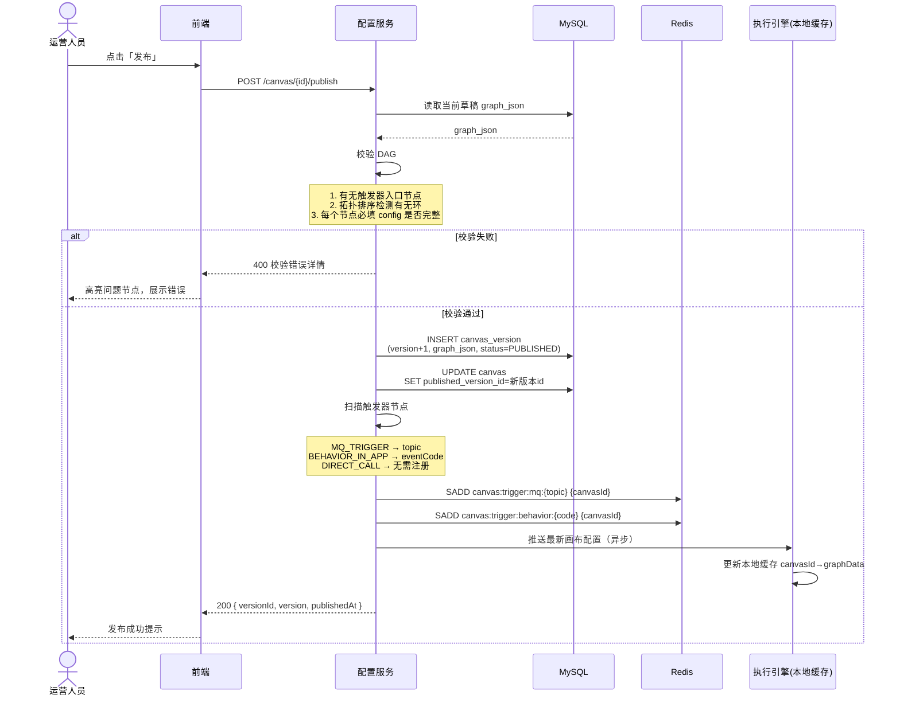
```mermaid
sequenceDiagram
    actor 运营人员
    participant FE as 前端
    participant CS as 配置服务
    participant MySQL
    participant Redis
    participant EE as 执行引擎(本地缓存)

    运营人员->>FE: 点击「发布」
    FE->>CS: POST /canvas/{id}/publish

    CS->>MySQL: 读取当前草稿 graph_json
    MySQL-->>CS: graph_json

    CS->>CS: 校验 DAG
    note over CS: 1. 有无触发器入口节点<br>2. 拓扑排序检测有无环<br>3. 每个节点必填 config 是否完整

    alt 校验失败
        CS-->>FE: 400 校验错误详情
        FE-->>运营人员: 高亮问题节点，展示错误
    else 校验通过
        CS->>MySQL: INSERT canvas_version<br>(version+1, graph_json, status=PUBLISHED)
        CS->>MySQL: UPDATE canvas<br>SET published_version_id=新版本id

        CS->>CS: 扫描触发器节点
        note over CS: MQ_TRIGGER → topic<br>BEHAVIOR_IN_APP → eventCode<br>DIRECT_CALL → 无需注册

        CS->>Redis: SADD canvas:trigger:mq:{topic} {canvasId}
        CS->>Redis: SADD canvas:trigger:behavior:{code} {canvasId}

        CS->>EE: 推送最新画布配置（异步）
        EE->>EE: 更新本地缓存 canvasId→graphData

        CS-->>FE: 200 { versionId, version, publishedAt }
        FE-->>运营人员: 发布成功提示
    end
```

### 6.3 触发路由注册

发布时向 Redis 注册 `topic → [canvasId]` 映射，下线时同步清除：

| 触发器类型 | Redis Key | 操作 |
|-----------|-----------|------|
| MQ_TRIGGER | `canvas:trigger:mq:{topicKey}` | SADD / SREM |
| BEHAVIOR_IN_APP | `canvas:trigger:behavior:{eventCode}` | SADD / SREM |
| TAGGER_REALTIME | `canvas:trigger:tagger:{tagCodeKey}` | SADD / SREM |
| DIRECT_CALL | — | 无需注册，HTTP 直接路由 |
| SCHEDULED_TRIGGER | — | 发布时向调度系统（XXL-Job）注册任务，下线时注销 |

### 6.4 服务重启后路由表恢复

Redis 路由表是内存数据，服务或 Redis 重启后可能丢失。执行引擎启动时执行**全量重建**：

```java
@PostConstruct
void initTriggerRoutes() {
    // 检查路由表是否完整（抽查几个已知画布）
    if (isTriggerTableEmpty()) {
        log.warn("触发路由表为空，从 MySQL 全量重建...");

        // 扫描所有已发布的画布
        List<Canvas> published = canvasRepository.findByStatus(CanvasStatus.PUBLISHED);
        for (Canvas canvas : published) {
            CanvasConfig config = canvasConfigService.loadConfig(canvas.getPublishedVersionId());
            triggerRouteService.registerAll(canvas.getId(), config.getNodes());
        }

        log.info("路由表重建完成，共处理 {} 个画布", published.size());
    }
}
```

**重启期间的消息处理**：

- 重建耗时通常 < 5s（按 100 个已发布画布估算）
- 期间到达的 MQ 消息：路由表为空 → 查不到 canvasId → 消息被忽略
- MQ At-Least-Once 特性保证消息会重投（默认重试间隔 1-5min），重投时路由表已恢复

**Redis 持久化建议**：开启 Redis AOF 持久化，可大幅降低路由表丢失概率（仅在 Redis 完全故障时才需要走全量重建）。

---

## 七、执行引擎设计

执行引擎是整个系统的核心，负责把画布 JSON 解析成可执行的流程，并按照 DAG 的拓扑顺序调度每个节点执行。它基于 **Spring Reactor** 实现，所有调度是异步非阻塞的——一个节点等待下游响应时不会占用线程，线程被释放去处理其他节点。

---

### 7.1 Handler 注册机制

**核心思想**：执行引擎本身不知道"发代金券"或"调接口"是什么逻辑，它只知道"按节点类型查找对应的 Handler，然后调用它"。这样新增一种节点类型不需要改引擎任何代码。

**HandlerRegistry 是一个 Map**，key 是节点类型字符串（如 `MQ_TRIGGER`），value 是对应的 Handler 实现类。服务启动时，Spring 容器扫描所有带 `@NodeHandler` 注解的 Bean，自动完成注册。

节点分两类：
- **通用 Handler**：IF判断、Groovy、延迟器等逻辑完全自包含，不依赖任何外部系统，引擎内置实现。
- **集成 Handler**：代金券、Tagger、触达平台等需要调公司内部系统，由各业务团队实现，作为 Spring Bean 注入注册。

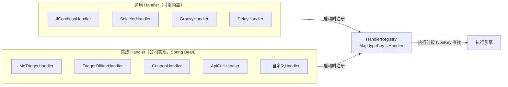
```mermaid
flowchart LR
    subgraph 通用Handler["通用 Handler（引擎内置）"]
        H1["IfConditionHandler"]
        H2["SelectorHandler"]
        H3["GroovyHandler"]
        H4["DelayHandler"]
    end

    subgraph 集成Handler["集成 Handler（公司实现，Spring Bean）"]
        H5["MqTriggerHandler"]
        H6["TaggerOfflineHandler"]
        H7["CouponHandler"]
        H8["ApiCallHandler"]
        H9["...自定义Handler"]
    end

    通用Handler -->|启动时注册| REG["HandlerRegistry<br/>Map typeKey→Handler"]
    集成Handler -->|启动时注册| REG
    REG -->|执行时按 typeKey 查找| EE["执行引擎"]
```

**新增集成节点只需两步，无需改引擎：**
1. 实现 `NodeHandler` 接口，注册为 Spring Bean
2. 在 `node_type_registry` 表插入一条记录（含 config_schema、output_schema）

**Spring 注解与自动注册实现：**

```java
// 1. 定义 @NodeHandler 注解（让 Spring 扫描时同时完成注册）
@Target(ElementType.TYPE)
@Retention(RetentionPolicy.RUNTIME)
@Component   // 同时声明为 Spring Bean
public @interface NodeHandler {
    String value();  // typeKey，如 "MQ_TRIGGER"
}

// 2. HandlerRegistry：启动时自动从 Spring 容器收集所有 Handler
@Component
public class HandlerRegistry {
    private final Map<String, com.photon.canvas.handler.NodeHandler> registry
        = new ConcurrentHashMap<>();

    // Spring 自动注入所有实现了 NodeHandler 接口的 Bean
    @Autowired
    public HandlerRegistry(List<com.photon.canvas.handler.NodeHandler> handlers) {
        for (com.photon.canvas.handler.NodeHandler handler : handlers) {
            NodeHandler anno = AnnotationUtils.findAnnotation(
                handler.getClass(), NodeHandler.class);
            if (anno != null) {
                registry.put(anno.value(), handler);
                log.info("注册节点 Handler: {} → {}", anno.value(),
                    handler.getClass().getSimpleName());
            }
        }
    }

    public com.photon.canvas.handler.NodeHandler get(String typeKey) {
        com.photon.canvas.handler.NodeHandler handler = registry.get(typeKey);
        if (handler == null) {
            throw new NodeExecutionException("未注册的节点类型: " + typeKey
                + "，请检查 @NodeHandler 注解或 node_type_registry 表");
        }
        return handler;
    }
}

// 3. 使用示例
@NodeHandler("COUPON")   // 同时完成 Spring Bean 注册和 HandlerRegistry 注册
public class CouponHandler implements NodeHandler {
    @Override
    public NodeResult execute(ResolvedNodeConfig config, ExecutionContext ctx) { ... }
    @Override
    public boolean isBenefitNode() { return true; }
}
```

---

### 7.2 DAG 解析

营销画布本质是一个**有向无环图（DAG）**——节点是业务操作，有向边代表执行顺序，无环确保流程不会死循环。

画布加载时，执行引擎需要把 graph_json（一组节点列表）解析成内存中可快速查询的图结构。这个过程做三件事：

**第一步：构建邻接表**。邻接表是"从某节点能到达哪些节点"的映射。不同节点类型的连接关系各不相同：
- 普通节点（延迟器、发送MQ等）：只有一条出边，指向 `nextNodeId`
- IF判断：有两条出边，成功走 `successNodeId`，失败走 `failNodeId`
- 条件选择器：有多条分支出边，每个分支指向不同节点
- 优先级节点：有多条子节点出边，按顺序逐个尝试

**第二步：统计入边数**。入边数为 0 的节点（没有其他节点指向它）是流程的起点。正常画布只有触发器节点是入边为 0 的——MQ触发、业务直调、端内行为都没有上游节点。

**第三步：校验**。入边为 0 的节点必须是触发器类型，否则说明画布配置有问题（比如有孤立的普通节点）。

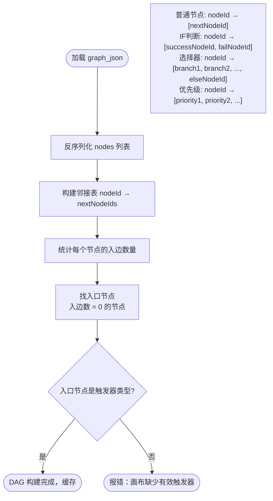
```mermaid
flowchart TD
    A([加载 graph_json]) --> B[反序列化 nodes 列表]
    B --> C[构建邻接表 nodeId → nextNodeIds]
    note1["普通节点: nodeId → [nextNodeId]
IF判断: nodeId → [successNodeId, failNodeId]
选择器: nodeId → [branch1, branch2, ..., elseNodeId]
优先级: nodeId → [priority1, priority2, ...]"]
    C --> D[统计每个节点的入边数量]
    D --> E[找入口节点<br/>入边数 = 0 的节点]
    E --> F{入口节点是触发器类型?}
    F -->|是| G([DAG 构建完成，缓存])
    F -->|否| H([报错：画布缺少有效触发器])
```

解析结果会缓存在本地内存中（Key = canvasId），下次同一画布触发时直接使用，不重复解析。

**DAG 解析时同时构建反向邻接表**（供 LOGIC_RELATION / HUB 使用）：

```java
// 正向邻接表：nodeId → [下游 nodeId 列表]
Map<String, List<String>> forwardEdges = new HashMap<>();
// 反向邻接表：nodeId → [直接上游 nodeId 列表]
Map<String, List<String>> reverseEdges = new HashMap<>();

// 解析 edges 时同时填充两张表
for (Edge edge : edges) {
    forwardEdges.computeIfAbsent(edge.source, k -> new ArrayList<>()).add(edge.target);
    reverseEdges.computeIfAbsent(edge.target, k -> new ArrayList<>()).add(edge.source);
}
```

**LOGIC_RELATION "检查上游是否满足"的具体判断**：

```java
// 获取 LOGIC_RELATION 的所有直接上游节点
List<String> upstreamIds = reverseEdges.get(logicRelationNodeId);

boolean conditionMet = switch (relation) {
    case "AND" -> upstreamIds.stream()
        .allMatch(id -> NodeStatus.SUCCESS == ctx.getNodeStatus(id));
    case "OR"  -> upstreamIds.stream()
        .anyMatch(id -> NodeStatus.SUCCESS == ctx.getNodeStatus(id));
};
```

**上游节点被 SKIPPED 时的处理**：
- SKIPPED 的节点永远不会变成 SUCCESS
- AND 模式：若直接上游中有 SKIPPED 节点 → 整体 AND 条件永远无法满足 → 立即标记 LOGIC_RELATION FAILED
- OR 模式：SKIPPED 节点不计入 OR 条件，继续等待其他上游

**发布校验**：LOGIC_RELATION 的直接上游**不允许是条件分支节点**（IF判断的 failNodeId 出来的节点等），防止出现"永远 SKIPPED"的上游。若检测到此类连接，发布时报错。

**环检测算法：Kahn 算法（拓扑排序）**

选择 Kahn 算法而非 DFS，原因是它在检测到环的同时天然给出拓扑顺序，可直接用于调度依赖。

```
伪代码：
1. 计算每个节点的入度 inDegree[nodeId]
2. 将所有 inDegree = 0 的节点加入队列 Q
3. while Q 不为空：
     取出节点 u
     processedCount++
     for u 的每个邻居 v：
         inDegree[v]--
         if inDegree[v] == 0：Q.add(v)
4. if processedCount < totalNodes：
     → 存在环，找出未处理节点即为环的成员，返回错误
   else：
     → 无环，DAG 合法
```

**ExecutionContext 在 Reactor 中的线程安全**

Reactor 协程可能在不同线程间切换，不能用 `ThreadLocal` 传递 ExecutionContext。使用 **Reactor Context API** 将 ctx 绑定到响应式管道：

```java
// 调用入口：将 ctx 写入 Reactor Context
Mono<Void> startExecution(ExecutionContext ctx, CanvasNode triggerNode) {
    return executeNode(triggerNode)
        .contextWrite(reactorCtx ->
            reactorCtx.put(EXEC_CTX_KEY, ctx)  // 注入到管道
        );
}

// 任意节点 Handler 中读取 ctx（无需参数传递）
Mono<NodeResult> executeNode(CanvasNode node) {
    return Mono.deferContextual(reactorCtx -> {
        ExecutionContext ctx = reactorCtx.get(EXEC_CTX_KEY);
        // 使用 ctx 执行节点逻辑
        return Mono.fromCallable(() ->
            handlerRegistry.get(node.getType()).execute(resolveConfig(node, ctx), ctx)
        );
    });
}
```

Reactor Context 在整个异步链路中自动传播，无论协程切换到哪个线程，`EXEC_CTX_KEY` 始终可取到正确的 ctx。

---

### 7.3 主调度流程

触发信号到达时，执行引擎按以下步骤处理：

**1. 加载画布**：先查本地内存缓存，命中则直接使用；未命中则从 MySQL 加载 published_version 的 graph_json，解析后缓存。

**2. 处理 ExecutionContext**：每次画布执行都有一个独立的上下文（Context），存储这次执行的全局数据——userId、触发载荷、各节点的输出、节点执行状态。引擎先检查 Redis 中是否有这个用户的挂起上下文（多阶段执行场景）：
- 有挂起上下文 → 反序列化恢复，追加本次触发的数据，从断点继续
- 没有挂起上下文 → 全新初始化一个 Context

**3. 找触发器节点**：根据触发方式（MQ topic / 行为 eventCode / 直调）在 DAG 中匹配对应的触发器节点，从这个节点开始执行。

**4. Reactor 异步链驱动**：执行引擎不是用循环来驱动节点执行，而是用 Reactor 的 `Mono/Flux` 链——每个节点执行完成后，通过 `flatMap` 触发下游节点，形成异步的执行链。整个过程不阻塞任何线程。

**5. 写执行记录**：整条链路执行完成后，将执行结果写入 `canvas_execution` 表。

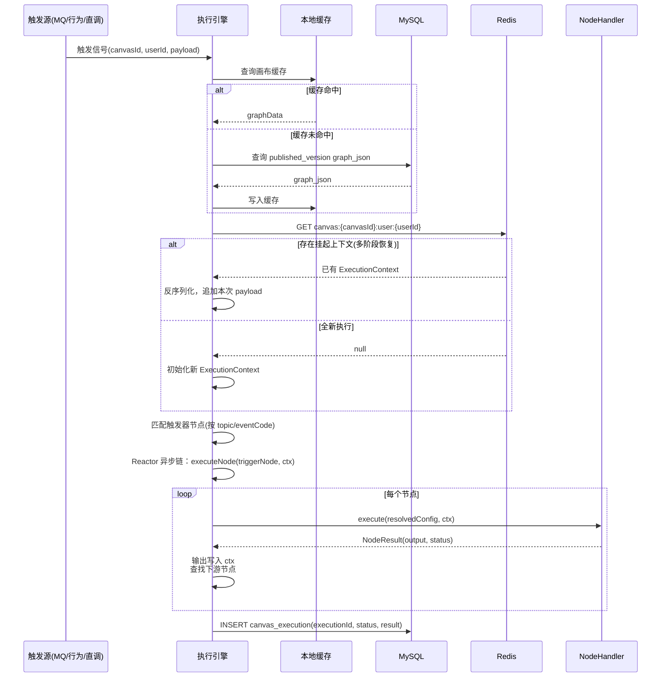
```mermaid
sequenceDiagram
    participant Trigger as 触发源(MQ/行为/直调)
    participant EE as 执行引擎
    participant Cache as 本地缓存
    participant MySQL
    participant Redis
    participant Handler as NodeHandler

    Trigger->>EE: 触发信号(canvasId, userId, payload)

    EE->>Cache: 查询画布缓存
    alt 缓存命中
        Cache-->>EE: graphData
    else 缓存未命中
        EE->>MySQL: 查询 published_version graph_json
        MySQL-->>EE: graph_json
        EE->>Cache: 写入缓存
    end

    EE->>Redis: GET canvas:{canvasId}:user:{userId}
    alt 存在挂起上下文(多阶段恢复)
        Redis-->>EE: 已有 ExecutionContext
        EE->>EE: 反序列化，追加本次 payload
    else 全新执行
        Redis-->>EE: null
        EE->>EE: 初始化新 ExecutionContext
    end

    EE->>EE: 匹配触发器节点(按 topic/eventCode)
    EE->>EE: Reactor 异步链：executeNode(triggerNode, ctx)

    loop 每个节点
        EE->>Handler: execute(resolvedConfig, ctx)
        Handler-->>EE: NodeResult(output, status)
        EE->>EE: 输出写入 ctx<br/>查找下游节点
    end

    EE->>MySQL: INSERT canvas_execution(executionId, status, result)
```

---

### 7.4 单节点执行内部逻辑

**这是执行引擎最复杂的部分**，每个节点被触发时都要经历以下几个判断阶段，顺序不能颠倒：

---

**阶段 1：解析节点配置**

节点的配置里可能有"从上下文取值"的字段（valueType=CONTEXT），也有直接填写的字面值（valueType=CUSTOM）。执行前先把 CONTEXT 类型的字段替换成真实值。

例如，接口调用节点的参数配置是 `{ paramKey: "orderId", valueType: "CONTEXT", value: "orderId" }`，执行前会变成 `{ paramKey: "orderId", value: "ORD_001" }`（从 ctx 中取 orderId 字段的值）。

---

**阶段 2：逻辑关系/集线器节点的特殊处理**

LOGIC_RELATION 和 HUB 节点的特点是**要等待多个上游节点都完成**，然后才继续。它们可能被多个上游节点并发触发（每个上游完成时都会进入这个节点）。

每次进入时，节点要先检查：所有上游是否都满足条件了？
- 还没满足 → 本次进入什么都不做，设标志位 `repeat=true` 退出，等待下一个上游触发时再进
- 满足了 → 继续往下走

---

**阶段 3：幂等检查**

节点可能因为网络抖动、消息重投等原因被重复触发。通过检查节点状态（`nodeStatus = done`）来跳过已成功执行的节点，保证每个节点在一次执行中只真正运行一次。

---

**阶段 4：抢占本地锁**

即使到了这里，也可能有并发——同一个 LOGIC_RELATION 节点，A 上游触发了一次，B 上游也在同一毫秒触发了。用 `AtomicBoolean.compareAndSet(true, false)` 原子操作只让一个协程获得执行权，其他协程设 `repeat=true` 后退出。

为什么不用 `synchronized`？因为 Reactor 的协程可能在不同线程间切换，`synchronized` 和 `ThreadLocal` 都不适用（它们绑定线程）。

---

**阶段 5：调用 Handler 执行业务逻辑**

到这里才真正调用具体的业务逻辑——调券系统发券、调接口查数据、推送通知等。Handler 执行完后返回结果，结果写入 ExecutionContext。

执行出错时检查防资损标志位：如果已经发过券或推送过通知，整体认定为成功（不能因为后续节点失败而重复操作）。

---

**阶段 6：触发下游节点**

节点执行成功后，根据执行结果和节点类型决定走哪条边：IF判断走 successNodeId 或 failNodeId，条件选择器走命中的分支，普通节点走 nextNodeId。所有下游节点**并行触发**（用 `Flux.flatMap`），互不等待。

---

**完整流程图：**

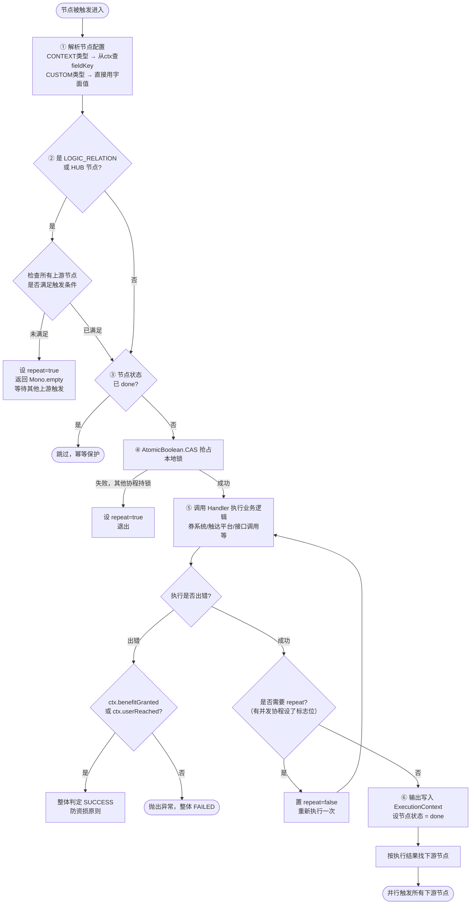
```mermaid
flowchart TD
    START([节点被触发进入]) --> A

    A["① 解析节点配置<br/>CONTEXT类型 → 从ctx查fieldKey<br/>CUSTOM类型 → 直接用字面值"] --> B

    B{"② 是 LOGIC_RELATION<br/>或 HUB 节点?"}

    B -->|是| C{"检查所有上游节点<br/>是否满足触发条件"}
    C -->|未满足| D["设 repeat=true<br/>返回 Mono.empty<br/>等待其他上游触发"]
    C -->|已满足| E

    B -->|否| E{"③ 节点状态<br/>已 done?"}
    E -->|是| F([跳过，幂等保护])
    E -->|否| G

    G["④ AtomicBoolean.CAS 抢占本地锁"]
    G -->|失败，其他协程持锁| H["设 repeat=true<br/>退出"]
    G -->|成功| I

    I["⑤ 调用 Handler 执行业务逻辑<br/>券系统/触达平台/接口调用等"] --> J

    J{"执行是否出错?"}
    J -->|出错| K{"ctx.benefitGranted<br/>或 ctx.userReached?"}
    K -->|是| L["整体判定 SUCCESS<br/>防资损原则"]
    K -->|否| M([抛出异常，整体 FAILED])

    J -->|成功| N{"是否需要 repeat?<br/>（有并发协程设了标志位）"}
    N -->|是| O["置 repeat=false<br/>重新执行一次"]
    O --> I
    N -->|否| P["⑥ 输出写入 ExecutionContext<br/>设节点状态 = done"]
    P --> Q["按执行结果找下游节点"]
    Q --> R([并行触发所有下游节点])
```

---

### 7.5 repeat 机制详解（并发保护核心）

**问题场景**：LOGIC_RELATION 节点（AND 条件）有 3 个上游节点，三个节点几乎同时完成，并发进入 LOGIC_RELATION。如果没有保护机制，节点可能被执行 3 次，导致重复发券。

**为什么不用普通的锁等待？** 在 Reactor 异步模型中，协程不绑定线程——协程 A 在等待时，底层线程可能被其他协程占用。如果 A 在锁上阻塞等待，会堵死整个线程池。所以不能用 `synchronized + wait`，只能用"快速失败 + 重试标记"的方案。

**repeat 机制的工作原理**：

每个节点维护两个状态：
- `waitProcess`：`AtomicBoolean`，初始值 `true`，CAS 操作抢锁
- 业务执行完后，检查 `waitProcess` 是否又被设为 `true`（表示有其他协程在等待）
- 如果是，再执行一次，处理其他协程带来的状态变更

关键点：**不管有多少个协程并发进来，只需要"最后一次状态"被处理**。只要保证最后一次执行能拿到最新的全局状态，所有中间状态都可以丢弃。

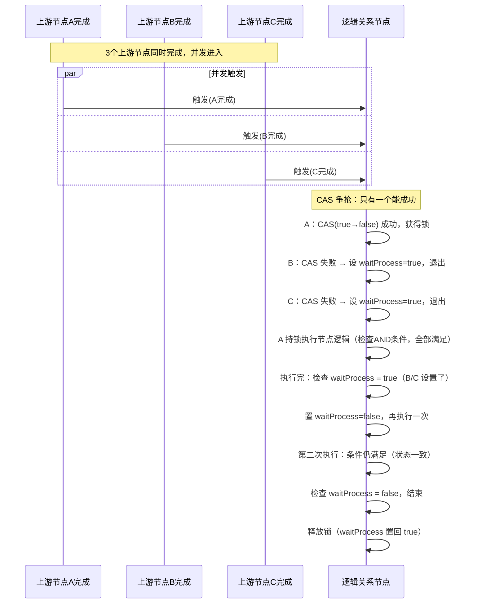
```mermaid
sequenceDiagram
    participant A as 上游节点A完成
    participant B as 上游节点B完成
    participant C as 上游节点C完成
    participant LR as 逻辑关系节点

    note over A,C: 3个上游节点同时完成，并发进入

    par 并发触发
        A->>LR: 触发(A完成)
    and
        B->>LR: 触发(B完成)
    and
        C->>LR: 触发(C完成)
    end

    note over LR: CAS 争抢：只有一个能成功
    LR->>LR: A：CAS(true→false) 成功，获得锁
    LR->>LR: B：CAS 失败 → 设 waitProcess=true，退出
    LR->>LR: C：CAS 失败 → 设 waitProcess=true，退出

    LR->>LR: A 持锁执行节点逻辑（检查AND条件，全部满足）
    LR->>LR: 执行完：检查 waitProcess = true（B/C 设置了）
    LR->>LR: 置 waitProcess=false，再执行一次
    LR->>LR: 第二次执行：条件仍满足（状态一致）
    LR->>LR: 检查 waitProcess = false，结束
    LR->>LR: 释放锁（waitProcess 置回 true）
```

**为什么"最多再执行一次"就够了？**

不管有多少个并发协程（B、C、D…），它们的作用只是"更新节点状态"。最后一个持锁的协程（A 的第二次执行）能看到所有协程写入后的最新状态，再执行一次就能正确处理所有并发的影响。

---

### 7.6 并发锁方案

画布执行涉及两类并发锁需求，用两种不同方案处理：

**本地锁（单实例内的并发协程）**

用 `AtomicBoolean.compareAndSet`。不依赖线程，适配 Reactor 协程可能跑在不同线程的特性。

**分布式锁（跨实例的并发）**

当同一个用户在同一时刻触发同一画布的多个实例（如多条 MQ 消息同时到达不同实例），需要分布式锁协调。

公司现有的分布式锁组件（lock-sedis）依赖 `threadId` 作为锁持有者标识——加锁时记录线程 ID，释放时验证线程 ID 是否匹配。但 Reactor 协程会在不同线程间切换，加锁时的线程 ID 和释放时可能不同，导致无法正常释放锁。

因此使用**原生 Redis setnx + 心跳续期**方案，用自定义 UUID 而非 threadId 标识锁持有者：
- 加锁：`SETNX lock:{key} {uuid}`，TTL 15s
- 续期：每 5s 刷新 TTL（**独立 ScheduledExecutorService 调度，不占用 Reactor 事件循环线程**）
- 释放：`DEL lock:{key}`，停止心跳
- **续期失败处理**：若续期时 Redis 不可达，TTL 将在 15s 内自然过期，锁自动释放（fail-fast，另一实例可接管）
- **宕机自动清理**：实例崩溃后心跳停止，TTL 15s 后锁自动失效，无需额外清理

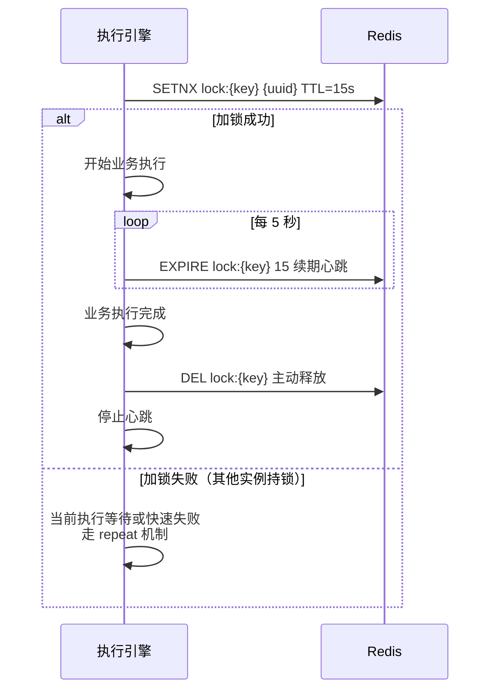
```mermaid
sequenceDiagram
    participant EE as 执行引擎
    participant Redis

    EE->>Redis: SETNX lock:{key} {uuid}  TTL=15s
    alt 加锁成功
        EE->>EE: 开始业务执行
        loop 每 5 秒
            EE->>Redis: EXPIRE lock:{key} 15  续期心跳
        end
        EE->>EE: 业务执行完成
        EE->>Redis: DEL lock:{key}  主动释放
        EE->>EE: 停止心跳
    else 加锁失败（其他实例持锁）
        EE->>EE: 当前执行等待或快速失败<br/>走 repeat 机制
    end
```

---

### 7.7 节点边界行为规范

以下场景在设计上容易产生歧义，明确定义各边界行为：

#### SELECTOR 无分支命中且未配置 else

条件选择器按顺序匹配每个分支，全部不命中时：
- 配置了 `elseNodeId` → 走 else 分支（正常）
- 没有配置 `elseNodeId` → **节点标记 SUCCESS，流程自然结束**，记录 WARN 日志

这是"本次不需要执行任何分支"的合法状态，不是错误。发布时前端展示提醒，不阻止发布。

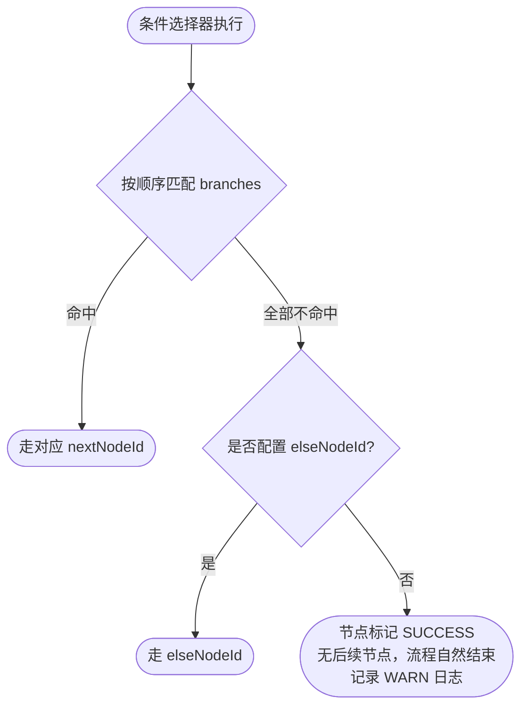
```mermaid
flowchart TD
    A([条件选择器执行]) --> B{按顺序匹配 branches}
    B -->|命中| C([走对应 nextNodeId])
    B -->|全部不命中| D{是否配置 elseNodeId?}
    D -->|是| E([走 elseNodeId])
    D -->|否| F([节点标记 SUCCESS<br/>无后续节点，流程自然结束<br/>记录 WARN 日志])
```

#### PRIORITY 所有分支都失败

优先级节点的语义是"尽力而为"——按顺序尝试每个子节点，第一个成功就停止。如果全部失败：
- 配置了 `nextNodeId` → **仍然走 nextNodeId**，节点标记 PARTIAL_FAIL，让后续节点决定如何处理
- 没有配置 `nextNodeId` → 节点标记 FAILED，触发防资损判定

#### LOGIC_RELATION 上游节点失败时的处理

LOGIC_RELATION 等待多个上游节点，若有上游节点失败：

| 关系类型 | 上游失败时的行为 |
|---------|--------------|
| **AND（且）** | 任意上游 FAILED → LOGIC_RELATION 立即标记 FAILED，不再等待其他上游，流程终止 |
| **OR（或）** | 某上游 FAILED 不影响等待，只要有任意一个上游 SUCCESS → LOGIC_RELATION 继续 |

AND 模式下"任意失败即终止"的原因：所有条件都要满足，一个失败说明整体条件不可能满足，继续等待无意义。

#### 两个节点输出相同的上下文字段 key

**不同执行层次（串行）**：后执行的节点覆盖先执行的（Last Writer Wins）。发布时警告，不阻止发布。

**同层并发节点**：覆盖顺序不可预测，**发布时阻止**（见 5.5 节）。

#### DIRECT_CALL 画布没有 DIRECT_RETURN 节点

执行引擎走完整个 DAG，到达叶子节点后返回空响应 `{}`，HTTP 状态 200。发布时展示提醒，不阻止发布（部分场景确实不需要返回值）。

#### Groovy 节点访问不存在的上下文字段

`input.xxx` 取到的值为 `null`，不抛出异常。Groovy 脚本自行判断 null 后处理；若脚本对 null 值做了不安全操作导致 NPE，节点执行失败，按重试策略处理。

#### 节点 SKIPPED 状态的触发条件

`canvas_execution_trace.status = 3（跳过）` 在以下情况写入：

| 场景 | 被跳过的节点 |
|------|------------|
| IF判断走 successNodeId | failNodeId 指向的分支下所有节点 |
| 条件选择器命中第一个分支 | 其他分支（否则如果/否则）指向的节点 |
| 优先级节点子节点1成功 | 子节点2、3... 及其后续 |
**写入机制**：执行完成后（SUCCESS 或 FAILED），引擎扫描 DAG 中所有节点，对从未进入 `nodeStatuses` 的节点批量写入 SKIPPED 记录。以下是典型的 SKIPPED 场景（举例，非穷举）：

| 场景 | 被跳过的节点 |
|------|------------|
| IF判断走 successNodeId | failNodeId 指向的分支下所有节点 |
| 条件选择器命中第一个分支 | 其他分支（否则如果/否则）指向的节点 |
| 优先级节点子节点1成功 | 子节点2、3... 及其后续 |
| LOGIC_RELATION AND模式，上游失败，整体 FAILED | nextNodeId 及所有后续节点（因流程已终止，从未进入执行队列） |

**本质**：SKIPPED = "执行结束时 nodeStatuses 中不存在该节点记录"。无论原因是分支未命中、优先级已满足还是流程终止，统一通过扫描发现，不需要节点执行逻辑主动写入。

---

## 八、触发机制

### 8.1 MQ 触发

#### MQ 消息格式规范（接入方契约）

外部系统发 MQ 消息触发画布时，消息体必须遵守以下格式，否则 `userId` 无法提取，画布无法执行：

```json
{
  "msgId":    "uuid-001",
  "userId":   "12345678",
  "timestamp": 1715000000000,
  "bizData": {
    "orderId":     "ORD_001",
    "orderStatus": "PAID",
    "amount":      "500.00"
  }
}
```

| 字段 | 类型 | 必填 | 说明 |
|------|------|------|------|
| `msgId` | String | 是 | 消息唯一 ID，用于幂等去重（dedup key 的组成部分） |
| `userId` | String | 是 | 触发用户 ID，画布执行的主体 |
| `timestamp` | Long | 是 | 消息产生时间（毫秒），用于日志和超时判断 |
| `bizData` | Object | 否 | 业务数据，全部写入 ExecutionContext 供下游节点引用 |

**`bizData` 中的字段名即为上下文 fieldKey**，可在 IF判断、Groovy、接口调用等节点中用"上下文获取"方式引用。

MQ 消息到达后，执行引擎通过路由表找到关联画布，逐个触发执行：

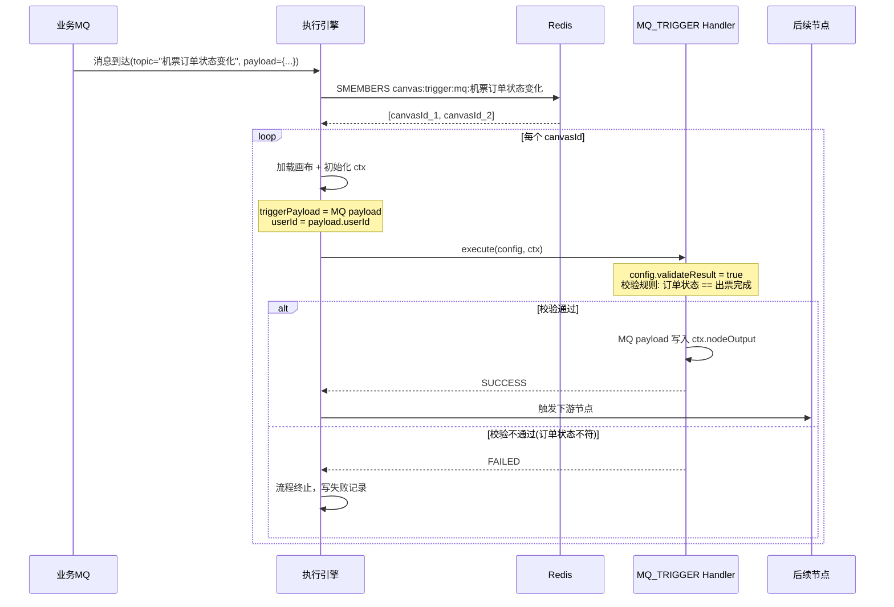
```mermaid
sequenceDiagram
    participant MQ as 业务MQ
    participant EE as 执行引擎
    participant Redis
    participant Handler as MQ_TRIGGER Handler
    participant Next as 后续节点

    MQ->>EE: 消息到达(topic="机票订单状态变化", payload={...})

    EE->>Redis: SMEMBERS canvas:trigger:mq:机票订单状态变化
    Redis-->>EE: [canvasId_1, canvasId_2]

    loop 每个 canvasId
        EE->>EE: 加载画布 + 初始化 ctx
        note over EE: triggerPayload = MQ payload<br>userId = payload.userId

        EE->>Handler: execute(config, ctx)
        note over Handler: config.validateResult = true<br>校验规则: 订单状态 == 出票完成

        alt 校验通过
            Handler->>Handler: MQ payload 写入 ctx.nodeOutput
            Handler-->>EE: SUCCESS
            EE->>Next: 触发下游节点
        else 校验不通过(订单状态不符)
            Handler-->>EE: FAILED
            EE->>EE: 流程终止，写失败记录
        end
    end
```

### 8.2 端内用户行为触发

行为事件由实时行为策略系统上报，引擎侧评估多策略组合条件：

#### 行为事件消息格式规范（接入方契约）

行为策略系统调用触发接口时，消息体必须遵守以下格式：

```json
{
  "eventCode":  "browse_flight",
  "userId":     "12345678",
  "timestamp":  1715000000000,
  "behaviorData": {
    "page":       "flight_main_flow",
    "duration":   20,
    "count":      1
  }
}
```

| 字段 | 类型 | 必填 | 说明 |
|------|------|------|------|
| `eventCode` | String | 是 | 行为事件标识，用于路由表查找（`canvas:trigger:behavior:{eventCode}`） |
| `userId` | String | 是 | 触发用户 ID |
| `timestamp` | Long | 是 | 事件产生时间（毫秒）|
| `behaviorData` | Object | 否 | 行为参数，写入 ExecutionContext 供 Handler 评估策略条件 |

**触发方式**：行为策略系统调用 `POST /canvas/trigger/behavior`，引擎侧做路由查找 + 策略评估。

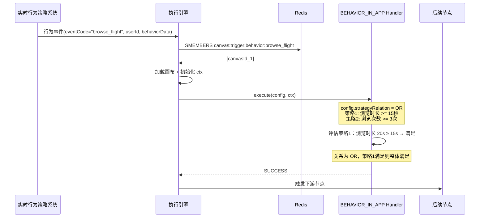
```mermaid
sequenceDiagram
    participant BS as 实时行为策略系统
    participant EE as 执行引擎
    participant Redis
    participant Handler as BEHAVIOR_IN_APP Handler
    participant Next as 后续节点

    BS->>EE: 行为事件(eventCode="browse_flight", userId, behaviorData)

    EE->>Redis: SMEMBERS canvas:trigger:behavior:browse_flight
    Redis-->>EE: [canvasId_1]

    EE->>EE: 加载画布 + 初始化 ctx
    EE->>Handler: execute(config, ctx)

    note over Handler: config.strategyRelation = OR<br>策略1: 浏览时长 >= 15秒<br>策略2: 浏览次数 >= 3次

    Handler->>Handler: 评估策略1：浏览时长 20s ≥ 15s → 满足
    note over Handler: 关系为 OR，策略1满足则整体满足

    Handler-->>EE: SUCCESS
    EE->>Next: 触发下游节点
```

**策略关系评估规则：**

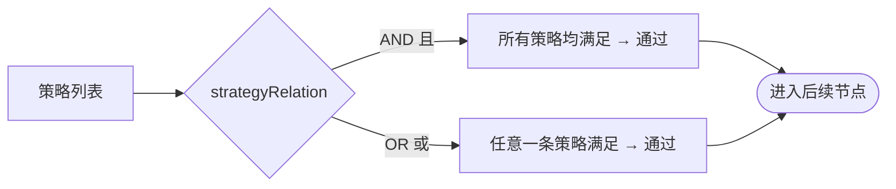
```mermaid
flowchart LR
    A[策略列表] --> B{strategyRelation}
    B -->|AND 且| C[所有策略均满足 → 通过]
    B -->|OR 或| D[任意一条策略满足 → 通过]
    C --> E([进入后续节点])
    D --> E
```

### 8.3 业务直调

业务方同步调用接口，引擎执行完整流程后将结果同步返回：

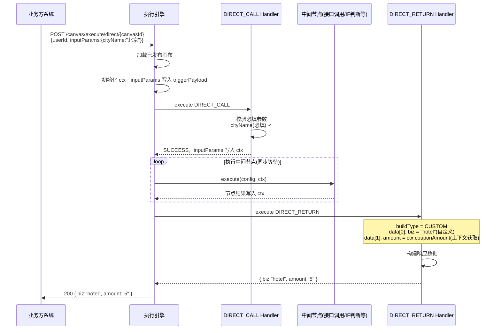
```mermaid
sequenceDiagram
    participant Caller as 业务方系统
    participant EE as 执行引擎
    participant Handler as DIRECT_CALL Handler
    participant Middle as 中间节点(接口调用/IF判断等)
    participant DR as DIRECT_RETURN Handler

    Caller->>EE: POST /canvas/execute/direct/{canvasId}<br>{userId, inputParams:{cityName:"北京"}}

    EE->>EE: 加载已发布画布
    EE->>EE: 初始化 ctx，inputParams 写入 triggerPayload

    EE->>Handler: execute DIRECT_CALL
    Handler->>Handler: 校验必填参数<br>cityName(必填) ✓
    Handler-->>EE: SUCCESS，inputParams 写入 ctx

    loop 执行中间节点(同步等待)
        EE->>Middle: execute(config, ctx)
        Middle-->>EE: 节点结果写入 ctx
    end

    EE->>DR: execute DIRECT_RETURN
    note over DR: buildType = CUSTOM<br>data[0]: biz = "hotel"(自定义)<br>data[1]: amount = ctx.couponAmount(上下文获取)

    DR->>DR: 构建响应数据
    DR-->>EE: { biz:"hotel", amount:"5" }

    EE-->>Caller: 200 { biz:"hotel", amount:"5" }
```

---

## 九、多阶段执行（暂停与恢复）

### 9.1 触发条件

当 LOGIC_RELATION 节点的多个上游触发器**来自不同时间点的独立 MQ 消息**时，先到的触发器无法让节点继续，流程进入挂起状态，等待其余触发器到达后再恢复。

典型场景：1小时内同时完成机票下单和酒店下单，才触发接送机推送。

### 9.2 完整挂起 / 恢复流程

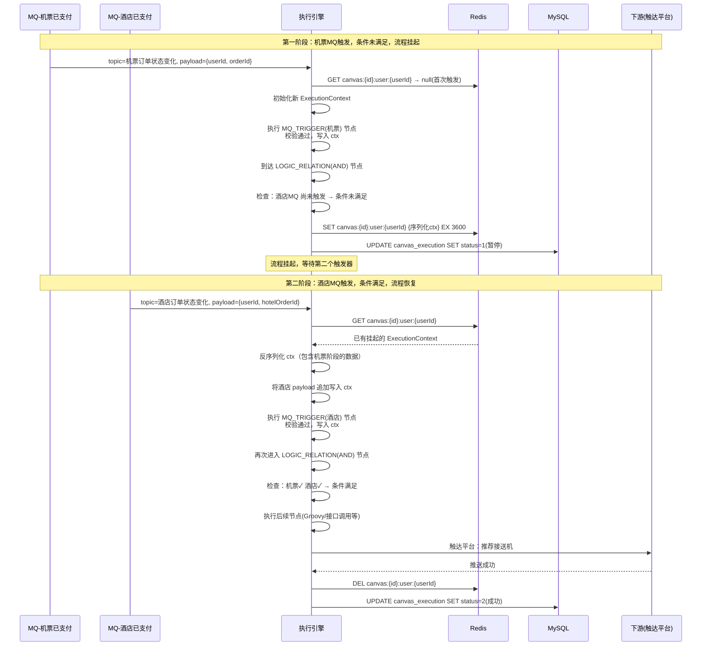
```mermaid
sequenceDiagram
    participant MQ_A as MQ-机票已支付
    participant MQ_B as MQ-酒店已支付
    participant EE as 执行引擎
    participant Redis
    participant MySQL
    participant DS as 下游(触达平台)

    note over MQ_A, DS: 第一阶段：机票MQ触发，条件未满足，流程挂起

    MQ_A->>EE: topic=机票订单状态变化, payload={userId, orderId}

    EE->>Redis: GET canvas:{id}:user:{userId} → null(首次触发)
    EE->>EE: 初始化新 ExecutionContext
    EE->>EE: 执行 MQ_TRIGGER(机票) 节点<br/>校验通过，写入 ctx
    EE->>EE: 到达 LOGIC_RELATION(AND) 节点
    EE->>EE: 检查：酒店MQ 尚未触发 → 条件未满足

    EE->>Redis: SET canvas:{id}:user:{userId} {序列化ctx} EX 3600
    EE->>MySQL: UPDATE canvas_execution SET status=1(暂停)
    note over EE: 流程挂起，等待第二个触发器

    note over MQ_A, DS: 第二阶段：酒店MQ触发，条件满足，流程恢复

    MQ_B->>EE: topic=酒店订单状态变化, payload={userId, hotelOrderId}

    EE->>Redis: GET canvas:{id}:user:{userId}
    Redis-->>EE: 已有挂起的 ExecutionContext

    EE->>EE: 反序列化 ctx（包含机票阶段的数据）
    EE->>EE: 将酒店 payload 追加写入 ctx
    EE->>EE: 执行 MQ_TRIGGER(酒店) 节点<br/>校验通过，写入 ctx
    EE->>EE: 再次进入 LOGIC_RELATION(AND) 节点
    EE->>EE: 检查：机票✓ 酒店✓ → 条件满足

    EE->>EE: 执行后续节点(Groovy/接口调用等)
    EE->>DS: 触达平台：推荐接送机
    DS-->>EE: 推送成功

    EE->>Redis: DEL canvas:{id}:user:{userId}
    EE->>MySQL: UPDATE canvas_execution SET status=2(成功)
```

### 9.3 Context Key 设计与超时

| 字段 | 值 | 说明 |
|------|----|------|
| Key | `canvas:{canvasId}:user:{userId}` | 同一用户同一画布唯一 |
| TTL | 按业务配置（如 3600s） | 超时后视为放弃，下次重新开始 |
| 超时处理 | 下次触发时 Redis 未命中 → 新建执行 | 不影响新流程 |

### 9.4 多阶段恢复的路由逻辑

**关键问题**：第二个触发信号（如酒店MQ）到达时，引擎如何知道该继续执行哪个节点？

**答案**：引擎不需要"找到暂停的节点"——它直接执行对应的触发器节点，触发器写入 ctx 后，LOGIC_RELATION 自己会检查是否所有条件已满足。

```
酒店 MQ 到达时的完整处理流程：

1. 引擎查路由：SMEMBERS canvas:trigger:mq:hotel_order_paid
   → 找到 [canvasId_1]

2. 对每个 canvasId：
   a. 查 Redis：GET canvas:{canvasId}:user:{userId}
   b. 存在挂起 ctx → 反序列化，追加本次 payload
      不存在 → 全新执行（用户第一次触发，跳过步骤3）

3. 找到 hotel_MQ_TRIGGER 节点（topicKey="hotel_order_paid"）
   执行该触发器节点 → 校验消息格式 → 写入 ctx.nodeOutputs

4. HOTEL_MQ_TRIGGER 的 nextNodeId 是 LOGIC_RELATION 节点
   执行 LOGIC_RELATION 节点

5. LOGIC_RELATION（AND）检查：
   - FLIGHT_MQ_TRIGGER: ctx.nodeStatuses["node_A"] == SUCCESS ✅（第一次触发时已标记）
   - HOTEL_MQ_TRIGGER:  ctx.nodeStatuses["node_B"] == SUCCESS ✅（刚刚执行）
   - 所有上游满足 → 继续执行后续节点

6. 执行后续节点，完成后 DEL Redis ctx
```

**关键依赖**：第一次触发时，`FLIGHT_MQ_TRIGGER` 节点的状态已经被写入 ctx 并持久化到 Redis。第二次触发时恢复 ctx，LOGIC_RELATION 能看到两个触发器都已成功。

**同一画布有多个 LOGIC_RELATION 等待不同条件时**：

```
画布结构：
  MQ_A → LOGIC_RELATION_1（等待 MQ_A + MQ_B）→ 节点X
  MQ_C → LOGIC_RELATION_2（等待 MQ_C + MQ_D）→ 节点Y

MQ_B 到达时：
  1. 执行 MQ_B 触发器节点 → 写入 ctx
  2. MQ_B 的 nextNodeId = LOGIC_RELATION_1
  3. LOGIC_RELATION_1 检查：MQ_A ✅ MQ_B ✅ → 继续执行节点X
  4. LOGIC_RELATION_2 不会被触发（MQ_B 不连向它）

路由完全由 DAG 连线决定，不需要引擎做额外判断。
```

### 9.5 多实例恢复的并发协调

**场景**：同一条酒店 MQ 消息被两个执行引擎实例同时消费（消息重投或 MQ 消费组分配问题），两个实例都尝试恢复同一个用户的挂起执行。

**方案：恢复操作加"恢复锁"**

在第九章已有的上下文 Key 基础上，增加一个专用的恢复锁：

```
恢复锁 Key = canvas:resume-lock:{canvasId}:{userId}
TTL         = 全局执行 timeout（默认 600s）
Value       = {instanceId}（哪个实例持锁）
```

```
触发信号到达，ctx 存在（说明是恢复场景）时：

实例 A：
  SETNX canvas:resume-lock:{canvasId}:{userId} {instanceA-uuid}  TTL=600s
  → 成功 → 加载 ctx，继续执行
  → 执行完成后 DEL resume-lock

实例 B（几乎同时）：
  SETNX canvas:resume-lock:{canvasId}:{userId} {instanceB-uuid}  TTL=600s
  → 失败（A 已持锁）→ 跳过，记录日志
  → 该消息被 A 处理，B 直接 ACK 丢弃
```

**与幂等 dedup key 的区别**：

| | dedup key | resume-lock |
|---|---|---|
| 目的 | 防止同一消息触发两次全新执行 | 防止两个实例同时恢复同一挂起执行 |
| TTL | 24h | 等于全局执行 timeout |
| 释放时机 | 不主动删除，TTL 到期 | 执行完成后主动 DEL |

**ctx 不存在（首次触发）时**：走幂等 dedup key 逻辑，不需要恢复锁。

### 9.6 dedup key 与 ctx 的查询优先级

**场景**：画布处于挂起状态时，同一触发信号被重复投递（MQ At-Least-Once 特性）。

**查询顺序（dedup key 优先）**：

```
MQ 消息到达：
  1. 先查 dedup key：
     GET canvas:dedup:{canvasId}:{userId}:{msgId}
     命中 → 已处理过，直接 ACK 丢弃（不论 ctx 是否存在）
     未命中 → 继续

  2. 写入 dedup key（SETNX 原子占位，此步成功即代表"我们负责处理"）：
     SETNX canvas:dedup:{canvasId}:{userId}:{msgId}  TTL=24h

  3. 再查 ctx：
     GET canvas:{canvasId}:user:{userId}
     存在 → 恢复执行（加 resume-lock）
     不存在 → 全新执行
```

**原子性说明**：步骤2和步骤3不需要合并为原子操作。SETNX 本身是原子的；步骤2成功后若在步骤3前崩溃，下次重投时 dedup 命中直接丢弃，这是正确行为（宁可少处理一次，不重复处理）。

**为什么 dedup key 优先**：防止"挂起中的重复消息触发额外恢复"。dedup 命中说明这条消息已经被处理过（无论当时是新执行还是恢复），不应再次响应。

**恢复锁 Key 粒度说明**：`canvas:resume-lock:{canvasId}:{userId}` 与 ctx Key 一一对应。同一用户同一画布同一时刻只有一个挂起状态（一个 ctx），锁用 `canvasId:userId` 粒度而非 `executionId` 是正确的——不存在两个不同 executionId 都在挂起等待同一 canvas 的情况（第二次触发要么 dedup 拦截，要么开启新执行）。

### 9.8 僵尸 ctx 清理机制

**场景**：第二个触发信号（如酒店MQ）到达，Instance A 成功执行 SETNX dedup key，但在获取 resume-lock 之前崩溃。此时：

- ctx 仍在 Redis（PAUSED 状态）
- dedup key 存在（TTL 24h）
- 下次 MQ 重投时 dedup 命中 → 直接丢弃
- 结果：ctx 永远无法被恢复，执行"僵尸化"

**解决方案：canvas_execution 记录 dedup key + Watchdog 清理**

```sql
-- 新增字段，记录当前占用的 dedup key（用于 Watchdog 清理）
ALTER TABLE canvas_execution
  ADD COLUMN last_dedup_key VARCHAR(200) COMMENT '最近一次占用的 dedup key，格式: canvas:dedup:{canvasId}:{userId}:{msgId}';
```

**设置 dedup 后记录到 DB：**

```java
// 第二个触发信号到达，SETNX dedup 成功后
boolean acquired = redisTemplate.opsForValue()
    .setIfAbsent(dedupKey, instanceId, 24, TimeUnit.HOURS);
if (acquired) {
    // 写入 DB，供 Watchdog 发现僵尸时清理
    canvasExecutionRepo.updateLastDedupKey(executionId, dedupKey);
    // 继续执行恢复逻辑...
}
```

**Watchdog 僵尸清理（在已有 30s 扫描中增加）：**

```
扫描条件：
  canvas_execution.status = PAUSED
  AND last_dedup_key IS NOT NULL
  AND updated_at < now - 10min（说明 dedup 设置后超过 10 分钟没有进展）

对每条记录：
  1. DEL {last_dedup_key}（清除 dedup，允许 MQ 再次投递）
  2. UPDATE last_dedup_key = NULL（重置，避免重复清理）
  3. 记录告警日志：僵尸 ctx 已清理，等待 MQ 重投
```

**MQ 重投后的处理**：
- dedup key 已被清除 → 重投消息通过 dedup 检查
- ctx 仍在 Redis → 恢复执行
- 本次引擎实例正常 → 顺利完成

**10 分钟阈值的选择**：resume-lock 加锁到执行完成通常 < 1 分钟，10 分钟足够区分"正常恢复中"和"僵尸"。

阈值配置（Nacos）：`canvas.watchdog.zombie-resume-threshold-min`，默认 10，建议设置为 `max(10, globalTimeoutSec / 60 + 5)`，确保不会误杀正在执行中的长耗时恢复。

**僵尸 dedup 的兜底方案（SETNX 后崩溃、updateLastDedupKey 未写入 DB）**：

若实例在 SETNX dedup 成功但 `updateLastDedupKey` 未写入 DB 前崩溃，Watchdog 无法通过 last_dedup_key 找到该 dedup key。兜底方案：

```
MQ 触发的 dedup key TTL 策略：
  - 首次触发（全新执行）：TTL = 24h（防止同一消息重复触发新执行）
  - 第二触发（恢复场景）：TTL = 执行超时时间 + 10min（约 620s）
    → 即使崩溃，最多 620s 后 dedup 自动过期
    → MQ 重投时 dedup 不存在，正常恢复
```

如何区分"首次"和"恢复"：SETNX 时检查 ctx 是否存在：
- ctx 不存在（首次） → dedup TTL = 24h
- ctx 存在（恢复）   → dedup TTL = globalTimeout + 600s（约10分钟）

```java
Duration dedupTtl = ctxExists
    ? Duration.ofSeconds(globalTimeoutSec + 600)  // 恢复场景：短TTL
    : Duration.ofHours(24);                        // 首次场景：长TTL
redisTemplate.opsForValue().setIfAbsent(dedupKey, instanceId, dedupTtl);
```

### 9.7 超长挂起期间的防重保证

**场景**：画布挂起（第一次触发已发券），50 分钟后第二个触发器到来，继续执行后续节点。

**`benefitGranted` 随 ctx 持久化**：第一次触发时，COUPON 节点成功后 `ctx.benefitGranted = true`，整个 ctx（含该标志位）序列化存入 Redis。50 分钟后恢复时，ctx 中 `benefitGranted` 依然是 `true`，引擎不会重发券。

```
第一次触发（机票MQ）：
  COUPON 节点执行成功 → ctx.benefitGranted = true
  到达 LOGIC_RELATION，条件未满足 → 挂起
  序列化 ctx（含 benefitGranted=true）→ Redis

50 分钟后（酒店MQ到达）：
  恢复 ctx → benefitGranted 仍为 true
  继续执行后续节点（触达平台等）
  即使触达失败：benefitGranted=true → 整体 SUCCESS，不重试发券
```

**极端情况**：若第一次触发时，COUPON 执行完但 ctx 还未写入 Redis 就崩溃了：
- ctx 不存在 → 第二次触发视为全新执行
- 重新执行 COUPON 节点，携带相同 idempotencyKey（`{executionId}:{nodeId}`）
- 券系统幂等保护，不会重复发券

---

## 十、执行结果判定

原则（来自原文）：

> 只要给用户发放了权益或者触达了用户，即使最后节点执行失败，也应当认定为执行成功。

### 判定流程

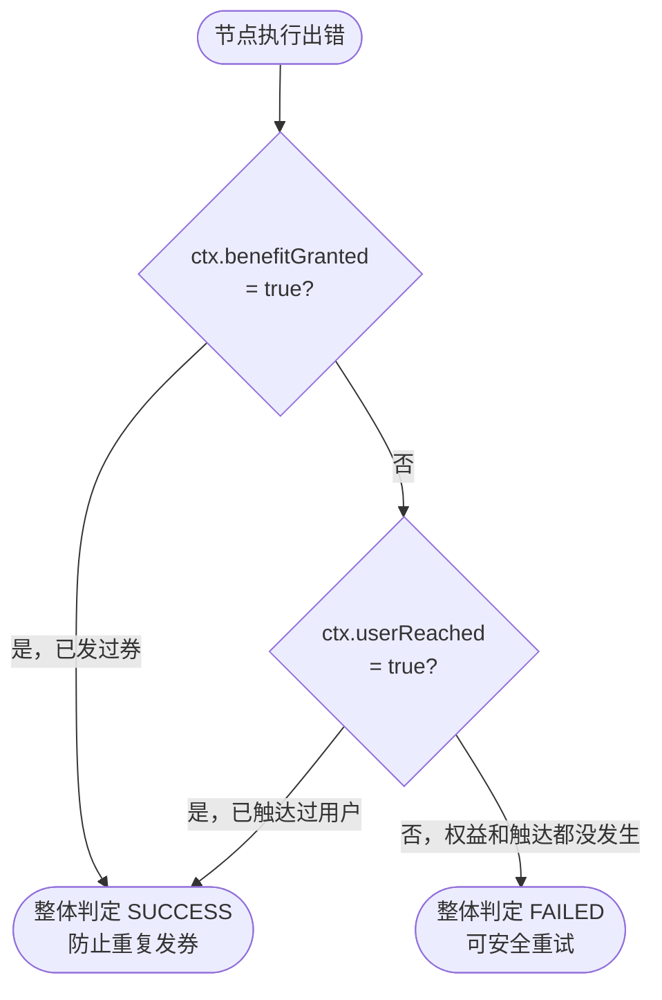
```mermaid
flowchart TD
    A([节点执行出错]) --> B{ctx.benefitGranted<br/>= true?}
    B -->|是，已发过券| C([整体判定 SUCCESS<br/>防止重复发券])
    B -->|否| D{ctx.userReached<br/>= true?}
    D -->|是，已触达过用户| C
    D -->|否，权益和触达都没发生| E([整体判定 FAILED<br/>可安全重试])
```

### 标志位写入时机

```mermaid
flowchart LR
    A[COUPON 节点执行成功] -->|发券成功| B[ctx.benefitGranted = true]
    C[IN_APP_NOTIFY 节点执行成功] -->|MQTT推送成功| D[ctx.userReached = true]
    E[REACH_PLATFORM 节点执行成功] -->|触达平台响应成功| D
```

**benefitGranted 是全局标志位（非按节点级别）**

`benefitGranted` 是整个 ExecutionContext 的全局布尔值，不区分是哪个 COUPON 节点触发的。

**设计决策**：若画布有两个 COUPON 节点（节点A和节点B），节点A成功、节点B失败：

```
节点A 执行成功 → benefitGranted = true
节点B 执行失败
  → ctx.benefitGranted = true → 整体判定 SUCCESS
  → 节点B 标记 FAILED，不重试
  → 损失：节点B 的券未发出，但保护：节点A 的券不会因重试而重复发出
```

**原则**：宁可少发一张券（节点B 未发），也不能因整体重试导致节点A 的券重复发出。少发是"可接受的损失"，重复发是"不可接受的资损"。

### 防资损完整判定算法

**核心原则**：`benefitGranted` / `userReached` 标志位**只在收到下游系统的明确成功响应时**才设置为 true。

```
COUPON Handler 执行流程（防资损算法）：

1. 构建发券请求，携带幂等 key：
   idempotencyKey = "{executionId}:{nodeId}"
   （同一执行的同一节点，重试时 key 不变，券系统不会重复发）

2. 调用券系统 API
   ├─ 收到明确成功响应（HTTP 200 + 业务状态=SUCCESS）
   │    → ctx.benefitGranted = true
   │    → 节点标记 SUCCESS，继续后续节点
   │
   ├─ 收到明确失败响应（HTTP 4xx 或业务状态=FAILED）
   │    → 视为券未发出（券系统做了幂等检查，返回失败即真实失败）
   │    → 节点标记 FAILED，走 RetryableException 判断
   │    → 若属于不可重试错误（用户不符合资格等）→ 直接失败
   │
   └─ 超时 / 网络不可达 / 5xx
        → 不知道是否发出，按"保守策略"处理：
        → 抛 RetryableException，触发重试
        → 重试时 idempotencyKey 不变，券系统幂等保护
        → maxRetry 耗尽仍失败 → 节点 FAILED，benefitGranted = false
        → 进入 DLQ，人工介入核查

关键：重试安全性由券系统的幂等保证，而不是由画布引擎保证。
```

**防资损与重试的协作：**

```
节点执行出错时：
  if (ctx.benefitGranted || ctx.userReached)：
    → 整体 SUCCESS（已发出，不能重试，避免重复）
  else：
    → 走正常重试策略
    → 重试耗尽后整体 FAILED（可安全重试整次执行）
```

**下游系统不可达且超过 maxRetry：**

此时无法确认是否已发券，进入 DLQ，由运营人员：
1. 查询券系统确认该用户是否已持有该券
2. 若已持有 → 标记该执行为 SUCCESS（手动）
3. 若未持有 → 通过 DLQ 重放触发重新执行

### 多权益节点场景的已知限制

**`benefitGranted` 是全局标志位**，在画布包含多个权益节点（如同时发代金券 + 里程）时，存在以下已知限制：

```
画布：IF判断 → 发代金券（节点A）→ 发里程（节点B）→ 触达平台

执行结果：
  节点A（代金券）成功 → benefitGranted = true
  节点B（里程）失败
  → 整体判定 SUCCESS（因 benefitGranted=true）
  → 节点B 的里程未发，且不会自动重试
```

**为什么这样设计**：防止重试整个执行导致节点A 的代金券被重复发放。宁可里程少发一次，不能代金券重复发。

**此限制在以下场景下可接受：**
- 画布只有一种权益类型（只有代金券，或只有里程）
- 多种权益中，某一种失败可以接受（营销活动容忍部分损失）

**此限制在以下场景下需要额外处理：**
- 多种权益都是关键的，必须全部发放才算成功

**推荐的处理方式（两种）：**

方案一：**拆分为多个独立画布**，每个画布只负责一种权益。各画布独立触发、独立防资损。

方案二：**DLQ 补偿**。在节点B 失败进入 DLQ 后，人工或自动识别"节点B 未发但整体已 SUCCESS"的执行记录，单独重发里程：
```sql
-- 查找整体 SUCCESS 但节点B FAILED 的执行
SELECT e.id, t.node_id
FROM canvas_execution e
JOIN canvas_execution_trace t ON t.execution_id = e.id
WHERE e.status = 2           -- SUCCESS
  AND t.node_id = 'node_B'
  AND t.status = 2;          -- FAILED
```

**运营侧配置建议**：若业务方要求"所有权益必须发放才算成功"，应在画布设计时使用单一权益节点，通过接口调用（API_CALL）在单个 Handler 内完成多种权益的原子发放，而非在画布层面串联多个权益节点。

---

## 十一、前端设计（ReactFlow）

> xflow（@antv/xflow）已于 2021 年停止维护，本章改用 **ReactFlow（@xyflow/react）**。
> ReactFlow API 来自官方文档核实：https://reactflow.dev

### 11.1 技术选型

| 技术 | 说明 | 来源 |
|------|------|------|
| `@xyflow/react` | 画布框架，36.5k stars，活跃维护 | 替代已停维护的 xflow |
| `@dagrejs/dagre` | 自动布局算法（Dagre） | ReactFlow 官方推荐搭配 |
| React | UI 框架 | — |
| antd | 组件库（配置面板表单） | — |

```bash
npm install @xyflow/react @dagrejs/dagre
```

---

### 11.2 先说清楚：ReactFlow 是什么，不是什么

**ReactFlow 提供**：画布容器、节点/边渲染、拖拽、连线、缩放、选中事件。

**ReactFlow 不提供**：左侧节点面板、右侧配置表单、保存/加载逻辑——这些全部由我们自己开发。

---

### 11.3 整体页面结构

```mermaid
graph TB
    subgraph Page["页面整体布局"]
        TOP["顶部工具栏：画布名称 / 保存 / 发布 / 版本历史 / 整理布局"]

        subgraph MAIN["主体区域（三栏）"]
            direction LR
            LEFT["左侧节点面板（我们开发）<br/>按类别分组展示节点类型<br/>HTML5 draggable 拖拽"]
            CENTER["画布区域（ReactFlow 提供）<br/>节点渲染 / 连线 / 缩放"]
            RIGHT["右侧配置面板（我们开发）<br/>点击节点后展开<br/>antd Form 渲染表单"]
        end

        TOP --> MAIN
    end
```

---

### 11.4 ReactFlow 数据结构（官方 API）

```typescript
// 来源：@xyflow/react 官方类型定义

// 节点
interface Node<T = Record<string, unknown>> {
  id: string
  type?: string          // 对应 nodeTypes 中注册的 key
  position: { x: number; y: number }
  data: T                // 自定义业务数据
  selected?: boolean
}

// 边
interface Edge {
  id: string
  source: string         // 源节点 ID
  target: string         // 目标节点 ID
  sourceHandle?: string
  targetHandle?: string
  label?: string         // 边标签（success / fail / else 等分支标识）
}
```

我们在 `Node.data` 中存储业务字段：

```typescript
interface CanvasNodeData {
  nodeType: string                 // MQ_TRIGGER / IF_CONDITION 等
  name: string                     // 节点名称（运营填写）
  category: string                 // 类别（用于颜色）
  bizConfig: Record<string, any>   // 各节点专属业务配置（含 nextNodeId 等）
}
```

---

### 11.5 扩展点一：自定义节点外观（我们开发）

ReactFlow 通过 `nodeTypes` 对象将 `type` 字符串映射到 React 组件：

```tsx
// 1. 实现节点卡片 React 组件
import { Handle, Position } from '@xyflow/react'

const CanvasNode = ({ data }: { data: CanvasNodeData }) => (
  <div className={`canvas-node canvas-node--${data.category}`}>
    <div className="canvas-node__header">
      {NODE_TYPE_LABELS[data.nodeType]}
    </div>
    <div className="canvas-node__body">{data.name}</div>
    {/* ReactFlow 的连接桩组件 */}
    <Handle type="target" position={Position.Top} />
    <Handle type="source" position={Position.Bottom} />
  </div>
)

// 2. 注册（必须定义在组件外部，避免每次渲染重新创建）
const nodeTypes = { canvasNode: CanvasNode }

// 3. 传给 ReactFlow
<ReactFlow nodeTypes={nodeTypes} ... />

// 4. 节点数据中指定 type
const node: Node<CanvasNodeData> = {
  id: 'n1',
  type: 'canvasNode',      // 与 nodeTypes 的 key 对应
  position: { x: 100, y: 200 },
  data: { nodeType: 'MQ_TRIGGER', name: '机票订单支付', category: 'behavior', bizConfig: {} }
}
```

**节点颜色规范（基于截图观察）：**

| 类别 | CSS 类 | 顶部背景色 |
|------|--------|-----------|
| 行为策略 | `canvas-node--behavior` | 蓝绿渐变 |
| 逻辑分支 | `canvas-node--logic` | 蓝色 |
| 人群圈选 | `canvas-node--audience` | 橙色 |
| 权益发放 | `canvas-node--benefit` | 红粉渐变 |
| 用户触达 | `canvas-node--reach` | 橙黄色 |
| 其他 | `canvas-node--other` | 蓝色 |

---

### 11.6 扩展点二：左侧节点面板（我们开发）

ReactFlow 没有内置节点面板，使用 HTML5 原生拖拽实现：

```tsx
// 左侧面板：每个节点类型是可拖拽的 div
const NodePanelItem = ({ nodeType, label }) => (
  <div
    draggable
    onDragStart={(e) => {
      e.dataTransfer.setData('application/canvas-node', nodeType)
      e.dataTransfer.effectAllowed = 'move'
    }}
    className="node-panel-item"
  >
    {label}
  </div>
)

// 画布区域处理 drop
const onDragOver = (e) => {
  e.preventDefault()
  e.dataTransfer.dropEffect = 'move'
}

const onDrop = (e) => {
  e.preventDefault()
  const nodeType = e.dataTransfer.getData('application/canvas-node')
  if (!nodeType) return

  // screenToFlowPosition：屏幕坐标 → 画布坐标（ReactFlow 官方 API）
  const position = screenToFlowPosition({ x: e.clientX, y: e.clientY })

  const newNode = {
    id: crypto.randomUUID(),
    type: 'canvasNode',
    position,
    data: {
      nodeType,
      name: NODE_DEFAULT_NAMES[nodeType],
      category: NODE_CATEGORIES[nodeType],
      bizConfig: {},
    },
  }
  setNodes((prev) => [...prev, newNode])
  setSelectedNodeId(newNode.id)   // 拖入后自动打开配置面板
}

// 面板数据从注册表动态加载
const nodeGroups = await fetch('/meta/node-types').then(r => r.json())
```

---

### 11.7 扩展点三：右侧配置面板（我们开发）

ReactFlow 没有内置配置面板，用 antd Form 动态渲染：

```tsx
// 点击节点时记录选中 ID
const onNodeClick = useCallback((_evt, node) => {
  setSelectedNodeId(node.id)
}, [])

// 右侧面板组件
const ConfigPanel = ({ nodeId }) => {
  const node = nodes.find(n => n.id === nodeId)
  const [schema, setSchema] = useState(null)

  useEffect(() => {
    if (!node) return
    fetch(`/meta/node-types/${node.data.nodeType}/schema`)
      .then(r => r.json())
      .then(setSchema)
  }, [node?.data.nodeType])

  if (!schema) return null

  return (
    <Form
      initialValues={node.data.bizConfig}
      onValuesChange={(changed) => {
        // 实时更新节点的 bizConfig
        setNodes(prev => prev.map(n =>
          n.id === nodeId
            ? { ...n, data: { ...n.data, bizConfig: { ...n.data.bizConfig, ...changed } } }
            : n
        ))
      }}
    >
      <Form.Item name="name" label="节点名称" rules={[{ required: true }]}>
        <Input />
      </Form.Item>
      {schema.fields.map(field => (
        <Form.Item key={field.key} name={field.key} label={field.label} rules={field.required ? [{ required: true }] : []}>
          {renderControl(field)}
        </Form.Item>
      ))}
    </Form>
  )
}
```

#### 11.7.1 后端 schema type → antd 表单控件映射

| 后端 type | antd / 自定义控件 | 说明 |
|---------|----------------|------|
| `input` | `<Input />` | 普通文本 |
| `number` | `<InputNumber />` | 数字 |
| `select` | `<Select />` | 单选下拉 |
| `toggle` | `<Switch />` | 开关 |
| `value-input` | `<ValueInput />` 自定义 | CUSTOM/CONTEXT 双模式 |
| `condition-rule-list` | `<ConditionRuleList />` 自定义 | 条件规则列表 |
| `param-list` | `<ParamList />` 自定义 | 参数列表 |
| `code-editor` | `<CodeMirror />` | Groovy 代码编辑器 |
| `node-selector` | `<NodeSelector />` 自定义 | 下步节点选择器 |

未知 type 降级为 `<Input />`。

---

### 11.8 扩展点四：画布数据的保存与加载（我们开发）

> **坐标存储策略**：节点 x/y 坐标**内嵌在 graph_json** 每个节点对象中，随画布草稿一起存入 DB，不使用 localStorage。理由：多端/多浏览器打开同一画布时坐标保持一致，且无需额外的持久化机制。

**graph_json 节点格式（含坐标）：**

```json
{
  "id": "node_001",
  "type": "MQ_TRIGGER",
  "name": "机票订单支付",
  "x": 120,
  "y": 80,
  "config": { "topicKey": "flight_order_status_change", "nextNodeId": "node_002" }
}
```

```tsx
const { getNodes, getEdges, setNodes, setEdges, screenToFlowPosition } = useReactFlow()

// 保存：坐标内嵌 graph_json，一起存后端
const saveCanvas = async () => {
  const nodes = getNodes()
  const backendNodes = nodes.map(n => ({
    id: n.id,
    type: n.data.nodeType,
    name: n.data.name,
    x: Math.round(n.position.x),   // 坐标内嵌，换端打开保持一致
    y: Math.round(n.position.y),
    config: n.data.bizConfig,
  }))
  await fetch(`/canvas/${canvasId}`, {
    method: 'PUT',
    body: JSON.stringify({ nodes: backendNodes }),
  })
}

// 加载：直接从 graph_json 读坐标，无需 localStorage
const loadCanvas = async () => {
  const { nodes: backendNodes } = await fetch(`/canvas/${canvasId}`).then(r => r.json())

  const rfNodes = backendNodes.map(n => ({
    id: n.id,
    type: 'canvasNode',
    position: { x: n.x ?? 0, y: n.y ?? 0 },  // 优先用存储坐标，新节点降级为 (0,0) 后自动布局
    data: { nodeType: n.type, name: n.name, category: NODE_CATEGORIES[n.type], bizConfig: n.config },
  }))
  const rfEdges = deriveEdgesFromNodes(backendNodes)
  setNodes(rfNodes)
  setEdges(rfEdges)
}

// 从后端节点 config 推导 ReactFlow edges
function deriveEdgesFromNodes(nodes) {
  const edges = []
  nodes.forEach(n => {
    const c = n.config
    const add = (target, label) => {
      if (!target) return
      edges.push({ id: crypto.randomUUID(), source: n.id, target, label })
    }
    add(c.nextNodeId)
    add(c.successNodeId, 'success')
    add(c.failNodeId,    'fail')
    add(c.elseNodeId,    'else')
    c.branches?.forEach(b => add(b.nextNodeId, b.label))
    c.priorities?.forEach(p => add(p.nextNodeId))
    c.groups?.forEach(g => add(g.nextNodeId, g.group))
  })
  return edges
}
```

---

### 11.9 事件处理

ReactFlow 通过 props 回调处理所有画布事件：

```tsx
<ReactFlow
  nodes={nodes}
  edges={edges}
  nodeTypes={nodeTypes}
  onNodesChange={onNodesChange}   // 节点移动/删除（useNodesState 提供）
  onEdgesChange={onEdgesChange}   // 边变更（useEdgesState 提供）
  onConnect={onConnect}           // 用户拖拽连线时触发
  onNodeClick={onNodeClick}       // 点击节点 → 打开右侧配置面板
  onDrop={onDrop}                 // 从左侧面板拖入节点
  onDragOver={onDragOver}
  isValidConnection={isValidConnection}  // 连线合法性校验
  fitView
/>
```

**连线时同步 bizConfig（按 sourceHandle 分发）：**

不同节点类型有不同的出边语义，需要根据 `connection.sourceHandle` 判断更新哪个 bizConfig 字段：

| 节点类型 | sourceHandle 值 | 更新的 bizConfig 字段 |
|---------|----------------|----------------------|
| 普通节点（DELAY/GROOVY/COUPON 等） | `default` | `nextNodeId` |
| IF_CONDITION | `success` | `successNodeId` |
| IF_CONDITION | `fail` | `failNodeId` |
| SELECTOR | `branch-{index}` | `branches[index].nextNodeId` |
| SELECTOR | `else` | `elseNodeId` |
| PRIORITY | `priority-{index}` | `priorities[index].nextNodeId` |
| AB_SPLIT | `group-{groupKey}` | `groups[index].nextNodeId`（按 groupKey 查找） |
| LOGIC_RELATION / HUB | `default` | `nextNodeId` |

**Handle 命名约定**（节点卡片 React 组件中声明）：

```tsx
// IF_CONDITION 节点的两个出口 Handle
<Handle type="source" position={Position.Bottom} id="success" style={{ left: '30%' }} />
<Handle type="source" position={Position.Bottom} id="fail"    style={{ left: '70%' }} />

// SELECTOR 节点（分支数量动态，基于 bizConfig.branches 渲染）
{branches.map((b, i) => (
  <Handle key={i} type="source" position={Position.Bottom}
    id={`branch-${i}`} style={{ left: `${(i+1)/(branches.length+1)*100}%` }} />
))}
<Handle type="source" position={Position.Bottom} id="else" style={{ right: 0 }} />
```

**`onConnect` 完整实现：**

```tsx
const onConnect = useCallback((connection: Connection) => {
  const { source, sourceHandle, target } = connection
  setNodes(prev => prev.map(n => {
    if (n.id !== source) return n
    const cfg = { ...n.data.bizConfig }
    if (sourceHandle === 'success')       cfg.successNodeId = target
    else if (sourceHandle === 'fail')     cfg.failNodeId    = target
    else if (sourceHandle === 'else')     cfg.elseNodeId    = target
    else if (sourceHandle?.startsWith('branch-')) {
      const idx = parseInt(sourceHandle.split('-')[1])
      cfg.branches = cfg.branches?.map((b: Branch, i: number) =>
        i === idx ? { ...b, nextNodeId: target } : b
      )
    } else if (sourceHandle?.startsWith('priority-')) {
      const idx = parseInt(sourceHandle.split('-')[1])
      cfg.priorities = cfg.priorities?.map((p: Priority, i: number) =>
        i === idx ? { ...p, nextNodeId: target } : p
      )
    } else if (sourceHandle?.startsWith('group-')) {
      const key = sourceHandle.replace('group-', '')
      cfg.groups = cfg.groups?.map((g: Group) =>
        g.groupKey === key ? { ...g, nextNodeId: target } : g
      )
    } else {
      cfg.nextNodeId = target  // 普通节点
    }
    return { ...n, data: { ...n.data, bizConfig: cfg } }
  }))
  setEdges(prev => addEdge(connection, prev))
}, [setNodes, setEdges])
```

**节点删除时清理 bizConfig 引用：**

当节点被删除时，其他节点 bizConfig 中引用它的 ID 需要清空（否则保存到后端后 DAG 校验会报错）：

```tsx
const onNodesDelete = useCallback((deletedNodes: Node[]) => {
  const deletedIds = new Set(deletedNodes.map(n => n.id))
  setNodes(prev => prev.map(n => ({
    ...n,
    data: {
      ...n.data,
      bizConfig: cleanBizConfigRefs(n.data.bizConfig, deletedIds)
    }
  })))
}, [setNodes])

function cleanBizConfigRefs(cfg: Record<string, any>, deletedIds: Set<string>) {
  const clean = (val: any) => deletedIds.has(val) ? undefined : val
  return {
    ...cfg,
    nextNodeId:    clean(cfg.nextNodeId),
    successNodeId: clean(cfg.successNodeId),
    failNodeId:    clean(cfg.failNodeId),
    elseNodeId:    clean(cfg.elseNodeId),
    branches:   cfg.branches?.map((b: Branch)   => ({ ...b, nextNodeId: clean(b.nextNodeId) })),
    priorities: cfg.priorities?.map((p: Priority)=> ({ ...p, nextNodeId: clean(p.nextNodeId) })),
    groups:     cfg.groups?.map((g: Group)       => ({ ...g, nextNodeId: clean(g.nextNodeId) })),
  }
}
```

---

### 11.10 连线规则约束

```tsx
const isValidConnection = (connection) => {
  const sourceNode = nodes.find(n => n.id === connection.source)
  const targetNode = nodes.find(n => n.id === connection.target)

  if (TRIGGER_TYPES.includes(targetNode?.data.nodeType)) return false  // 触发器无入边
  if (sourceNode?.data.nodeType === 'DIRECT_RETURN') return false     // 直调返回无出边
  if (connection.source === connection.target) return false             // 不允许自环
  return true
}
```

---

### 11.11 自动布局（Dagre）

```tsx
import dagre from '@dagrejs/dagre'

const getLayoutedElements = (nodes, edges) => {
  const g = new dagre.graphlib.Graph().setDefaultEdgeLabel(() => ({}))
  g.setGraph({ rankdir: 'TB', nodesep: 40, ranksep: 60 })

  nodes.forEach(n => g.setNode(n.id, { width: 200, height: 76 }))
  edges.forEach(e => g.setEdge(e.source, e.target))
  dagre.layout(g)

  return {
    nodes: nodes.map(n => {
      const { x, y } = g.node(n.id)
      return { ...n, position: { x: x - 100, y: y - 38 } }
    }),
    edges,
  }
}

// 顶部工具栏"整理画布"
const onLayout = () => {
  const { nodes: ln, edges: le } = getLayoutedElements(getNodes(), getEdges())
  setNodes([...ln])
  setEdges([...le])
  const positions = Object.fromEntries(ln.map(n => [n.id, n.position]))
  localStorage.setItem(`canvas_pos_${canvasId}`, JSON.stringify(positions))
}
```

---

### 11.12 撤销 / 重做

ReactFlow 没有内置历史记录，通过状态快照实现（最多 50 步）：

```tsx
const [history, setHistory] = useState([])
const [future,  setFuture]  = useState([])

const snapshot = useCallback(() => {
  setHistory(prev => [...prev.slice(-49), { nodes: getNodes(), edges: getEdges() }])
  setFuture([])
}, [getNodes, getEdges])

const undo = () => {
  if (!history.length) return
  const prev = history[history.length - 1]
  setFuture(f => [{ nodes: getNodes(), edges: getEdges() }, ...f])
  setHistory(h => h.slice(0, -1))
  setNodes(prev.nodes); setEdges(prev.edges)
}

const redo = () => {
  if (!future.length) return
  const next = future[0]
  setHistory(h => [...h, { nodes: getNodes(), edges: getEdges() }])
  setFuture(f => f.slice(1))
  setNodes(next.nodes); setEdges(next.edges)
}
// Ctrl+Z / Ctrl+Shift+Z 绑定到上述函数
```

---

### 11.13 发布前校验

```tsx
const validateBeforePublish = (nodes) => {
  const errors = []
  if (!nodes.some(n => TRIGGER_TYPES.includes(n.data.nodeType)))
    errors.push('画布必须包含至少一个触发器节点')
  nodes.forEach(n => {
    const missing = getMissingRequired(n.data)
    if (missing.length) errors.push(`节点「${n.data.name}」缺少必填项：${missing.join(', ')}`)
  })
  nodes.filter(n => n.data.nodeType === 'IF_CONDITION').forEach(n => {
    if (!n.data.bizConfig.successNodeId) errors.push(`节点「${n.data.name}」未配置判断成功节点`)
    if (!n.data.bizConfig.failNodeId)    errors.push(`节点「${n.data.name}」未配置判断失败节点`)
  })
  return errors
}
```

---

### 11.14 完整交互流程

```mermaid
sequenceDiagram
    actor 运营人员
    participant FE as 前端应用
    participant RF as ReactFlow 画布
    participant API as 后端接口

    运营人员->>FE: 打开画布编辑页
    FE->>API: GET /canvas/{id}
    API-->>FE: graph_json
    FE->>FE: 后端格式 → ReactFlow Node[] + Edge[]<br/>（deriveEdgesFromNodes + positions from localStorage）
    FE->>RF: setNodes() + setEdges()

    运营人员->>RF: 从左侧面板拖入节点
    RF->>FE: onDrop 回调
    FE->>FE: screenToFlowPosition 转换坐标
    FE->>RF: setNodes([...nodes, newNode])

    运营人员->>RF: 点击节点
    RF->>FE: onNodeClick 回调（node.id）
    FE->>API: GET /meta/node-types/{nodeType}/schema
    API-->>FE: 表单 schema
    FE->>FE: 右侧 antd Form 动态渲染

    运营人员->>RF: 拖拽连线
    RF->>FE: onConnect 回调
    FE->>FE: 更新源节点 bizConfig.nextNodeId<br/>addEdge 更新 edges 状态

    运营人员->>FE: 保存
    FE->>FE: getNodes()/getEdges() → 后端格式
    FE->>API: PUT /canvas/{id}

    运营人员->>FE: 发布
    FE->>FE: validateBeforePublish()
    FE->>API: POST /canvas/{id}/publish
```

## 十二、高并发设计

> 本章部分内容来自原文（Reactor 异步非阻塞、并发锁方案），其余为设计补充，需评审确认。

### 12.1 并发模型：为什么 Reactor 能承接高流量

传统 Spring MVC 每个请求占用一个线程，线程数即并发上限（通常几百）。Spring Reactor 使用事件循环，少量线程可以调度大量并发执行：

```mermaid
flowchart LR
    subgraph MVC["传统 Spring MVC（线程模型）"]
        T1["线程1 → 执行画布A"] 
        T2["线程2 → 执行画布B"]
        T3["线程3 → 等待下游响应（阻塞）"]
        T4["线程4 → 等待下游响应（阻塞）"]
        note1["并发上限 ≈ 线程池大小<br/>等待IO时线程被浪费"]
    end

    subgraph Reactor["Spring Reactor（事件循环）"]
        EL["2~4 个 EventLoop 线程"]
        E1["执行画布A"]
        E2["执行画布B"]
        E3["等待下游IO → 挂起，线程去做别的"]
        E4["IO返回 → 恢复执行"]
        EL --> E1
        EL --> E2
        EL --> E3
        EL --> E4
        note2["少量线程处理大量并发<br/>等待IO不占用线程"]
    end
```

**前提**：所有下游调用必须是非阻塞的（响应式 HTTP 客户端、响应式 Redis 客户端等）。阻塞调用会堵塞 EventLoop 线程，反而比 MVC 更差。

---

### 12.2 流量入口：MQ 消费的背压控制

MQ 是最大的流量入口。如果消费速度快于处理速度，执行引擎会被打爆。

```mermaid
sequenceDiagram
    participant MQ as 业务MQ（消息堆积）
    participant Consumer as MQ消费者
    participant EE as 执行引擎
    participant DS as 下游系统

    note over MQ: 高峰期：10000条/秒
    note over Consumer: 背压控制：每次只拉 N 条

    loop 持续消费
        Consumer->>MQ: 拉取 N 条（N 由当前处理能力动态决定）
        MQ-->>Consumer: N 条消息
        Consumer->>EE: 并发触发 N 个画布执行
        EE->>DS: 并发调下游
        DS-->>EE: 响应
        EE-->>Consumer: 执行完成，可继续拉取
    end

    note over Consumer: 未完成的执行积压时<br/>自动降低拉取速率
```

**背压关键配置：**

| 配置项 | 说明 | 建议值 |
|--------|------|--------|
| 单次拉取消息数 | 每次从 MQ 拉多少条 | 按压测结果调整，初始 100 |
| 最大并发执行数 | 同时在跑的画布执行上限 | 按机器内存/CPU 调整 |
| 下游超时时间 | 单个节点调下游的超时 | 建议 ≤ 3s |

---

### 12.3 水平扩展：无状态执行引擎

执行引擎设计为**无状态**，可以水平扩展多个实例共同消费 MQ：

```mermaid
graph TB
    MQ["业务MQ"]

    subgraph Cluster["执行引擎集群（可水平扩展）"]
        EE1["执行引擎实例1"]
        EE2["执行引擎实例2"]
        EE3["执行引擎实例N"]
    end

    Redis[("Redis<br/>• 画布触发路由<br/>• 多阶段上下文<br/>• 分布式锁")]
    MySQL[("MySQL<br/>• 执行记录<br/>• 画布版本")]
    Cache["本地缓存（各实例独立）<br/>画布配置 graph_json"]

    MQ -->|MQ消费组，自动分配分区| EE1
    MQ --> EE2
    MQ --> EE3
    EE1 <--> Redis
    EE2 <--> Redis
    EE3 <--> Redis
    EE1 --> MySQL
    EE2 --> MySQL
    EE3 --> MySQL
    EE1 --- Cache
    EE2 --- Cache
    EE3 --- Cache
```

**无状态的保证：**
- 执行上下文存 Redis，不存实例内存（多阶段挂起恢复可跨实例）
- 画布配置缓存在本地，但发布时广播失效（所有实例重新加载）
- 分布式锁用 Redis setnx，不依赖本地状态

**扩容时只需增加实例，MQ 消费组自动重新分配分区。**

---

### 12.4 执行隔离：防止单画布拖垮整个集群

高流量下单个热点画布（如大促活动）可能消耗所有资源，需要隔离：

```mermaid
flowchart TB
    MQ["MQ消息"]

    subgraph Router["流量路由层"]
        R1{"画布类型判断"}
    end

    subgraph Normal["普通执行池"]
        N1["执行引擎实例1"]
        N2["执行引擎实例2"]
    end

    subgraph Priority["高优先级执行池（大促/重要活动）"]
        P1["执行引擎实例3（独占）"]
    end

    MQ --> R1
    R1 -->|普通画布| Normal
    R1 -->|标记为高优先级的画布| Priority
```

**单画布并发限流：**

每个 canvasId 设置最大并发执行数上限，超出时排队等待而非直接触发：

```
同一画布同时执行中的实例数 > maxConcurrency（如 1000）
  → 新触发进入等待队列
  → 队列满（如 10000）→ 丢弃并记录 overflow 日志
```

---

### 12.5 下游保护：熔断与降级

执行引擎调用下游系统（券系统、触达平台等）时，下游变慢会拖慢整个执行链：

```mermaid
flowchart LR
    EE["执行引擎"]

    subgraph CB["熔断器（Circuit Breaker）"]
        CLOSED["关闭（正常）<br/>直接调用下游"]
        OPEN["打开（熔断）<br/>直接返回失败/降级"]
        HALF["半开（探测）<br/>放少量请求试探"]
        CLOSED -->|"错误率 > 阈值<br/>或超时率 > 阈值"| OPEN
        OPEN -->|"冷却时间过后"| HALF
        HALF -->|"探测成功"| CLOSED
        HALF -->|"探测失败"| OPEN
    end

    DS["下游系统<br/>券系统/触达平台"]

    EE --> CB --> DS
```

**建议每个集成节点类型独立配置熔断器**，避免一个下游故障影响其他节点。

**熔断器默认配置（可通过 Nacos 覆盖）：**

```yaml
canvas:
  circuit-breaker:
    default:                    # 所有节点的默认值
      failure-threshold: 5      # 滑动窗口内失败次数达到此值 → 打开
      failure-window-sec: 60    # 滑动窗口大小（秒）
      open-duration-sec: 30     # 熔断打开持续时间（秒），后转 HALF_OPEN
      half-open-attempts: 3     # HALF_OPEN 状态允许的探测请求数
      timeout-ms: 3000          # 单次调用超时（毫秒），超时算失败

    # 按节点类型覆盖（高风险接口更严格）
    COUPON:
      failure-threshold: 3      # 发券失败容忍度更低
      open-duration-sec: 60
    API_CALL:
      failure-threshold: 10     # 通用接口容忍度更高
      timeout-ms: 5000
    REACH_PLATFORM:
      failure-threshold: 8
      timeout-ms: 2000
```

**熔断器三种状态的行为：**

| 状态 | 行为 | 转换条件 |
|------|------|---------|
| CLOSED（正常） | 所有请求正常通过，统计失败率 | 失败次数 ≥ threshold → OPEN |
| OPEN（熔断） | 直接抛 `CircuitOpenException`，节点标记 FAILED | 冷却时间过后 → HALF_OPEN |
| HALF_OPEN（探测） | 放少量请求试探下游 | 探测成功 → CLOSED；探测失败 → OPEN |

熔断打开时节点直接 FAILED，走重试策略（重试也会被熔断器拦截）→ 重试耗尽 → 进 DLQ。

---

### 12.6 高并发下的多阶段执行

多阶段执行（流程挂起/恢复）在高并发下有特殊风险：同一个用户的同一画布可能被并发触发多次恢复。

**风险场景：**
```
用户A 的画布处于挂起状态
同时到达：
  - 酒店MQ（触发恢复）
  - 再次收到酒店MQ（重复消息）
→ 两个实例同时尝试恢复同一个上下文
→ 可能导致重复发券
```

**解决方案：恢复时加分布式锁**

```
恢复流程：
1. SETNX canvas:executing:{canvasId}:{userId} {instanceId}  TTL=执行超时时间
2. 加锁成功 → 加载 ctx，继续执行
3. 加锁失败 → 说明另一个实例正在执行，丢弃本次触发
4. 执行完成 → DEL 锁
```

---

### 12.7 多级缓存

> 设计补充，非原文内容。

当前文档只提了一层本地缓存，完整应设计三级：

```mermaid
flowchart LR
    EE["执行引擎"]
    L1["L1: JVM 本地<br/>Caffeine<br/>~0ms / 实例独立"]
    L2["L2: Redis<br/>~1ms / 跨实例共享"]
    L3["L3: MySQL<br/>~10ms / 兜底"]

    EE -->|查画布配置| L1
    L1 -->|Miss| L2
    L2 -->|Miss| L3
    L3 -->|回填| L2
    L2 -->|回填| L1
```

**缓存对象与 TTL：**

| 缓存对象 | TTL | 失效触发 |
|---------|-----|---------|
| 画布 graph_json | 永久（发布时主动失效） | 画布发布/下线时广播失效 |
| node_type_registry | 1小时 | 节点类型变更时失效 |
| context_field | 30分钟 | 字段注册变更时失效 |
| /meta/* 元数据 | 5分钟 | TTL 自动过期 |

**L1 Caffeine 容量配置：**

```java
// application-canvas.yml（可通过 Nacos 覆盖）
canvas:
  cache:
    canvas-config:
      maximum-size: 500       # 最多缓存 500 个画布（超出时按 LRU 淘汰）
      expire-after-write: -1  # 永不过期，依赖主动失效
    node-type-registry:
      maximum-size: 200
      expire-after-write: 3600s
    meta-data:
      maximum-size: 1000
      expire-after-write: 300s
```

**容量选择依据**：100+ 活动画布，每个约 10KB，500 条上限 ≈ 5MB JVM 堆，远低于 8GB 堆内存 1% 阈值。LRU 淘汰保证热点画布常驻。

发布画布时，配置服务向 Redis 发布失效通知，各实例订阅后清除 L1 Caffeine 缓存。

---

### 12.8 Disruptor：替换 MQ 消费分发层

> 设计补充，非原文内容。

MQ 消费到消息后分发给执行引擎，用 Disruptor 替代 `BlockingQueue`，消除锁竞争：

```mermaid
flowchart LR
    MQ["业务MQ<br/>消费线程"]

    subgraph OLD["普通方式"]
        BQ["BlockingQueue<br/>生产者/消费者竞争同一把锁"]
    end

    subgraph NEW["Disruptor Ring Buffer"]
        RB["Ring Buffer（无锁）<br/>顺序内存访问，CPU缓存友好"]
        H1["ExecutionHandler-1"]
        H2["ExecutionHandler-2"]
        H3["ExecutionHandler-N"]
        RB --> H1
        RB --> H2
        RB --> H3
    end

    MQ -->|"当前"| OLD
    MQ -->|"优化后"| NEW
```

Disruptor 适合此处的原因：
- **单一生产者**（MQ 消费线程）多消费者模式，Disruptor 对此有专门优化
- Ring Buffer 预分配内存，减少 GC 压力
- 省去 `synchronized`，吞吐提升 3~10 倍（视负载而定）

**推荐配置：**

```java
// RingBuffer 大小：必须是 2 的幂次方
int ringBufferSize = 65536;  // 2^16，可通过 Nacos 调整

// 消费者线程数 = CPU 核数（执行是 I/O 密集型，不建议超过核数的 2 倍）
int consumerThreads = Runtime.getRuntime().availableProcessors();

Disruptor<CanvasEvent> disruptor = new Disruptor<>(
    CanvasEvent::new,
    ringBufferSize,
    DaemonThreadFactory.INSTANCE,
    ProducerType.SINGLE,          // 单生产者（MQ 消费线程）
    new YieldingWaitStrategy()    // 低延迟场景推荐
);
disruptor.handleEventsWith(
    IntStream.range(0, consumerThreads)
        .mapToObj(i -> new CanvasExecutionHandler())
        .toArray(CanvasExecutionHandler[]::new)
);
```

**RingBuffer 大小选择**：65536（64K）约占 64K × 事件对象大小（~256B）= 16MB。填满表示积压 64K 条消息，此时 Disruptor 会背压阻塞生产者——这是设计意图，比无界队列更安全。

---

### 12.9 Groovy 脚本预编译缓存

> 设计补充，非原文内容。

Groovy 编译是 CPU 密集操作（每次执行约几十毫秒）。可在画布**发布时预编译并缓存**：

```mermaid
sequenceDiagram
    participant CS as 配置服务
    participant Cache as 脚本编译缓存
    participant EE as 执行引擎

    note over CS: 画布发布时（一次性开销）
    CS->>CS: 扫描所有 Groovy 节点
    CS->>Cache: compile(script) → CompiledScript<br/>key = canvasId:nodeId:scriptHash

    note over EE: 运行时（零编译开销）
    EE->>Cache: get(canvasId:nodeId:scriptHash)
    Cache-->>EE: CompiledScript（直接调用 run()）
```

脚本内容不变时（hash 相同）复用编译结果。画布重新发布且脚本有变化时，hash 变化，重新编译。

---

### 12.10 执行记录异步写入

> 设计补充，非原文内容。

`canvas_execution_trace` 是高频写入，同步写会拖慢主执行链路。改为内存缓冲 + 批量刷盘：

```mermaid
flowchart LR
    EE["执行引擎<br/>节点完成"]
    BUF["内存 Ring Buffer<br/>（Disruptor）"]
    FLUSH["异步刷盘线程<br/>触发条件：<br/>• 积满 200 条<br/>• 或距上次 500ms"]
    DB["MySQL<br/>canvas_execution_trace"]

    EE -->|"非阻塞，<1μs"| BUF
    BUF -->|批量消费| FLUSH
    FLUSH -->|"batch INSERT"| DB
```

主执行链路不等待 DB 写入，单节点延迟可降低 5~20ms。

---

### 12.11 内部 MQ 削峰缓冲

> 设计补充，非原文内容。

大促开始瞬间外部 MQ 流量突发，执行引擎来不及消费。加一层内部 Topic 作为缓冲：

```mermaid
flowchart LR
    EXT["外部业务MQ<br/>峰值: 50000条/s"]
    INT["内部执行 Topic<br/>（RocketMQ）"]
    EE1["执行引擎实例1"]
    EE2["执行引擎实例2"]
    EE3["执行引擎实例N"]

    EXT -->|"快速消费写入，不丢消息"| INT
    INT -->|"按处理能力匀速消费"| EE1
    INT --> EE2
    INT --> EE3

    note1["外部MQ → 内部MQ：毫秒级，不阻塞外部业务<br/>内部MQ → 引擎：可控速率，自然削峰"]
```

---

### 12.12 虚拟线程（Java 21+ Project Loom）

> 设计补充，非原文内容。需 Java 21+ 环境支持。

**虚拟线程解决的问题与 Reactor 相同**：让线程等待 I/O 时释放 OS 线程。区别在于：
- Reactor：写响应式代码（Mono/Flux），框架异步调度
- 虚拟线程：写普通阻塞代码，JVM 自动调度（OS 线程在虚拟线程阻塞时自动切换）

**在本系统中，两者可以共存：**

```mermaid
flowchart TB
    subgraph MAIN["主调度链路（保留 Reactor）"]
        R1["DAG 节点调度<br/>Mono/Flux 链"]
        R2["并发锁 AtomicBoolean<br/> repeat 机制"]
        R3["背压控制<br/>Flux.flatMap(concurrency)"]
    end

    subgraph VT["节点内部 I/O（改用虚拟线程）"]
        V1["HTTP 调下游<br/>RestTemplate（简单）<br/>替代 WebClient（复杂）"]
        V2["延迟器<br/>Thread.sleep()<br/>替代 Mono.delay()"]
        V3["Groovy 执行<br/>同步调用，不占 OS 线程"]
        V4["JDBC 查询<br/>替代 R2DBC"]
    end

    MAIN -->|"publishOn(virtualThreadScheduler)"| VT
```

**配置方式（Spring Boot 3.2+）：**

```java
// 创建虚拟线程调度器，供 Reactor publishOn 使用
Scheduler virtualThreadScheduler = Schedulers.fromExecutorService(
    Executors.newVirtualThreadPerTaskExecutor()
);

// 在 Groovy 节点 Handler 中切换到虚拟线程执行
Mono.fromCallable(() -> groovyShell.run(compiledScript, binding))
    .subscribeOn(virtualThreadScheduler)  // Groovy 执行切到虚拟线程
    .flatMap(result -> continueExecution(result, ctx));

// 在延迟器节点中
Mono.fromRunnable(() -> Thread.sleep(delayMs))
    .subscribeOn(virtualThreadScheduler);  // sleep 不占 OS 线程
```

**注意事项：**

| 注意点 | 说明 |
|--------|------|
| 虚拟线程不适合 CPU 密集计算 | 等待 I/O 时才有优势，Groovy 纯计算没帮助 |
| synchronized 块会 pin 虚拟线程 | 避免在虚拟线程中使用 `synchronized`，改用 `ReentrantLock` |
| AtomicBoolean 不受影响 | 原有并发锁机制兼容虚拟线程 |
| 需要 Java 21+ | 确认部署环境支持 |

---

### 12.13 性能优化汇总

| 方案 | 主要收益 | 实现复杂度 | 依赖条件 |
|------|---------|-----------|---------|
| 多级缓存（12.7） | 减少 DB/Redis 查询 | 低 | — |
| Disruptor 分发层（12.8） | 提升 MQ 消费吞吐 | 中 | 引入 Disruptor 依赖 |
| Groovy 预编译（12.9） | 减少 CPU 消耗 | 低 | — |
| 异步写执行记录（12.10） | 降低主链路延迟 | 低 | — |
| 内部 MQ 削峰（12.11） | 大促流量平滑 | 中 | RocketMQ 支持 |
| 虚拟线程（12.12） | 简化代码 + 提升 I/O 并发 | 低~中 | Java 21+ |
| Reactor 背压（原有） | 防止执行引擎被打爆 | — | 原文设计 |
| 水平扩展（原有） | 线性提升吞吐 | — | 无状态设计已支持 |

**优先级建议（实施顺序）：**

```
第一步（收益大、成本低）：
  多级缓存 + Groovy预编译 + 异步写执行记录

第二步（针对高流量场景）：
  内部MQ削峰 + 虚拟线程（升级 Java 21）

第三步（极致性能优化）：
  Disruptor 替换分发层
```

---

### 12.14 性能指标（原文参考值）

> 来自原文落地效果章节：

| 指标 | 目标值 |
|------|--------|
| 系统可用性 | 99.95% |
| 核心接口响应时间 | < 50ms |
| 单节点执行超时上限 | 建议 3s（设计补充） |
| 支持并发活动数 | 100+（原文） |

---

## 十三、可靠性与安全设计

> 本章均为设计补充，非原文内容，需评审确认。

### 13.1 幂等性：防止重复执行

**风险**：MQ 消息重复投递、网络抖动导致触发两次 → 用户收到两张券。

**方案：执行去重 Key**

```mermaid
sequenceDiagram
    participant MQ
    participant EE as 执行引擎
    participant Redis

    MQ->>EE: 消息到达 (msgId=abc123)

    EE->>Redis: SET NX canvas:dedup:{canvasId}:{userId}:{msgId} 1 EX 86400
    alt Key 不存在（首次触发）
        Redis-->>EE: OK，获得执行权
        EE->>EE: 正常执行画布
    else Key 已存在（重复投递）
        Redis-->>EE: 已存在，拒绝
        EE->>EE: 丢弃，记录 dedup 日志
    end
```

**去重 Key 设计：**

| 触发类型 | 去重 Key 格式 | TTL |
|---------|-------------|-----|
| MQ 触发 | `canvas:dedup:{canvasId}:{userId}:{mqMsgId}` | 24h |
| 行为触发 | `canvas:dedup:{canvasId}:{userId}:{behaviorType}:{timeWindowBucket}` | **10分钟**（固定值，见下方说明） |
| 业务直调 | 调用方自带 `idempotencyKey`，传入请求体 | 1h |

**行为触发 dedup TTL 说明**：

`timeWindowBucket` = `(System.currentTimeMillis() / 600_000L)`

- `System.currentTimeMillis()` 返回**毫秒级**时间戳（13位数字）
- 除以 600_000（= 10分钟的毫秒数）得到当前10分钟窗口编号
- TTL = 10分钟（≥ bucket 生命周期，到期自动释放；bucket 边界处的 key 最多多存几秒，不影响去重语义）

**⚠️ 实现注意**：若误用秒级时间戳（10位数字）除以 600_000，窗口宽度变为 166 小时，去重完全失效。必须使用毫秒级时间戳。

```
示例：用户 user_001 在 10:03 和 10:07 两次浏览机票主流程
  10:03 → timeWindowBucket = 1715000000000 / 600000 = 2858333
  10:07 → timeWindowBucket = 1715000400000 / 600000 = 2858334（不同桶）
  → 两次都会触发（10分钟粒度的去重）

  10:03 和 10:05 两次浏览
  → 同一桶 → 第二次被 dedup 拦截
```

如需更细或更粗的粒度（如1分钟/1小时），通过 Nacos 配置 `canvas.dedup.behavior-window-minutes` 调整。

**注意**：去重保护的是**触发入口**，防资损规则（已发券即成功）保护**执行出口**，两者互补。

---

### 13.2 节点失败重试与退避策略

**分类处理：可重试 vs 不可重试**

```mermaid
flowchart TD
    A([节点执行失败]) --> B{错误类型}
    B -->|网络超时 / 5xx 响应 / Redis 抖动| C[可重试]
    B -->|业务规则不满足 / 参数校验失败 / 4xx| D[不可重试]
    B -->|Groovy 脚本逻辑错误| D

    C --> E{重试次数 < maxRetry?}
    E -->|是| F[指数退避等待<br/>1s → 2s → 4s]
    F --> G[再次执行节点]
    E -->|否| H[转入死信队列]
    D --> I[立即标记失败<br/>走防资损判定]
```

**重试配置（可按节点类型覆盖）：**

| 配置项 | 默认值 | 说明 |
|--------|--------|------|
| `maxRetry` | 3 | 最大重试次数 |
| `baseDelayMs` | 1000 | 初始等待时间 |
| `maxDelayMs` | 30000 | 最大等待上限 |
| `backoffMultiplier` | 2.0 | 退避倍数（指数退避） |
| `retryableExceptions` | 超时/5xx | 哪些错误可重试（见下方完整列表） |

**retryableExceptions 完整白名单：**

```java
public static boolean isRetryable(Throwable ex) {
    return ex instanceof RetryableException          // 明确标记为可重试
        || ex instanceof TimeoutException            // Reactor timeout
        || ex instanceof java.net.SocketTimeoutException  // HTTP 连接超时
        || ex instanceof java.net.ConnectException   // 连接拒绝
        || ex instanceof org.springframework.web.reactive.function.client.WebClientRequestException  // WebClient 网络错误
        || isRocketMqError(ex)                       // RocketMQ 消费侧异常
        || isHttp5xx(ex);                            // HTTP 5xx 响应
}

private static boolean isRocketMqError(Throwable ex) {
    String className = ex.getClass().getName();
    return className.startsWith("org.apache.rocketmq.remoting.exception.");
    // 覆盖：RemotingTimeoutException（消费超时）
    //       RemotingSendRequestException（发送失败）
    //       RemotingConnectException（连接异常）
}

private static boolean isHttp5xx(Throwable ex) {
    if (ex instanceof org.springframework.web.reactive.function.client.WebClientResponseException e) {
        return e.getStatusCode().is5xxServerError();
    }
    return false;
}
```

**不可重试异常（业务错误，第一次失败就进 DLQ）：**

```java
// NodeExecutionException（不可重试业务异常）的子类：
class ValidationFailedException extends NodeExecutionException { ... }  // 参数校验失败
class BusinessRuleException     extends NodeExecutionException { ... }  // 业务规则不满足（如用户不符合资格）
class QuotaExceededException    extends NodeExecutionException { ... }  // 配额超限
class CircuitOpenException      extends NodeExecutionException { ... }  // 熔断器打开
```

Reactor 实现（非阻塞重试）：

```java
Mono.fromCallable(() -> handler.execute(config, ctx))
    .retryWhen(Retry.backoff(maxRetry, Duration.ofMillis(baseDelayMs))
        .maxBackoff(Duration.ofMillis(maxDelayMs))
        .filter(ex -> isRetryable(ex)))  // 只重试可重试异常
    .onErrorResume(ex -> handleFinalFailure(node, ctx, ex))
```

---

### 13.3 死信队列与人工干预

**触发条件**：节点重试耗尽 / 全局超时 / 不可恢复错误。

```mermaid
flowchart LR
    EE["执行引擎<br/>执行失败"]
    DLQ["死信 Topic<br/>（RocketMQ DLQ）"]
    ALERT["告警系统<br/>钉钉/邮件"]
    OP["运营/研发人员"]
    REPLAY["重放服务<br/>手动触发重新执行"]

    EE -->|发送死信消息| DLQ
    DLQ -->|触发告警| ALERT
    ALERT --> OP
    OP -->|查看失败详情| DLQ
    OP -->|修复后手动| REPLAY
    REPLAY -->|重新触发| EE
```

**死信消息体：**

```json
{
  "originalTrigger": { "topic": "...", "payload": {...} },
  "canvasId": "123",
  "versionId": 5,
  "userId": "user_xxx",
  "failedNodeId": "node_003",
  "failedNodeType": "API_CALL",
  "errorMsg": "Connection timeout after 3000ms",
  "retryCount": 3,
  "executionContext": "...(序列化的上下文快照)",
  "failedAt": "2026-05-09T10:00:00Z"
}
```

**重放接口**：`POST /canvas/execution/replay`，接受死信消息体，跳过已成功的节点，从失败节点重新执行。

---

### 13.4 全局执行超时与 Watchdog

**两层超时保护：**

```mermaid
flowchart TB
    subgraph 节点级超时["节点级超时（每个节点独立）"]
        N1["普通节点: 3s"]
        N2["延迟器节点: 不计入（设计上就是等待）"]
        N3["Groovy 节点: 可配置，默认 5s"]
    end

    subgraph 执行级超时["执行级超时（整次画布）"]
        E1["同步执行（业务直调）: 30s"]
        E2["异步执行（MQ触发）: 10min（不含延迟节点等待时间）"]
        E3["多阶段挂起: TTL 按画布配置，如 7 天"]
    end

    subgraph Watchdog["Watchdog 后台扫描（每 30s）"]
        W1["扫描 canvas_execution<br/>status=RUNNING<br/>started_at < now - timeout"]
        W2["强制取消 Mono 订阅<br/>cancel()"]
        W3["状态更新为 TIMEOUT<br/>发送告警<br/>转入 DLQ"]
        W1 --> W2 --> W3
    end
```

**Reactor timeout + Watchdog 双重保险设计：**

两者分工明确，互为补充：

| 机制 | 触发方式 | 精度 | 覆盖场景 |
|------|---------|------|---------|
| Reactor `.timeout()` | 响应式管道内联超时 | 毫秒级精确 | 正常的节点调用超时 |
| Watchdog 扫描 | 定时任务，每 30s | ±30s 精度 | Reactor 管道僵死、JVM GC 停顿、Groovy 脚本无法中断等异常情况 |

**Reactor 超时实现（主保护）：**

```java
// 节点级超时：每个 Handler 调用都用 Reactor timeout
Mono.fromCallable(() -> handler.execute(config, ctx))
    .timeout(Duration.ofMillis(nodeTimeoutMs))
    .onErrorMap(TimeoutException.class, e -> new RetryableException("节点超时"));

// 执行级超时：整条 Reactor 链
executeCanvas(canvas, ctx)
    .timeout(Duration.ofSeconds(globalTimeoutSec))
    .onErrorMap(TimeoutException.class,
        e -> new CanvasTimeoutException("超时：" + globalTimeoutSec + "s"))
```

**Watchdog 兜底**：Groovy 脚本执行时（运行在虚拟线程上），若脚本进入死循环，虚拟线程 `interrupt()` 可能无法中断。Watchdog 在 30s 内检测到后强制终止整个执行，是最后的安全网。

---

### 13.5 Groovy 安全沙箱

**风险**：用户可以写任意 Groovy 代码，未加限制则可执行系统命令、读取文件、OOM 攻击。

**方案：SecureASTCustomizer + 白名单 + 超时**

```java
// 1. 完整白名单（允许安全类库，以下为全量枚举）
SecureASTCustomizer security = new SecureASTCustomizer();
security.setAllowedImports(Arrays.asList(
    // Java 基础类型与工具
    "java.lang.Math",
    "java.lang.String", "java.lang.StringBuilder", "java.lang.StringBuffer",
    "java.lang.Integer", "java.lang.Long", "java.lang.Double",
    "java.lang.Boolean", "java.lang.Character",
    "java.lang.Number",
    // 集合
    "java.util.List", "java.util.ArrayList",
    "java.util.Map", "java.util.HashMap", "java.util.LinkedHashMap",
    "java.util.Set", "java.util.HashSet",
    "java.util.Collections", "java.util.Arrays",
    "java.util.Optional",
    // 日期时间
    "java.time.LocalDate", "java.time.LocalDateTime", "java.time.LocalTime",
    "java.time.ZonedDateTime", "java.time.ZoneId", "java.time.Duration",
    "java.time.format.DateTimeFormatter",
    // 数学精度
    "java.math.BigDecimal", "java.math.BigInteger", "java.math.RoundingMode",
    // 字符串工具
    "java.util.regex.Pattern", "java.util.regex.Matcher",
    // 平台工具类（运营常用）
    "com.photon.canvas.groovy.GroovyUtils"  // parseDateTime / formatMoney 等
));

// 2. 明确禁止的危险操作
security.setDisallowedImports(Arrays.asList(
    "java.io.*",           // 禁止文件操作
    "java.net.*",          // 禁止网络访问
    "java.lang.Runtime",   // 禁止执行系统命令
    "java.lang.Process",
    "java.lang.Thread",    // 禁止操控线程
    "java.lang.ClassLoader",
    "java.lang.reflect.*", // 禁止反射
    "sun.*", "com.sun.*"   // 禁止 JVM 内部类
));
security.setDisallowedMethodNames(Arrays.asList(
    "execute", "exec", "exit", "halt", "getRuntime",
    "forName", "newInstance", "getDeclaredMethod"
));
```
));

// 2. 禁止危险操作
security.setIndirectImportCheckEnabled(true);
security.setDisallowedMethodNames(Arrays.asList(
    "execute", "exec", "exit", "halt"
));

// 3. CPU 超时（虚拟线程 + Future）
ExecutorService vte = Executors.newVirtualThreadPerTaskExecutor();
Future<Object> future = vte.submit(() -> compiledScript.run(binding));
try {
    return future.get(scriptTimeoutMs, TimeUnit.MILLISECONDS);
} catch (TimeoutException e) {
    future.cancel(true);
    throw new NodeExecutionException("Groovy 脚本执行超时");
}
```

**额外保护：**

| 保护措施 | 实现方式 |
|---------|---------|
| 禁止文件 I/O | `java.io.*` 不在白名单 |
| 禁止网络访问 | `java.net.*` 不在白名单 |
| 防止 `System.exit()` | SecurityManager 拦截（Java 17 前）或 AST 检查 |
| 防止内存炸弹 | 脚本执行线程设置内存限制 |
| 禁止反射 | `java.lang.reflect.*` 不在白名单 |

**推荐做法**：提供预置工具方法（如 `parseDateTime`、`formatMoney`），引导用户用工具方法而非自己 import。

**Groovy Binding 内存生命周期：**

每次 Groovy 节点执行都创建一个独立的 `Binding` 对象，**执行完成后立即可被 GC**，节点之间完全隔离：

```
Groovy 节点 A 执行：
  new Binding()  ← 创建，注入 input/userId/utils 等变量
  compiledScript.run(binding)
  返回 NodeResult
  binding = null  ← 引用释放，GC 可回收
  // A 的所有局部变量随 binding 消亡，不会泄露给 B

Groovy 节点 B 执行：
  new Binding()  ← 全新对象，看不到 A 的任何变量
  ...
```

**`CompiledScript` 是共享缓存**（发布时预编译），多次执行共用同一个编译结果，但每次执行的 `Binding`（变量绑定）是独立的，互不干扰。

**输出 Map 大小限制**：

Groovy 脚本的返回值（Map）在写入 `ExecutionContext` 前做大小检查：

```java
// GroovyHandler 内部
Map<String, Object> output = (Map) result;
String outputJson = objectMapper.writeValueAsString(output);
if (outputJson.length() > MAX_GROOVY_OUTPUT_BYTES) {  // 默认 64KB
    throw new NodeExecutionException(
        "Groovy 脚本输出超过大小限制（" + MAX_GROOVY_OUTPUT_BYTES / 1024 + "KB）");
}
```

| 限制项 | 默认值 | 可通过 Nacos 调整 |
|--------|--------|-----------------|
| 单次输出 Map 大小 | 64 KB | `canvas.groovy.max-output-kb` |
| 脚本执行 timeout | 5000ms | `canvas.groovy.timeout-ms` |
| 执行期间最大堆占用 | 无硬限制（依赖 JVM） | — |

**`GroovyShell` 对象复用策略**：

`GroovyShell` 初始化有一定开销，使用**对象池**复用：
- 池大小 = CPU 核数 × 2
- 每次执行从池中借出，执行完归还
- `CompilerConfiguration`（含 `SecureASTCustomizer`）在池创建时一次性初始化，不变

---

### 13.6 版本执行一致性

**问题**：画布重新发布时，正在执行中的实例应该用旧版还是新版？

**方案：触发时快照版本，执行全程锁定**

```mermaid
sequenceDiagram
    participant MQ
    participant EE as 执行引擎
    participant MySQL
    participant Cache

    MQ->>EE: 触发信号
    EE->>MySQL: 读取 canvas.published_version_id → versionId=5
    EE->>EE: 写 canvas_execution.version_id = 5
    EE->>Cache: 加载 canvas:5:config（缓存 key 含版本号）

    note over EE: 执行中途，画布重新发布，version=6

    EE->>EE: 继续用 versionId=5 执行<br/>（已锁定，不受发布影响）

    note over EE: 多阶段挂起恢复时
    EE->>EE: 从 Redis ctx 读取 version_id=5<br/>加载对应版本配置继续执行
```

**缓存 Key 带版本号**：`canvas:{canvasId}:v{versionId}:config`，旧版本缓存自然过期（TTL 24h），不影响新版本。

**版本锁定的具体实现（代码级）：**

```java
// 1. 触发时：读取当前发布版本，写入 ctx 并持久化
Long versionId = canvasRepository.getPublishedVersionId(canvasId);
ctx.setVersionId(versionId);
canvasExecutionRepository.insert(
    new CanvasExecution(executionId, canvasId, versionId, userId, triggerType)
);

// 2. 加载画布配置：按 versionId 加载，不用 "latest"
CanvasConfig config = canvasConfigCache.get(canvasId, versionId);
// 缓存 Key = "canvas:{canvasId}:v{versionId}:config"
// 多实例共享同一 Redis key，发布新版本不影响旧 key

// 3. 多阶段恢复时：从 Redis ctx 读取 versionId，而不是当前 published_version_id
ExecutionContext resumedCtx = redisContextService.load(canvasId, userId);
Long lockedVersionId = resumedCtx.getVersionId();  // 用原来的版本
CanvasConfig config = canvasConfigCache.get(canvasId, lockedVersionId);
```

**发布新版本时不需要任何锁**：
- 旧执行的 versionId 已写入 `canvas_execution` 表，不会变
- 旧版本缓存 key 与新版本不同，不会互相影响
- 旧版本缓存 24h 后自动过期（所有旧执行都已完成）

**下线处理**：画布下线时，等待所有使用该版本的执行完成（或超时），再彻底清除。

---

### 13.7 上下文生命周期与清理

**三种清理时机：**

```mermaid
flowchart LR
    subgraph 正常清理
        A["执行成功完成"] -->|DEL ctx key| B["Redis 立即释放"]
    end

    subgraph TTL 自动清理
        C["流程挂起"] -->|SET with TTL| D["Redis 自动过期<br/>TTL = 画布配置的等待窗口"]
    end

    subgraph 后台巡检清理
        E["每日 Cron Job<br/>扫描 canvas_execution<br/>status=PAUSED<br/>updated_at < TTL前"] --> F["将 status 更新为 EXPIRED<br/>DEL 对应 Redis key<br/>记录统计"]
    end
```

**上下文大小保护：**

| 保护项 | 限制 | 超出处理 |
|--------|------|---------|
| 单次上下文总大小 | 1MB | 截断并告警 |
| 单字段值大小 | 64KB | 截断并告警 |
| 嵌套深度 | 5层 | 拒绝写入 |

**Context 序列化优化**：默认 JSON 较慢，大上下文可切换为 Kryo（二进制，速度快 3~5 倍，体积小 60%）：

```java
// 可配置序列化策略
public interface ContextSerializer {
    byte[] serialize(ExecutionContext ctx);
    ExecutionContext deserialize(byte[] bytes);
}

// 默认：Jackson JSON（可读性好，调试方便）
// 高性能选项：KryoSerializer（大上下文场景）
```

---

### 13.8 数据脱敏

执行上下文和执行轨迹中可能包含 PII（订单信息、用户手机号、金额等），需按场景分级处理：

| 数据 | 存储位置 | 处理方式 |
|------|---------|---------|
| userId | execution / context | 保留（内部 ID，非直接 PII） |
| 手机号 | context / trace | 脱敏：`138****8888` |
| 身份证号 | context / trace | 脱敏：`110***********1234` |
| 金额 | context / trace | 明文存储，日志中标记 `[SENSITIVE]` |
| MQ payload 原文 | trigger_payload | 敏感字段替换后存储 |

**分层处理策略：**

```mermaid
flowchart LR
    RAW["原始数据<br/>含完整 PII"]

    subgraph STORE["存储层（脱敏后写入）"]
        TRACE["execution_trace<br/>脱敏存储，不可还原"]
        LOG["日志系统<br/>脱敏存储"]
    end

    subgraph CTX["上下文层（执行中保留原值）"]
        REDIS["Redis Context<br/>执行中需要完整数据<br/>加密存储，TTL 过期自动清理"]
    end

    RAW -->|脱敏后写| STORE
    RAW -->|加密后存| CTX
```

**脱敏工具类**（在写入 trace 和日志前统一过滤）：

```java
public class DataMaskingUtil {
    // 手机号：保留前3后4
    public static String maskPhone(String phone) { ... }
    // 身份证：保留前3后4
    public static String maskIdCard(String id)   { ... }
    // 通用：按字段名规则自动脱敏 JSON
    public static String maskJson(String json, Set<String> sensitiveKeys) { ... }
}
```

`sensitiveKeys` 从配置中心管理，运营无需改代码即可新增脱敏字段。

---

### 13.9 紧急停止（Kill Switch）

**场景**：画布配错（券金额写成 10000 元）、逻辑漏洞（发给了不该发的用户），需要立刻停止所有新触发和正在执行的实例。

```mermaid
sequenceDiagram
    actor 运营人员
    participant CS as 配置服务
    participant MySQL
    participant Redis
    participant EE1 as 执行引擎实例1
    participant EE2 as 执行引擎实例2

    运营人员->>CS: POST /canvas/{id}/kill
    CS->>MySQL: UPDATE canvas SET status=KILLED
    CS->>Redis: SREM 所有触发路由（新触发不再路由）
    CS->>Redis: PUBLISH canvas:kill:{canvasId} "stop"

    Redis-->>EE1: Kill 信号
    Redis-->>EE2: Kill 信号

    EE1->>EE1: 拒绝新触发<br/>标记当前执行为 KILLED
    EE2->>EE2: 拒绝新触发<br/>标记当前执行为 KILLED

    CS-->>运营人员: 停止完成
```

**Kill 的两种模式（可选）：**

| 模式 | 行为 | 适用场景 |
|------|------|---------|
| `GRACEFUL` | 拒绝新触发，正在执行的跑完 | 逻辑问题，存量不影响 |
| `FORCE` | 拒绝新触发，强制终止正在执行 | 资损风险，必须立即停 |

**恢复**：修复画布后 `POST /canvas/{id}/publish` 重新发布，自动重新注册路由。

---

## 十四、可观测性设计

> 本章均为设计补充，非原文内容。

### 14.1 核心监控指标

使用 Micrometer + Prometheus 暴露以下指标：

**执行层指标：**

| 指标名 | 类型 | 标签 | 说明 |
|--------|------|------|------|
| `canvas.execution.total` | Counter | canvasId, status | 执行总次数 |
| `canvas.execution.duration` | Histogram | canvasId | 端到端执行耗时 |
| `canvas.execution.paused.count` | Gauge | canvasId | 当前挂起中的执行数 |
| `canvas.execution.queue.size` | Gauge | — | 待处理执行队列长度 |

**节点层指标：**

| 指标名 | 类型 | 标签 | 说明 |
|--------|------|------|------|
| `canvas.node.execution.total` | Counter | nodeType, status | 各节点类型执行次数 |
| `canvas.node.execution.duration` | Histogram | nodeType | 各节点耗时分布 |
| `canvas.node.retry.total` | Counter | nodeType | 重试次数 |

**基础设施指标：**

| 指标名 | 类型 | 说明 |
|--------|------|------|
| `canvas.mq.consumer.lag` | Gauge | MQ 消费积压量 |
| `canvas.dlq.size` | Gauge | 死信队列消息数 |
| `canvas.context.size.bytes` | Histogram | Redis 上下文大小分布 |
| `canvas.cache.hit.rate` | Gauge | 画布配置缓存命中率 |

---

### 14.2 执行轨迹可视化

运营人员可在画布上直观看到每次执行走了哪条路：

```mermaid
flowchart LR
    subgraph Canvas["画布执行轨迹视图"]
        N1["MQ触发<br/>✅ 200ms"]
        N2["IF判断<br/>✅ 5ms<br/>走 → true 分支"]
        N3["代金券<br/>✅ 150ms<br/>发券成功"]
        N4["触达平台<br/>⏭️ 跳过"]
        N5["集线器<br/>⏳ 等待中"]

        N1 -->|绿色路径| N2
        N2 -->|绿色路径| N3
        N2 -.->|灰色路径| N4
    end

    style N1 fill:#52c41a,color:#fff
    style N2 fill:#52c41a,color:#fff
    style N3 fill:#52c41a,color:#fff
    style N4 fill:#d9d9d9
    style N5 fill:#faad14
```

**节点颜色语义：**

| 颜色 | 状态 | 含义 |
|------|------|------|
| 🟢 绿色 | SUCCESS | 执行成功 |
| 🔴 红色 | FAILED | 执行失败 |
| 🟡 黄色 | RUNNING / PAUSED | 执行中 / 等待恢复 |
| ⚪ 灰色 | SKIPPED | 未走到此分支 |

**数据来源**：`canvas_execution_trace` 表，已有字段足够支撑可视化。前端按 `execution_id` 查询所有节点轨迹，映射到画布节点 ID 上色。

---

### 14.3 告警配置

| 告警规则 | 阈值 | 级别 | 通知方式 |
|---------|------|------|---------|
| 执行失败率 | > 5% / 5min | P1 | 电话 + 钉钉 |
| 死信队列消息数 | > 10 条 | P1 | 钉钉 |
| MQ 消费积压 | > 50000 条 | P2 | 钉钉 |
| 执行 P99 耗时 | > 30s | P2 | 钉钉 |
| 上下文序列化大小 | > 500KB | P3 | 邮件 |
| 挂起超时未恢复数 | > 1000 条 | P3 | 邮件 |

---

### 14.4 全链路追踪

每次执行生成唯一 `traceId`，贯穿所有节点调用和下游系统：

```
traceId = executionId (UUID)
  ├── Span: MQ_TRIGGER.execute        (100ms)
  ├── Span: IF_CONDITION.evaluate     (2ms)
  ├── Span: API_CALL.execute          (80ms)
  │     └── HTTP → 下游系统 (携带 X-Trace-Id header)
  └── Span: COUPON.execute            (150ms)
        └── HTTP → 券系统 (携带 X-Trace-Id header)
```

下游系统收到 `X-Trace-Id` 后记录在自己的日志中，全链路问题可跨系统追查。

---

## 十五、活动生命周期与用量控制

> 设计补充，非原文内容。

### 15.1 画布有效期配置

画布需支持有效期控制，在有效期外的触发信号直接丢弃：

**新增 canvas 表字段：**

```sql
ALTER TABLE canvas ADD COLUMN valid_start          DATETIME     COMMENT '活动开始时间，null=立即生效';
ALTER TABLE canvas ADD COLUMN valid_end            DATETIME     COMMENT '活动结束时间，null=永不过期';
ALTER TABLE canvas ADD COLUMN per_user_total_limit INT          COMMENT '单用户总触发上限，null=不限';
ALTER TABLE canvas ADD COLUMN per_user_daily_limit INT          COMMENT '单用户每日触发上限，null=不限';
ALTER TABLE canvas ADD COLUMN cooldown_seconds     INT          COMMENT '同用户两次触发最短间隔(秒)，null=不限';
ALTER TABLE canvas ADD COLUMN max_total_executions INT          COMMENT '全局总触发量上限，null=不限';
```

**新增用量记录表：**

```sql
CREATE TABLE canvas_user_quota (
  canvas_id        BIGINT      NOT NULL,
  user_id          VARCHAR(64) NOT NULL,
  trigger_date     DATE        NOT NULL COMMENT '日期（用于每日限制）',
  daily_count      INT         NOT NULL DEFAULT 0,
  total_count      INT         NOT NULL DEFAULT 0,
  last_trigger_at  DATETIME,
  PRIMARY KEY (canvas_id, user_id, trigger_date),
  INDEX idx_canvas_user (canvas_id, user_id)
);
```

---

### 15.2 触发前置检查流程

每次触发前，在路由到执行引擎之前先做前置检查：

```mermaid
flowchart TD
    T([触发信号到达]) --> A

    A{canvas.status<br/>= PUBLISHED?}
    A -->|否| REJECT1([丢弃：画布未发布或已停止])
    A -->|是| B

    B{当前时间<br/>在 valid_start ~ valid_end 内?}
    B -->|否| REJECT2([丢弃：不在活动有效期])
    B -->|是| C

    C{全局执行量<br/>< max_total_executions?}
    C -->|否| REJECT3([丢弃：全局上限已达])
    C -->|是| D

    D{用户今日触发次数<br/>< per_user_daily_limit?}
    D -->|否| REJECT4([丢弃：用户今日超限])
    D -->|是| E

    E{用户总触发次数<br/>< per_user_total_limit?}
    E -->|否| REJECT5([丢弃：用户总量超限])
    E -->|是| F

    F{距用户上次触发<br/>> cooldown_seconds?}
    F -->|否| REJECT6([丢弃：冷却期未到])
    F -->|是| G([通过：进入执行引擎])

    G --> H[原子更新 canvas_user_quota<br/>+1 daily_count / total_count<br/>更新 last_trigger_at]
```

**性能考虑**：
- 用量检查用 Redis 做一级缓存（`canvas:quota:{canvasId}:{userId}:{date}` → daily_count），减少 DB 查询
- 全局计数用 Redis incr（`canvas:global_count:{canvasId}`），原子操作防并发
- 每日计数：Redis key 带日期，自然按天隔离，TTL = 2 天

**配额原子扣减（防并发超配）**：

检查 + 扣减必须是原子操作，否则并发触发时多个实例同时读到"未超配"然后同时写入，导致超发。

```java
// 原子模式：先 INCR，再检查是否超配，超配则 DECR 回滚
Long newCount = redisTemplate.opsForValue()
    .increment("canvas:quota:{canvasId}:{userId}:{date}");

if (newCount > perUserDailyLimit) {
    // 超配：立即回滚
    redisTemplate.opsForValue()
        .decrement("canvas:quota:{canvasId}:{userId}:{date}");
    throw new QuotaExceededException(QUOTA_001);
}
// 通过检查，继续执行
```

这种模式的优势：Redis INCR 是原子操作，乐观扣减；超配只有极短时间的暂时超出（INCR 成功到 DECR 之间），实际业务影响可忽略。

### 15.3 配额数据一致性

Redis 和 MySQL 同时维护用量数据，需要明确两者的主次关系和故障处理：

**正常情况（Redis 可用）：**

```
触发时：
  1. Redis INCR canvas:quota:{canvasId}:{userId}:{date}（原子加1）
  2. 异步写 MySQL canvas_user_quota（Write-Behind，批量刷盘）

检查时：
  1. 先查 Redis（毫秒级）
  2. Redis 未命中 → 查 MySQL → 回写 Redis（Write-Through）
```

**Redis 重启/崩溃后的恢复：**

```mermaid
flowchart TD
    A([Redis 重启，所有 key 丢失]) --> B
    B[下次触发：Redis Miss] --> C
    C[查 MySQL canvas_user_quota<br/>获取 daily_count / total_count] --> D
    D[回写 Redis<br/>恢复计数] --> E([后续触发正常工作])

    note1["Redis 重启到恢复期间<br/>若有并发触发，可能轻微超发<br/>（营销场景可接受）"]
```

**严格模式（不可接受超发时）**：改用 Redis + MySQL 双写事务（性能略低），两者都写成功才算成功。

---

## 十六、运营管控

> 设计补充，非原文内容。

### 16.1 灰度发布

支持新版本先发布给一部分流量验证，无问题再全量：

**新增 canvas 表字段：**

```sql
ALTER TABLE canvas ADD COLUMN canary_version_id  BIGINT COMMENT '灰度版本ID';
ALTER TABLE canvas ADD COLUMN canary_percent      INT    COMMENT '灰度流量比例 0~100';
ALTER TABLE canvas ADD COLUMN previous_version_id BIGINT COMMENT '上一个稳定版本（用于回滚）';
```

**灰度路由：**

```java
// 触发时决定用哪个版本
Long versionId = canvas.getPublishedVersionId();  // 默认稳定版
if (canvas.getCanaryVersionId() != null) {
    int dice = ThreadLocalRandom.current().nextInt(100);
    if (dice < canvas.getCanaryPercent()) {
        versionId = canvas.getCanaryVersionId();  // 命中灰度
    }
}
```

**灰度流程：**

```mermaid
sequenceDiagram
    actor 运营人员
    participant CS as 配置服务

    运营人员->>CS: POST /canvas/{id}/canary?percent=10<br/>发布新版本为灰度，10% 流量
    CS->>CS: canary_version_id = 新版本<br/>canary_percent = 10

    note over CS: 观察指标（成功率、耗时）...

    alt 灰度正常，全量发布
        运营人员->>CS: POST /canvas/{id}/promote-canary
        CS->>CS: published_version_id = canary_version_id<br/>previous_version_id = 旧 published<br/>canary 字段清空
    else 灰度有问题，回退
        运营人员->>CS: POST /canvas/{id}/rollback-canary
        CS->>CS: canary 字段清空（立即生效）
    end
```

---

### 16.2 版本回滚

非灰度场景下的快速回滚（直接全量切回上一个稳定版本）：

```
POST /canvas/{id}/rollback

1. 校验 previous_version_id 不为空
2. 更新：published_version_id ← previous_version_id
3. 更新：previous_version_id ← 当前 published_version_id
4. 更新 Redis 触发路由（使用回滚后版本）
5. 广播缓存失效（所有实例重新加载）
```

**无需校验，无需确认，秒级生效**（紧急回滚时效率优先）。

---

### 16.3 干运行（Dry Run）

发布前测试画布流程，不产生任何真实副作用：

```mermaid
sequenceDiagram
    actor 运营人员
    participant CS as 配置服务
    participant EE as 执行引擎（Mock模式）

    运营人员->>CS: POST /canvas/{id}/dry-run<br/>{ userId, triggerPayload }

    CS->>EE: 执行（dryRun=true）
    note over EE: 所有集成节点 Handler<br/>判断 dryRun=true 时<br/>返回 Mock 响应，不调真实接口

    EE->>EE: 完整走一遍 DAG
    EE-->>CS: 完整执行轨迹<br/>每个节点：input / mock_output / 耗时 / 走了哪条边

    CS-->>运营人员: 返回执行轨迹<br/>（前端在画布上高亮显示）
```

**Mock 响应配置：**

每种集成节点类型预置默认 Mock 响应，也支持干运行时自定义：

```json
{
  "mockOverrides": {
    "node_003": { "status": "SUCCESS", "output": { "orderId": "MOCK_001" } },
    "node_005": { "status": "FAILED",  "errorMsg": "模拟失败" }
  }
}
```

**mockOverrides 未指定节点的默认行为**：

| 场景 | 行为 |
|------|------|
| 节点在 `mockOverrides` 中且 status=SUCCESS | 使用指定的 output，写入 ctx |
| 节点在 `mockOverrides` 中且 status=FAILED | 节点 FAILED，走防资损判定 |
| 节点不在 `mockOverrides` 中 | 默认返回 SUCCESS，output 为空 Map（`{}`） |

未指定节点返回空 output 不会影响后续节点——后续节点引用该节点字段时取到 null，Groovy 脚本需自行处理 null 值。

干运行记录单独存储（`canvas_execution.trigger_type = DRY_RUN`），不计入用量统计。

---

## 十七、数据治理

> 设计补充，非原文内容。

### 17.1 执行数据分区策略

`canvas_execution` 和 `canvas_execution_trace` 是高频写入表，需按时间分区：

```sql
-- 按月分区（MySQL RANGE 分区）
CREATE TABLE canvas_execution (
  ...
) PARTITION BY RANGE (YEAR(created_at) * 100 + MONTH(created_at)) (
  PARTITION p202601 VALUES LESS THAN (202602),
  PARTITION p202602 VALUES LESS THAN (202603),
  -- 每月由 Cron Job 自动创建下月分区
  PARTITION p_future VALUES LESS THAN MAXVALUE
);
```

**分区维护 Job**（每月 1 日凌晨执行）：
1. 创建下个月的新分区
2. 将超过保留期的分区数据归档到冷存储
3. DROP 已归档的旧分区

**Job 失败处理（重要）**：

若分区创建 Job 失败，当月新数据会写入 `p_future` 分区。`p_future` 无上限，积累后会严重影响查询性能。

```
Job 失败时：
  1. 立即发送 P1 告警（钉钉 + 邮件）
  2. 运维人工补执行分区创建 SQL：
     ALTER TABLE canvas_execution REORGANIZE PARTITION p_future INTO (
       PARTITION p{YYYYMM} VALUES LESS THAN ({YYYYMM+1}),
       PARTITION p_future  VALUES LESS THAN MAXVALUE
     );
  3. 验证：EXPLAIN SELECT ... 确认分区裁剪正常
```

Job 本身设计为**幂等**：重复执行不报错（使用 `IF NOT EXISTS` 语法），可安全重试。

---

### 17.2 数据保留与清理策略

```mermaid
flowchart LR
    HOT["热数据<br/>最近 3 个月<br/>MySQL 正常查询"]
    WARM["温数据<br/>3~12 个月<br/>MySQL 分区，查询慢"]
    COLD["冷数据<br/>> 1 年<br/>OSS/S3 归档<br/>不可直接查询"]
    DEL["删除<br/>> 2 年（可配置）"]

    HOT -->|3个月后| WARM
    WARM -->|满1年| COLD
    COLD -->|满2年| DEL
```

| 数据类型 | 热数据保留 | 归档触发 | 归档后操作 |
|---------|-----------|---------|-----------|
| canvas_execution | 3 个月 | 超过 3 个月 | 聚合统计后归档，删除明细 |
| canvas_execution_trace | 1 个月 | 超过 1 个月 | 直接归档，较早删除 |
| canvas_audit_log | 永久（量小） | 不归档 | — |

---

### 17.3 审计日志

记录所有对画布的变更操作，不可篡改：

```sql
CREATE TABLE canvas_audit_log (
  id          BIGINT      PRIMARY KEY AUTO_INCREMENT,
  canvas_id   BIGINT      NOT NULL,
  operator    VARCHAR(64) NOT NULL COMMENT '操作人 userId',
  action      VARCHAR(32) NOT NULL COMMENT '操作类型（见下方枚举）',
  from_version BIGINT     COMMENT '变更前版本',
  to_version  BIGINT      COMMENT '变更后版本',
  detail      TEXT        COMMENT '变更详情 JSON（diff）',
  ip          VARCHAR(64) COMMENT '操作来源 IP',
  created_at  DATETIME    NOT NULL,
  INDEX idx_canvas_id (canvas_id),
  INDEX idx_created_at (created_at)
);
```

**action 枚举：**

| action | 触发时机 |
|--------|---------|
| CREATED | 画布创建 |
| EDITED | 保存草稿 |
| PUBLISHED | 正式发布 |
| CANARY_STARTED | 灰度发布 |
| CANARY_PROMOTED | 灰度全量 |
| ROLLED_BACK | 回滚到上一版本 |
| KILLED | 紧急停止 |
| OFFLINE | 正常下线 |
| DRY_RUN | 干运行（记录谁测试过） |
| CANARY_STARTED | 开启灰度（初始百分比） |
| CANARY_ADJUSTED | 调整灰度百分比（10%→20%等） |
| CANARY_PROMOTED | 灰度全量发布 |
| CANARY_ROLLED_BACK | 灰度回退 |
| QUOTA_ADJUSTED | 运营手动调整某用户的配额限制 |

---

### 17.4 执行统计表

汇总每个画布每日的执行结果，供运营看板展示：

```sql
CREATE TABLE canvas_execution_stats (
  id            BIGINT   NOT NULL AUTO_INCREMENT,
  canvas_id     BIGINT   NOT NULL,
  stat_date     DATE     NOT NULL COMMENT '统计日期',
  total_count   INT      NOT NULL DEFAULT 0 COMMENT '当日触发总次数',
  success_count INT      NOT NULL DEFAULT 0 COMMENT '成功次数（含防资损成功）',
  fail_count    INT      NOT NULL DEFAULT 0 COMMENT '失败次数',
  paused_count  INT      NOT NULL DEFAULT 0 COMMENT '当前仍处于挂起状态的次数',
  timeout_count INT      NOT NULL DEFAULT 0 COMMENT '超时次数',
  avg_duration_ms BIGINT COMMENT '当日平均端到端执行耗时（毫秒）',
  PRIMARY KEY (id),
  UNIQUE KEY uk_canvas_date (canvas_id, stat_date),
  INDEX idx_stat_date (stat_date)
) ENGINE=InnoDB DEFAULT CHARSET=utf8mb4 COMMENT='画布执行统计（按画布/日汇总）';
```

**写入时机**：执行状态变更时（RUNNING→SUCCESS/FAILED/PAUSED），由异步 Job 每 5 分钟批量汇总写入，不在主执行链路中写入。

---

## 十九、认证与权限设计

> 系统面向内部运营人员，采用自建 JWT 登录 + RBAC 双角色模型。

### 19.1 用户表

```sql
CREATE TABLE sys_user (
  id           BIGINT       NOT NULL AUTO_INCREMENT,
  username     VARCHAR(64)  NOT NULL COMMENT '登录用户名（唯一）',
  password     VARCHAR(128) NOT NULL COMMENT 'BCrypt 加密后的密码',
  display_name VARCHAR(64)  NOT NULL COMMENT '展示名称',
  role         VARCHAR(16)  NOT NULL COMMENT 'ADMIN / OPERATOR',
  enabled      TINYINT      NOT NULL DEFAULT 1 COMMENT '0=禁用',
  created_at   DATETIME     NOT NULL,
  updated_at   DATETIME     NOT NULL,
  PRIMARY KEY (id),
  UNIQUE KEY uk_username (username)
) ENGINE=InnoDB DEFAULT CHARSET=utf8mb4 COMMENT='系统用户表';
```

---

### 19.2 RBAC 权限模型

系统仅有两个角色，权限清单如下：

| 操作 | OPERATOR | ADMIN |
|------|----------|-------|
| 查看画布列表 | ✅ | ✅ |
| 创建画布 | ✅ | ✅ |
| 编辑自己的画布草稿 | ✅ | ✅ |
| 编辑他人的画布草稿 | ❌ | ✅ |
| 发布画布 | ❌ | ✅ |
| 下线画布 | ❌ | ✅ |
| 灰度发布 / 回滚 | ❌ | ✅ |
| 紧急停止（Kill） | ❌ | ✅ |
| 干运行 | ✅ | ✅ |
| 查看执行轨迹 | ✅ | ✅ |
| 管理用户 | ❌ | ✅ |

**设计原则**：OPERATOR 只能影响"草稿"阶段，任何影响线上执行的操作（发布、下线、Kill）均需 ADMIN。

---

### 19.3 JWT 登录流程

```mermaid
sequenceDiagram
    actor 用户
    participant FE as 前端
    participant API as 后端 /auth

    用户->>FE: 输入用户名/密码
    FE->>API: POST /auth/login { username, password }

    API->>API: 查 sys_user，BCrypt 验证密码
    alt 验证通过
        API->>API: 生成 JWT<br/>payload: { userId, username, role, exp }
        API-->>FE: { token, expiresIn }
        FE->>FE: 存 localStorage（key: canvas_token）<br/>axios 拦截器自动带 Authorization: Bearer {token}
    else 验证失败
        API-->>FE: 401 用户名或密码错误
    end
```

**JWT Payload：**

```json
{
  "sub": "42",
  "username": "operator_zhang",
  "role": "OPERATOR",
  "iat": 1715000000,
  "exp": 1715086400
}
```

| 字段 | 说明 |
|------|------|
| `sub` | 用户 ID（sys_user.id） |
| `role` | 角色（ADMIN / OPERATOR）|
| `exp` | 过期时间，默认 24h，可通过 Nacos 配置 |

---

### 19.4 后端 Spring Security WebFlux 配置

```java
@Configuration
@EnableWebFluxSecurity
public class SecurityConfig {

    @Bean
    public SecurityWebFilterChain securityWebFilterChain(ServerHttpSecurity http,
                                                          JwtAuthFilter jwtAuthFilter) {
        return http
            .csrf(ServerHttpSecurity.CsrfSpec::disable)
            .authorizeExchange(ex -> ex
                .pathMatchers("/auth/login").permitAll()           // 登录接口无需认证
                .pathMatchers(HttpMethod.POST, "/canvas/*/publish",
                              "/canvas/*/offline",
                              "/canvas/*/kill",
                              "/canvas/*/canary",
                              "/canvas/*/rollback").hasRole("ADMIN") // 发布/下线/回滚仅 ADMIN
                .anyExchange().authenticated()
            )
            .addFilterAt(jwtAuthFilter, SecurityWebFiltersOrder.AUTHENTICATION)
            .httpBasic(ServerHttpSecurity.HttpBasicSpec::disable)
            .formLogin(ServerHttpSecurity.FormLoginSpec::disable)
            .build();
    }
}

// JWT 过滤器：从 Authorization header 解析 token，写入 SecurityContext
@Component
public class JwtAuthFilter implements WebFilter {

    @Override
    public Mono<Void> filter(ServerWebExchange exchange, WebFilterChain chain) {
        String header = exchange.getRequest().getHeaders().getFirst(HttpHeaders.AUTHORIZATION);
        if (header == null || !header.startsWith("Bearer ")) {
            return chain.filter(exchange);
        }
        String token = header.substring(7);
        try {
            Claims claims = jwtUtil.parse(token);
            String role = claims.get("role", String.class);
            UsernamePasswordAuthenticationToken auth = new UsernamePasswordAuthenticationToken(
                claims.getSubject(), null,
                List.of(new SimpleGrantedAuthority("ROLE_" + role))
            );
            return chain.filter(exchange)
                .contextWrite(ReactiveSecurityContextHolder.withAuthentication(auth));
        } catch (JwtException e) {
            exchange.getResponse().setStatusCode(HttpStatus.UNAUTHORIZED);
            return exchange.getResponse().setComplete();
        }
    }
}
```

---

### 19.5 前端登录页与 Token 管理

**登录页路由**：`/login`，未登录时所有路由重定向到 `/login`。

```tsx
// axios 拦截器：自动带 token，401 时跳转登录
http.interceptors.request.use(config => {
  const token = localStorage.getItem('canvas_token')
  if (token) config.headers.Authorization = `Bearer ${token}`
  return config
})

http.interceptors.response.use(
  res => res,
  err => {
    if (err.response?.status === 401) {
      localStorage.removeItem('canvas_token')
      window.location.href = '/login'
    }
    return Promise.reject(err)
  }
)
```

**前端权限控制**：JWT 的 `role` 字段存入 React Context，用于：
- 隐藏/禁用发布、下线、Kill 按钮（OPERATOR 不可见）
- 编辑他人画布时提示"无权限"

---

### 19.6 API 接口

| 方法 | 路径 | 说明 | 权限 |
|------|------|------|------|
| POST | `/auth/login` | 登录，返回 JWT | 公开 |
| POST | `/auth/logout` | 登出（前端清 token，后端可加黑名单） | 已登录 |
| GET | `/auth/me` | 获取当前用户信息 | 已登录 |
| GET | `/admin/users` | 用户列表 | ADMIN |
| POST | `/admin/users` | 创建用户 | ADMIN |
| PUT | `/admin/users/{id}` | 修改用户（含重置密码） | ADMIN |
| PUT | `/admin/users/{id}/disable` | 禁用用户 | ADMIN |

---

## 十八、新节点类型补充

> 设计补充，非原文内容。以下节点在原文节点清单基础上扩展。

### 18.1 SCHEDULED_TRIGGER（定时触发）

在指定时间或按 Cron 周期触发画布执行。

**核心设计问题：触发给哪些用户？**

事件驱动型触发（MQ/行为）有自然的 userId（谁触发事件就处理谁）。定时触发没有，需要配置"用户来源（userSource）"。

```json
{
  "name": "每日10点新客发券",
  "scheduleType": "CRON",
  "cronExpression": "0 10 * * *",
  "timezone": "Asia/Shanghai",
  "userSource": {
    "type": "TAGGER_GROUP",
    "tagCode": "new_user_30day",
    "limit": 100000,
    "pageSize": 1000
  },
  "nextNodeId": "node_002"
}
```

**userSource 类型：**

| type | 说明 | 参数 |
|------|------|------|
| `TAGGER_GROUP` | 从 Tagger 系统拉取指定标签的用户列表 | tagCode, limit |
| `USER_LIST` | 静态用户 ID 列表（适合少量指定用户） | userIds: [] |
| `USER_API` | 调用自定义接口获取用户列表 | apiKey, params |

**执行流程：**

```mermaid
sequenceDiagram
    participant SCH as 调度系统
    participant EE as 执行引擎
    participant US as 用户来源

    SCH->>EE: 定时触发（无 userId）
    EE->>US: 分页拉取用户列表<br/>每批 pageSize 条
    US-->>EE: [userId_1, userId_2, ...]

    loop 每批用户（并发控制）
        EE->>EE: 为每个 userId<br/>触发一次独立的画布执行
    end

    note over EE: 每个用户走各自的 quota 检查<br/>有效期校验等前置检查仍然生效
```

| scheduleType | 说明 |
|-------------|------|
| `ONCE` | 指定具体时间点，触发一次后自动注销 |
| `CRON` | 标准 Cron 表达式，周期触发 |

**实现**：画布发布时向调度系统（XXL-Job / Elastic-Job）注册任务，下线时注销。

---

### 18.2 MANUAL_APPROVAL（人工审批）

流程暂停，等待指定人员审批后继续：

```json
{
  "name": "风控审批",
  "approvers": ["user_001", "user_002"],
  "timeoutHours": 24,
  "onTimeout": "REJECT",
  "approveNodeId": "node_send_coupon",
  "rejectNodeId": "node_end"
}
```

**onTimeout 枚举含义：**

| onTimeout 值 | 超时后行为 |
|-------------|----------|
| `REJECT` | 视为审批拒绝，走 rejectNodeId |
| `APPROVE` | 视为审批通过，走 approveNodeId（适用于"默认放行"的低风险场景） |
| `KEEP_WAITING` | 不做任何处理，流程永久挂起直到有人审批；ctx TTL 由 Watchdog 定期续期，确保不过期 |

`KEEP_WAITING` 适合高风险操作（不通过审批绝对不能执行），建议配合运营监控（等待 > N 天时告警）。

```mermaid
sequenceDiagram
    participant EE as 执行引擎
    participant Notify as 通知系统
    participant Approver as 审批人
    participant API as 审批接口

    EE->>Notify: 发送审批通知（钉钉/邮件）
    EE->>EE: 上下文持久化到 Redis<br/>流程挂起

    alt 审批人同意
        Approver->>API: POST /canvas/execution/{id}/approve
        API->>EE: 恢复执行，走 approveNodeId
    else 审批人拒绝
        Approver->>API: POST /canvas/execution/{id}/reject
        API->>EE: 恢复执行，走 rejectNodeId
    else 超时无响应
        EE->>EE: Watchdog 检测到超时<br/>按 onTimeout 配置处理
    end
```

---

### 18.3 CANVAS_TRIGGER（触发子画布）

在一个画布执行中触发另一个画布，支持组合复用：

```json
{
  "name": "触发机票推荐画布",
  "targetCanvasId": "canvas_456",
  "invokeMode": "ASYNC",
  "paramMapping": {
    "orderId": "ctx.orderId",
    "userId":  "ctx.userId"
  },
  "nextNodeId": "node_next"
}
```

| invokeMode | 说明 |
|-----------|------|
| `SYNC` | 等待子画布执行完成，可获取子画布输出 |
| `ASYNC` | 触发后不等待，继续执行本画布 |

**防循环检测：**

```
ExecutionContext 中维护 callStack: [canvasId_A, canvasId_B]
触发子画布时：
  if targetCanvasId in callStack → 拒绝，记录循环日志
  else → callStack.push(targetCanvasId)，继续
最大深度限制：5层
```

---

### 18.4 画布间触发（补充第八章触发机制）

上述 `CANVAS_TRIGGER` 节点使画布可以互相组合，与第八章触发机制整合：

| 触发类型 | 入口 | 适用 |
|---------|------|------|
| MQ 触发 | 外部 MQ 消息 | 业务事件驱动 |
| 行为触发 | 实时行为策略系统 | 用户行为驱动 |
| 业务直调 | HTTP 接口 | 同步调用 |
| 定时触发 | 调度系统 | 时间驱动 |
| 画布触发 | 父画布 CANVAS_TRIGGER 节点 | 画布组合/复用 |

---

## 二十、子流程与表格设计

> 本章基于原文 5.2、5.3 节，补充完整数据模型与执行机制。

### 20.1 子流程的三种形态

原文将子流程分为三种类型，各有不同的配置和执行逻辑：

| 类型 | 适用场景 | 关键特征 |
|------|---------|---------|
| **工作流（WORKFLOW）** | 模块化的完整活动流程 | 包含完整节点链路，可独立执行 |
| **策略表格（STRATEGY_TABLE）** | 多维度条件组合取结果 | 行=因子，列=策略，交点=结果 |
| **数据表格（DATA_TABLE）** | 按业务key查属性配置 | 行=属性，列=业务key，格=属性值 |

---

### 20.2 子流程数据模型

```sql
CREATE TABLE sub_flow (
  id           BIGINT      PRIMARY KEY AUTO_INCREMENT,
  name         VARCHAR(100) NOT NULL,
  type         VARCHAR(32)  NOT NULL  COMMENT 'WORKFLOW/STRATEGY_TABLE/DATA_TABLE',
  config_json  MEDIUMTEXT   NOT NULL  COMMENT '子流程配置（见各类型格式）',
  version      INT          DEFAULT 1,
  status       TINYINT      DEFAULT 0 COMMENT '0=草稿 1=已发布',
  created_by   VARCHAR(64),
  created_at   DATETIME,
  updated_at   DATETIME
);
```

画布节点引用子流程（`SUB_FLOW_REF` 节点）：

```json
{
  "type": "SUB_FLOW_REF",
  "name": "使用VIP发券策略",
  "subFlowId": 123,
  "subFlowVersion": 2,
  "inputMapping": {
    "market":  "ctx.userMarket",
    "channel": "ctx.acquisitionChannel"
  },
  "outputPrefix": "subflow1",
  "nextNodeId": "node_004"
}
```

**`subFlowVersion` 版本策略：**

| 值 | 语义 |
|----|------|
| 正整数（如 `2`） | 锁定到子流程的指定版本，父流程重新发布后版本不变 |
| `-1`（或不填） | 执行时动态取子流程当前已发布版本，子流程更新后父流程自动跟进 |

推荐使用锁定版本（正整数），行为可预期。使用 `-1` 需注意子流程变更可能静默影响父流程。前端配置面板在选择子流程时默认锁定当前发布版本，提供"始终用最新"选项。

**父子上下文传递规则：**
- 子流程收到父上下文字段的**副本**（inputMapping 中指定的字段）
- 子流程输出写回父上下文时加 `outputPrefix` 前缀，避免 key 冲突
- 父上下文访问子流程结果：`ctx["subflow1_couponType"]`

---

### 20.3 策略表格（STRATEGY_TABLE）

**配置格式：**

```json
{
  "type": "STRATEGY_TABLE",
  "name": "新客发券策略",
  "factors": [
    { "key": "market",  "label": "市场身份", "options": ["newUser","oldUser","vipUser"] },
    { "key": "channel", "label": "渠道",     "options": ["organic","paid","referral"] }
  ],
  "resultSchema": [
    { "key": "couponType", "label": "券类型", "options": ["A_10","B_20","C_50"] },
    { "key": "amount",     "label": "金额",   "type": "number" }
  ],
  "strategies": [
    {
      "id": "s1", "name": "策略1", "order": 1,
      "conditions": { "market": "newUser", "channel": "organic" },
      "result":     { "couponType": "A_10", "amount": "10" }
    },
    {
      "id": "s2", "name": "策略2", "order": 2,
      "conditions": { "market": "newUser" },
      "result":     { "couponType": "B_20", "amount": "20" }
    }
  ]
}
```

**执行流程：**

```mermaid
flowchart TD
    A([子流程被调用]) --> B[从父上下文读取因子值<br/>market = ctx.userMarket]
    B --> C[按 order 依次匹配策略]
    C --> D{策略条件全部满足?}
    D -->|是| E[输出该策略的 result<br/>写入父上下文（带前缀）]
    D -->|否，继续下一条| C
    C -->|所有策略均不匹配| F[无匹配，返回空结果<br/>父流程走 failNodeId]
```

策略支持**优先级排序**（左右拖动调整 order），**未指定的因子=匹配任意值**（模糊匹配），精确条件优先于模糊条件。

---

### 20.4 数据表格（DATA_TABLE）

**配置格式：**

```json
{
  "type": "DATA_TABLE",
  "name": "券文案配置",
  "attributes": [
    { "key": "title",       "label": "券标题" },
    { "key": "description", "label": "使用说明" },
    { "key": "color",       "label": "展示颜色", "options": ["red","blue","green"] }
  ],
  "columns": [
    {
      "key": "flight_coupon_A",
      "label": "机票代金券A",
      "values": {
        "title":       "机票9折券",
        "description": "国内机票满500减50",
        "color":       "blue"
      }
    },
    {
      "key": "hotel_coupon_B",
      "label": "酒店代金券B",
      "values": {
        "title":       "酒店立减券",
        "description": "国内酒店满300减30",
        "color":       "red"
      }
    }
  ]
}
```

**执行流程：**

```mermaid
flowchart TD
    A([子流程被调用]) --> B[从父上下文读取查询 key<br/>如 couponCode = ctx.couponCode]
    B --> C{在 columns 中找到<br/>匹配的 column.key?}
    C -->|找到| D[输出该列所有属性值<br/>写入父上下文（带前缀）]
    C -->|未找到| E[返回空，父流程走 failNodeId]
```

**典型使用场景**：多张不同的券，每张券有不同文案、金额、有效期。运营在表格中维护，Groovy/下游节点按 couponCode 查询对应配置，无需修改代码。

---

### 20.5 子流程调用的执行引擎侧处理

**`SUB_FLOW_REF` 节点的执行步骤：**

```
1. 从 ctx 中按 inputMapping 提取字段值，构建子流程的输入数据副本
   （copy，不是引用——子流程修改不影响父流程）

2. 根据 subFlowId + subFlowVersion 加载子流程配置
   （优先内存缓存，与主画布缓存机制相同）

3. 根据子流程类型分支处理：
   ├── STRATEGY_TABLE → 执行策略匹配逻辑（见下方）
   ├── DATA_TABLE     → 执行键值查找逻辑（见下方）
   └── WORKFLOW       → 启动子 DAG 执行（见下方）

4. 子流程执行完成后，将输出带 outputPrefix 写入父上下文
   如 outputPrefix="sf1"，则 result.couponType → ctx["sf1_couponType"]

5. 父流程 SUB_FLOW_REF 节点标记 SUCCESS，继续执行 nextNodeId
```

**STRATEGY_TABLE 匹配算法：**

```
输入：ctx（当前执行上下文）
输出：匹配到的 result，或 null（无匹配）

for strategy in strategies（按 order 升序）：
    matched = true
    for (factorKey, expectedValue) in strategy.conditions：
        actualValue = ctx.getContextValue(factorKey)
        if expectedValue == "*"：continue  // 通配，跳过
        if actualValue is null：
            matched = false             // 上下文中无此因子，视为不匹配
            break
        if actualValue != expectedValue：
            matched = false
            break
    if matched：
        return strategy.result  // 第一条满足的策略即返回

return null  // 无匹配
```

精确匹配（所有因子都指定）优先于模糊匹配（含通配 `*`）——可在 order 上体现（精确策略 order 值更小）。

**DATA_TABLE 查找算法：**

```
输入：lookupKey（从 config.lookupKey 或 ctx 获取）
输出：匹配列的所有属性值，或 null（未找到）

column = columns.find(c -> c.key == lookupKey)
if column == null：return null
return column.values
```

**WORKFLOW 子流程执行：**

```
1. 防循环检查：if subCanvasId in ctx.callStack → 拒绝（循环调用）
2. ctx.callStack.add(subCanvasId)
3. 创建子 ExecutionContext（继承 executionId，userId；复制 inputMapping 字段）
4. 执行子 DAG（与主流程相同的 Reactor 链，共用线程池）
5. 等待子 DAG 完成（invokeMode=SYNC）或直接继续（invokeMode=ASYNC）
6. SYNC 模式：将子流程 ctx.nodeOutputs 中的所有字段带前缀写回父 ctx
7. ctx.callStack.remove(subCanvasId)
```

**子流程 Timeout 级联规则：**

子流程调用时，从父流程剩余的 timeout 预算中分配时间，不允许子流程无限制占用：

```
父流程开始时：
  remainingBudget = globalTimeout（默认 600s）

每个节点执行完后：
  remainingBudget -= 节点实际耗时

进入 SUB_FLOW_REF（SYNC 模式）时：
  subFlowTimeout = min(remainingBudget - 1s, subFlowMaxTimeout)
  // 保留 1s 给父流程的收尾工作
  if subFlowTimeout <= 0:
    → 直接超时 FAILED，不启动子流程
  子流程使用 subFlowTimeout 执行
  完成后：remainingBudget -= 子流程实际耗时

进入 SUB_FLOW_REF（ASYNC 模式）时：
  子流程有独立的 globalTimeout（不继承父流程剩余）
  父流程 remainingBudget 不扣减（fire-and-forget）

父流程 remainingBudget <= 0 时：
  Watchdog 检测，整体超时 FAILED
```

**示例**：父流程 globalTimeout=600s，串行调用 3 个 SYNC 子流程：

```
子流程A 分配 599s，实际用 200s  → remainingBudget = 600-200 = 400s
子流程B 分配 399s，实际用 350s  → remainingBudget = 400-350 = 50s
子流程C 分配 49s （min(49, C的maxTimeout)）
  → 若 C 执行需要 100s：50s 后超时，C 标记 FAILED
  → 父流程走防资损判定
```

`DELAY` 节点和 `MANUAL_APPROVAL` 等待时间**不计入** remainingBudget（见附录 E.3）。

---

> 设计补充，非原文内容。

### 21.1 统计数据模型

```sql
-- 执行汇总统计（每日聚合）
CREATE TABLE canvas_execution_stats (
  id               BIGINT  PRIMARY KEY AUTO_INCREMENT,
  canvas_id        BIGINT  NOT NULL,
  version_id       BIGINT,
  stat_date        DATE    NOT NULL,
  trigger_type     VARCHAR(32),
  total_triggered  INT     DEFAULT 0 COMMENT '总触发次数',
  total_success    INT     DEFAULT 0 COMMENT '执行成功次数',
  total_failed     INT     DEFAULT 0 COMMENT '执行失败次数',
  total_paused     INT     DEFAULT 0 COMMENT '挂起中（多阶段）',
  unique_users     INT     DEFAULT 0 COMMENT '触达唯一用户数',
  coupon_issued    INT     DEFAULT 0 COMMENT '发券次数',
  reach_sent       INT     DEFAULT 0 COMMENT '触达推送次数',
  avg_duration_ms  INT     COMMENT '平均执行耗时',
  p99_duration_ms  INT     COMMENT 'P99 执行耗时',
  INDEX idx_canvas_date (canvas_id, stat_date)
);

-- 节点漏斗统计
CREATE TABLE canvas_node_funnel_stats (
  id             BIGINT  PRIMARY KEY AUTO_INCREMENT,
  canvas_id      BIGINT  NOT NULL,
  node_id        VARCHAR(64) NOT NULL,
  node_type      VARCHAR(32),
  stat_date      DATE    NOT NULL,
  total_entered  INT     DEFAULT 0 COMMENT '进入该节点的次数',
  total_success  INT     DEFAULT 0 COMMENT '成功次数',
  total_failed   INT     DEFAULT 0 COMMENT '失败次数',
  total_skipped  INT     DEFAULT 0 COMMENT '跳过次数（未走到此分支）',
  avg_duration_ms INT,
  INDEX idx_canvas_node (canvas_id, node_id, stat_date)
);
```

### 21.2 统计更新方式

```mermaid
flowchart LR
    EE["执行引擎<br/>节点完成事件"]
    BUF["内部统计事件队列<br/>（复用 Disruptor）"]
    AGG["统计聚合服务<br/>每10s批量写入"]
    DB["canvas_execution_stats<br/>canvas_node_funnel_stats"]

    EE -->|非阻塞| BUF
    BUF -->|批量消费| AGG
    AGG -->|INSERT ON DUPLICATE KEY UPDATE| DB
```

每次节点执行完成后投递统计事件（nodeId、status、duration），聚合服务批量更新统计表，不影响主执行链路。

**聚合服务宕机补偿**：

实时路径（Disruptor → 聚合服务）不保证持久化，聚合服务宕机期间的统计事件会丢失。补偿方案：

```
每日凌晨 02:00 执行全量重算 Job：
  SELECT canvas_id, stat_date,
    COUNT(*)                                    AS total_triggered,
    SUM(status=2)                               AS total_success,
    SUM(status=3)                               AS total_failed,
    COUNT(DISTINCT user_id)                     AS unique_users,
    AVG(TIMESTAMPDIFF(MILLISECOND, created_at, updated_at)) AS avg_duration_ms
  FROM canvas_execution
  WHERE stat_date = CURDATE() - INTERVAL 1 DAY
  GROUP BY canvas_id, stat_date

  → INSERT INTO canvas_execution_stats ... ON DUPLICATE KEY UPDATE ...
```

全量重算会覆盖实时写入的数据（`ON DUPLICATE KEY UPDATE`），保证每日统计最终准确。实时数据用于当天看板展示，次日凌晨后的数据为准确值。

聚合窗口默认 **每10s** 批量写入，可通过 Nacos `canvas.stats.flush-interval-sec` 调整（范围 1-60s）。

### 21.3 效果分析 API 与前端展示

**新增 API：**

| 方法 | 路径 | 说明 |
|------|------|------|
| GET | `/canvas/{id}/stats` | 整体执行统计（时间范围） |
| GET | `/canvas/{id}/funnel` | 节点漏斗转化数据 |
| GET | `/canvas/{id}/trend` | 每日执行量趋势 |

**前端展示：**

```mermaid
flowchart LR
    subgraph Dashboard["活动效果看板"]
        KPI["核心指标<br/>触发次数 / 成功率<br/>触达用户数 / 发券次数"]
        FUNNEL["节点漏斗<br/>每个节点的进入/成功/失败<br/>直观看到哪里流失最多"]
        TREND["时间趋势<br/>每日执行量折线图<br/>可对比不同版本"]
    end
```

---

## 二十二、错误码与日志规范

> 设计补充，非原文内容。

### 22.1 统一错误响应格式

所有 API 出错统一返回：

```json
{
  "code": "CANVAS_004",
  "message": "画布 DAG 存在环路，节点 node_003 → node_001 形成循环",
  "data": null,
  "traceId": "exec-uuid-001"
}
```

### 22.2 错误码表

**CANVAS 画布管理：**

| 错误码 | 描述 | HTTP 状态 |
|--------|------|-----------|
| `CANVAS_001` | 画布不存在 | 404 |
| `CANVAS_002` | 画布未发布，无法执行 | 400 |
| `CANVAS_003` | 画布已下线 | 400 |
| `CANVAS_004` | DAG 存在环路 | 400 |
| `CANVAS_005` | 节点必填配置缺失 | 400 |
| `CANVAS_006` | 无有效触发器节点 | 400 |
| `CANVAS_007` | 画布已被 Kill，等待恢复 | 409 |
| `CANVAS_008` | 版本不存在 | 404 |
| `CANVAS_009` | 待审批中，无法直接发布 | 409 |
| `CANVAS_010` | 编辑版本冲突，请刷新后重试 | 409 |

**EXEC 执行引擎：**

| 错误码 | 描述 | HTTP 状态 |
|--------|------|-----------|
| `EXEC_001` | 执行超时 | 408 |
| `EXEC_002` | 执行被 Kill 强制终止 | 409 |
| `EXEC_003` | 执行未找到 | 404 |
| `EXEC_004` | 画布循环调用（CANVAS_TRIGGER 超过最大深度）| 400 |

**NODE 节点执行：**

| 错误码 | 描述 | HTTP 状态 |
|--------|------|-----------|
| `NODE_001` | 节点执行失败（下游接口异常） | 502 |
| `NODE_002` | Groovy 脚本执行超时 | 408 |
| `NODE_003` | Groovy 脚本违反安全规则 | 403 |
| `NODE_004` | 节点类型未注册 | 500 |
| `NODE_005` | 上下文字段不存在 | 400 |
| `NODE_006` | 子流程不存在或已下线 | 404 |
| `NODE_007` | 子流程调用循环（超过最大深度） | 400 |
| `NODE_008` | 子流程执行超时 | 408 |
| `NODE_009` | 人工审批超时，按 onTimeout 处理 | 408 |
| `NODE_010` | 定时触发：用户来源（userSource）拉取失败 | 502 |
| `NODE_011` | 定时触发：userSource 返回空用户列表 | 204 |

**QUOTA 用量限制：**

| 错误码 | 描述 | HTTP 状态 |
|--------|------|-----------|
| `QUOTA_001` | 用户今日触发次数已达上限 | 429 |
| `QUOTA_002` | 用户总触发次数已达上限 | 429 |
| `QUOTA_003` | 冷却期内，距上次触发时间不足 | 429 |
| `QUOTA_004` | 活动全局触发量已达上限 | 429 |
| `QUOTA_005` | 活动尚未开始 | 400 |
| `QUOTA_006` | 活动已结束 | 400 |

---

### 22.3 日志规范

所有执行引擎日志使用**结构化 JSON 格式**，必须包含以下字段：

```json
{
  "timestamp":   "2026-05-09T10:00:00.123Z",
  "level":       "INFO",
  "service":     "canvas-engine",
  "traceId":     "exec-uuid-001",
  "canvasId":    "123",
  "versionId":   "5",
  "userId":      "user_***（脱敏）",
  "nodeId":      "node_003",
  "nodeType":    "API_CALL",
  "event":       "NODE_COMPLETED",
  "durationMs":  150,
  "message":     "接口调用成功，返回状态: true"
}
```

**标准事件（event）枚举：**

| event | 触发时机 |
|-------|---------|
| `EXECUTION_STARTED` | 执行开始 |
| `EXECUTION_COMPLETED` | 执行成功完成 |
| `EXECUTION_FAILED` | 执行失败 |
| `EXECUTION_TIMEOUT` | 执行超时 |
| `EXECUTION_KILLED` | 被 Kill 强制终止 |
| `EXECUTION_PAUSED` | 多阶段挂起 |
| `EXECUTION_RESUMED` | 多阶段恢复 |
| `NODE_STARTED` | 节点开始执行 |
| `NODE_COMPLETED` | 节点执行成功 |
| `NODE_FAILED` | 节点执行失败 |
| `NODE_RETRIED` | 节点重试 |
| `NODE_SKIPPED` | 节点跳过（未走到此分支） |
| `TRIGGER_DEDUPLICATED` | 幂等去重，丢弃重复触发 |
| `QUOTA_REJECTED` | 用量超限，拒绝触发 |
| `DRY_RUN_COMPLETED` | 干运行完成 |

**日志关联**：同一次执行的所有日志共享 `traceId = executionId`，通过 ELK/Kibana 直接过滤即可看到完整执行链路。

---

## 二十三、运营工具补充

> 设计补充，非原文内容。

### 23.1 画布模板管理

常用画布结构可保存为模板，下次新建直接基于模板，不必从头配置：

```sql
CREATE TABLE canvas_template (
  id           BIGINT      PRIMARY KEY AUTO_INCREMENT,
  name         VARCHAR(100) NOT NULL,
  description  VARCHAR(500),
  category     VARCHAR(50)  COMMENT '新客获取/老客召回/节日促销/其他',
  graph_json   MEDIUMTEXT   NOT NULL,
  thumbnail    VARCHAR(500) COMMENT '画布预览图 URL',
  is_official  TINYINT      DEFAULT 0 COMMENT '1=平台官方模板',
  use_count    INT          DEFAULT 0,
  created_by   VARCHAR(64),
  created_at   DATETIME
);
```

**新增 API：**

| 方法 | 路径 | 说明 |
|------|------|------|
| GET | `/canvas/templates` | 模板列表（可按 category 过滤） |
| POST | `/canvas/{id}/save-as-template` | 将当前画布另存为模板 |
| POST | `/canvas/from-template/{templateId}` | 基于模板创建新画布 |

前端：新建画布时提供模板选择页，官方模板标注来源，按使用次数排序。

---

### 23.2 发布审批流程

涉及高风险操作的画布（大额发券、大规模触达）发布前需要审批：

**风险识别规则（可配置）：**
- 代金券金额 > N 元 → 触发审批
- 无每日用户上限 → 触发审批
- 包含 Groovy 节点 → 触发审批（需代码审查）

**画布状态流转：**

```mermaid
flowchart LR
    DRAFT["草稿"] -->|保存| DRAFT
    DRAFT -->|提交审批| PENDING["待审批"]
    DRAFT -->|低风险直接发布| PUBLISHED["已发布"]
    PENDING -->|审批通过| PUBLISHED
    PENDING -->|审批拒绝| DRAFT
    PUBLISHED -->|下线| OFFLINE["已下线"]
    PUBLISHED -->|Kill| KILLED["已停止"]
```

**新增 API：**

| 方法 | 路径 | 说明 |
|------|------|------|
| POST | `/canvas/{id}/submit-review` | 提交审批（附带说明） |
| POST | `/canvas/{id}/approve` | 审批通过 |
| POST | `/canvas/{id}/reject` | 审批拒绝（附带拒绝原因） |
| GET | `/canvas/pending-reviews` | 待审批列表（审批人看） |

审批通过后自动发布，无需发布人再次操作。审批记录写入 `canvas_audit_log`。

---

### 23.3 版本历史对比

运营人员可以对比两个版本之间的差异，了解做了什么改动：

**API：**
```
GET /canvas/{id}/versions/{v1}/diff/{v2}
```

**响应结构：**
```json
{
  "added": [
    { "nodeId": "node_005", "type": "COUPON", "name": "新增代金券节点" }
  ],
  "removed": [
    { "nodeId": "node_003", "type": "DELAY", "name": "删除延迟器" }
  ],
  "modified": [
    {
      "nodeId": "node_002",
      "type": "IF_CONDITION",
      "name": "IF判断",
      "changes": [
        { "field": "config.rules[0].value", "from": "oldUser", "to": "newUser" }
      ]
    }
  ],
  "connectionChanges": [
    { "type": "ADDED", "source": "node_001", "target": "node_005" }
  ]
}
```

**前端展示：**
- 画布上节点颜色区分：🟢 新增 / 🔴 删除 / 🟡 修改 / ⚪ 未变更
- 点击修改节点展示字段级 diff
- 可切换查看 v1 / v2 任一版本的完整画布状态

---

### 23.4 并发编辑保护（乐观锁）

**场景**：两个运营人员同时打开同一画布编辑，后保存的会静默覆盖前一个人的修改。

**方案：基于 `edit_version` 的乐观锁**

```sql
ALTER TABLE canvas ADD COLUMN edit_version INT NOT NULL DEFAULT 0;
```

**流程：**

```mermaid
sequenceDiagram
    actor A as 运营人员A
    actor B as 运营人员B
    participant CS as 配置服务

    A->>CS: GET /canvas/123 → editVersion=5
    B->>CS: GET /canvas/123 → editVersion=5

    A->>A: 编辑节点...
    B->>B: 编辑节点...

    A->>CS: PUT /canvas/123 { editVersion:5, graphJson:... }
    CS->>CS: db.editVersion==5 ✓ 保存成功<br/>editVersion → 6
    CS-->>A: 200 OK

    B->>CS: PUT /canvas/123 { editVersion:5, graphJson:... }
    CS->>CS: db.editVersion==6 ≠ 5 ✗ 冲突
    CS-->>B: 409 Conflict<br/>{"code":"CANVAS_010","message":"画布已被他人修改，请刷新后重试"}
```

前端收到 409 时提示用户刷新，展示最新版本，用户决定是否重新编辑。

**注意**：`edit_version` 独立于发布版本号 `version`，只管编辑冲突，不影响版本历史。

---

### 23.5 画布克隆

快速复制一个已有画布作为起点，无需正式保存为模板：

```
POST /canvas/{id}/clone

Response:
{
  "canvasId": 456,
  "name": "推荐接送机活动 (副本)",
  "status": "DRAFT"
}
```

**克隆规则：**
- 复制当前最新草稿的 `graph_json`
- 新画布名称自动加 `(副本)` 后缀
- 状态重置为 DRAFT
- 所有有效期、用量限制字段重置为 null（需重新配置）
- 克隆记录写入 `canvas_audit_log`（action=CLONED，from_canvas_id=源画布ID）

---

## 二十五、部署与运维

> 设计补充，非原文内容。

### 25.1 画布导入导出（跨环境迁移）

**场景**：开发环境配好的画布需要迁移到测试或生产环境，不能手动重建。

**导出格式**（在已有 graph_json 基础上补充元信息）：

```json
{
  "exportVersion": "1.0",
  "exportedAt": "2026-05-09T10:00:00Z",
  "exportedBy": "user_001",
  "canvas": {
    "name": "推荐接送机活动",
    "description": "...",
    "validStart": null,
    "validEnd": null,
    "perUserDailyLimit": 1,
    "graphJson": { "nodes": [...] }
  }
}
```

**新增 API：**

| 方法 | 路径 | 说明 |
|------|------|------|
| GET | `/canvas/{id}/export` | 导出画布为 JSON 文件（下载） |
| POST | `/canvas/import` | 导入画布（创建新草稿，不自动发布） |
| POST | `/canvas/import?mode=replace&targetId={id}` | 覆盖已有画布草稿 |

**跨环境迁移流程：**

```mermaid
flowchart LR
    DEV["开发环境<br/>配置并验证画布"] -->|export| JSON["canvas.json"]
    JSON -->|import| STG["测试环境<br/>干运行验证"]
    STG -->|通过| JSON2["re-export"]
    JSON2 -->|import| PROD["生产环境<br/>发布审批 → 发布"]
```

**注意**：导入时不导入执行历史、统计数据、用量记录，只导入画布配置结构。目标环境的 node_type_registry 中必须已注册导出画布使用的所有节点类型，否则导入校验失败并提示缺失的节点类型。

---

### 25.2 健康检查与启动依赖

**健康检查端点**（Spring Boot Actuator）：

```
GET /actuator/health

Response:
{
  "status": "UP",
  "components": {
    "mysql":   { "status": "UP" },
    "redis":   { "status": "UP" },
    "mq":      { "status": "UP" },
    "canvas":  { "status": "UP", "details": { "cachedCanvases": 42 } }
  }
}
```

**启动依赖检查**（服务启动时执行）：

```mermaid
flowchart TD
    START([服务启动]) --> A

    A{MySQL 可连接?}
    A -->|否| FAIL1([拒绝启动<br/>退出进程，输出错误日志])
    A -->|是| B

    B{Redis 可连接?}
    B -->|否| FAIL2([拒绝启动])
    B -->|是| C

    C{MQ 可连接?}
    C -->|否| WARN1([启动但降级<br/>仅支持业务直调触发<br/> MQ触发禁用，记录告警])
    C -->|是| D

    D[加载已发布画布到本地缓存]
    D --> READY([服务就绪<br/>开始接收请求])
```

**降级策略**：MQ 是触发入口之一，MQ 不可用时不应拒绝启动——业务直调和定时触发仍可工作。MySQL/Redis 是核心依赖，不可用直接拒绝启动。

### 25.3 配置中心（Nacos）动态配置

以下参数如果写死在代码里，调整时需要重新部署。推荐走 Nacos 动态下发，无需重启即可生效：

**执行引擎配置（`canvas-engine.yaml`）：**

| 配置项 | 默认值 | 说明 |
|--------|--------|------|
| `canvas.node.timeout-ms` | 3000 | 单节点执行超时（ms） |
| `canvas.execution.global-timeout-sec` | 600 | 单次执行全局超时（秒） |
| `canvas.execution.max-concurrency` | 1000 | 单画布最大并发执行数 |
| `canvas.mq.batch-size` | 100 | MQ 单次拉取消息数 |
| `canvas.groovy.timeout-ms` | 5000 | Groovy 脚本超时（ms） |
| `canvas.context.max-size-kb` | 1024 | 上下文最大体积（KB） |
| `canvas.dlq.alert-threshold` | 10 | DLQ 告警阈值 |

**Groovy 安全白名单（`canvas-groovy-security.yaml`）：**

```yaml
canvas:
  groovy:
    allowed-imports:
      - java.lang.Math
      - java.lang.String
      - java.util.*
      - java.time.*
      - com.photon.canvas.groovy.GroovyUtils
    blocked-methods:
      - execute
      - exec
      - exit
      - halt
```

白名单变更后 Nacos 推送，执行引擎**下一次**执行 Groovy 节点时生效（不影响正在执行的）。

**用量限制全局默认值（`canvas-quota.yaml`）：**

```yaml
canvas:
  quota:
    default-per-user-daily-limit: ~     # null = 不限
    default-cooldown-seconds: 0
    dedup-ttl-hours: 24                 # 幂等去重 key 的 TTL
    context-ttl-hours: 24              # 挂起上下文默认 TTL
```

单个画布可覆盖全局默认值（在画布配置中单独设置）。

---

### 25.4 MQ 消息 ACK 策略

MQ ACK 时机直接影响"消息丢失"和"重复处理"之间的权衡，本系统选择：**写入幂等 Key 后立即 ACK**。

```mermaid
sequenceDiagram
    participant MQ
    participant Consumer as MQ 消费者
    participant Redis
    participant EE as 执行引擎（异步）

    MQ->>Consumer: 消息到达（未 ACK）

    Consumer->>Redis: SET NX dedup key
    alt Key 已存在（重复消息）
        Redis-->>Consumer: 已存在
        Consumer->>MQ: ✅ ACK（丢弃重复，幂等安全）
    else Key 不存在（首次消息）
        Redis-->>Consumer: 写入成功
        Consumer->>MQ: ✅ ACK（已承诺处理）
        Consumer->>EE: 异步触发执行（不等完成）
    end

    note over EE: 执行失败 → DLQ 处理<br/>执行成功 → 正常结束
```

**选择此策略的原因：**

| 策略 | 优点 | 缺点 |
|------|------|------|
| 执行完再 ACK | 崩溃时消息自动重投 | 长耗时画布导致消息长时间未 ACK，MQ 超时重投变重复 |
| **写入 dedup key 后 ACK（推荐）** | ACK 快，无超时风险；幂等 key 防重复 | 极小窗口内崩溃可能丢消息（可接受） |
| 先 ACK 再执行 | 最快 | 崩溃时消息丢失且 dedup key 未写，无法恢复 |

**关键**：dedup key 的写入是原子操作（Redis SET NX），写成功即代表"我们对这条消息负责"，此后 ACK 是安全的。

---

### 25.5 优雅关机（Graceful Shutdown）

服务重新部署时，需要保证正在执行的画布不被强制中断。

**Spring Boot 3.x 配置：**

```yaml
server:
  shutdown: graceful          # 启用优雅关机
spring:
  lifecycle:
    timeout-per-shutdown-phase: 30s  # 等待 30s 后强制终止
```

**关机流程：**

```mermaid
sequenceDiagram
    participant OPS as 运维系统
    participant APP as 应用进程
    participant MQ as MQ 消费者
    participant EE as 执行引擎

    OPS->>APP: SIGTERM 信号

    APP->>MQ: 暂停消费（停止拉取新消息）
    APP->>APP: 停止接受新 HTTP 请求

    note over EE: 正在执行中的 Mono 链继续运行
    note over EE: 等待最长 30s

    alt 30s 内执行完成
        EE->>APP: 所有链路结束
        APP->>OPS: 正常退出（exit 0）
    else 超时仍有未完成执行
        APP->>APP: 强制终止剩余链路
        note over APP: 多阶段执行已持久化到 Redis，<br/>另一实例重启后可自动恢复<br/>普通执行被中断 → Watchdog 检测后标记 FAILED
    end
```

**多阶段挂起执行不受影响**：上下文已持久化到 Redis，另一实例或重启后的实例会在下次触发时自动恢复。

**被强制中断的执行**：Watchdog 每 30s 扫描 `status=RUNNING` 且 `updated_at < now - timeout` 的记录，标记为 FAILED 并发告警，支持通过 DLQ 重放。

---

### 25.6 MySQL 读写分离

画布列表查询、执行记录查询、统计数据看板等都是高频读操作，推荐配置主从读写分离：

```mermaid
flowchart LR
    subgraph Write["写操作（→ Master）"]
        W1["画布保存/发布"]
        W2["执行记录写入"]
        W3["节点轨迹写入"]
        W4["用量计数更新"]
    end

    subgraph Read["读操作（→ Slave）"]
        R1["画布列表查询"]
        R2["执行历史查询"]
        R3["统计看板数据"]
        R4["审计日志查看"]
    end

    Write --> Master[("MySQL Master")]
    Read  --> Slave[("MySQL Slave<br/>（异步同步）")]
    Master -->|binlog 同步| Slave
```

**路由规则**（使用 dynamic-datasource-spring-boot-starter）：

| 场景 | 数据源 | 说明 |
|------|--------|------|
| `@Transactional` | Master | 事务默认走主库 |
| 普通 `SELECT`（无事务） | Slave | 自动路由到从库 |
| 执行引擎读画布配置 | Slave | 读多写少，走从库 |
| 用量计数写入 | Master | 需要强一致 |

**主从延迟注意**：发布画布后立即触发执行，执行引擎从从库读可能还没同步到最新版本。解决方案：发布后的第一次触发强制走主库（在触发信号里携带 `forceReadMaster=true` 标记）。

---

### 25.7 容量规划参考

基于原文落地效果（100+ 活动、99.95% 可用性）估算初始资源规格：

**流量估算：**

| 指标 | 估算 |
|------|------|
| 每日执行次数 | 100 活动 × 1000 用户/活动 = 10 万次/天 |
| 峰值系数 | 10x（大促期间） |
| 峰值执行 QPS | 10万 × 10 / 86400 ≈ **12 QPS** |
| 峰值节点执行 QPS | 12 × 平均5节点 = **60 QPS** |
| 峰值下游调用 QPS | 12 × 平均3调用 = **36 QPS** |

**初始资源建议：**

| 组件 | 规格 | 实例数 | 说明 |
|------|------|--------|------|
| 执行引擎 | 4 核 / 8GB | 2 | WebFlux + 虚拟线程，可水平扩展 |
| Redis | 8GB | 2（主从） | 触发路由 + 上下文 + 幂等 key |
| MySQL | 16GB / SSD | 1主1从 | 分区表 + 读写分离 |
| MQ | — | — | 复用公司现有基础设施 |

**扩容信号**（出现以下任一时增加执行引擎实例）：
- MQ 消费积压 > 10000 条持续 5 分钟
- 执行 P99 耗时 > 10s
- CPU 使用率 > 70% 持续 10 分钟

---

## 二十六、API 通用规范

> 设计补充，非原文内容。所有接口遵循以下规范。

### 26.1 分页规范

列表接口统一使用 **page+size** 分页（非游标分页），响应格式统一：

**请求参数（Query String）：**

| 参数 | 类型 | 默认 | 说明 |
|------|------|------|------|
| `page` | int | 1 | 页码，从 1 开始 |
| `size` | int | 20 | 每页条数，最大 100 |
| `orderBy` | string | `created_at` | 排序字段 |
| `orderDir` | string | `desc` | 排序方向：asc/desc |

**响应格式：**

```json
{
  "code": "SUCCESS",
  "data": {
    "list":    [...],
    "total":   150,
    "page":    1,
    "size":    20,
    "pages":   8
  },
  "traceId": "xxx"
}
```

**列表接口常用过滤参数（各接口按需添加）：**

`/canvas/list` 支持：`status`, `keyword`（名称模糊搜索）, `createdBy`, `fromDate`, `toDate`

---

### 26.2 认证与版本控制

**认证**：所有接口通过网关统一鉴权，header 中携带 `Authorization: Bearer {token}`，canvas-engine 服务信任网关转发的用户信息（`X-User-Id`、`X-User-Name`）。

**接口版本**：当前版本统一为 `v1`，路径前缀 `/api/v1/`。破坏性变更时升级为 `v2`，`v1` 保持至少 6 个月兼容期。

---

### 26.3 Swagger / OpenAPI 文档

使用 `springdoc-openapi` 自动生成接口文档，无需手动维护：

**依赖（Spring Boot WebFlux）：**

```xml
<dependency>
    <groupId>org.springdoc</groupId>
    <artifactId>springdoc-openapi-starter-webflux-ui</artifactId>
    <version>2.x</version>
</dependency>
```

**访问地址：**

| 环境 | 地址 |
|------|------|
| 本地开发 | `http://localhost:8080/swagger-ui.html` |
| 测试环境 | `https://canvas-engine-stg.internal/swagger-ui.html` |
| 生产环境 | 禁用（通过配置 `springdoc.api-docs.enabled=false`） |

**注解规范（Controller 示例）：**

```java
@Tag(name = "画布管理", description = "画布的增删改查和版本管理")
@RestController
public class CanvasController {

    @Operation(summary = "发布画布",
               description = "校验 DAG 合法性后生成版本快照，注册触发路由")
    @ApiResponse(responseCode = "200", description = "发布成功")
    @ApiResponse(responseCode = "400", description = "DAG 校验失败，返回具体错误节点")
    @PostMapping("/canvas/{id}/publish")
    public Mono<PublishResult> publish(@PathVariable Long id) { ... }
}
```

**DTO 注解：**

```java
@Schema(description = "执行触发请求")
public class ExecuteRequest {
    @Schema(description = "触发用户ID", example = "12345678", required = true)
    private String userId;

    @Schema(description = "触发入参（键值对）", example = "{\"orderId\":\"ORD_001\"}")
    private Map<String, Object> inputParams;
}
```

---

### 26.4 关键 API 完整 Request/Response

#### 触发执行

```
POST /canvas/execute/direct/{canvasId}
```

Request Body:
```json
{
  "userId":      "12345678",
  "inputParams": { "orderId": "ORD_001", "cityName": "北京" }
}
```

Response（同步执行完成）：
```json
{
  "code": "SUCCESS",
  "data": {
    "executionId": "550e8400-e29b-41d4-a716-446655440000",
    "status":      "SUCCESS",
    "output":      { "biz": "hotel", "amount": "50" }
  },
  "traceId": "550e8400-e29b-41d4-a716-446655440000"
}
```

Response（多阶段挂起）：
```json
{
  "code": "SUCCESS",
  "data": {
    "executionId": "...",
    "status":      "PAUSED",
    "output":      null
  }
}
```

---

#### 查询执行轨迹

```
GET /canvas/execution/{executionId}/trace
```

Response：
```json
{
  "code": "SUCCESS",
  "data": {
    "executionId": "...",
    "canvasId":    "123",
    "versionId":   5,
    "userId":      "12345678",
    "status":      "SUCCESS",
    "startedAt":   "2026-05-09T10:00:00Z",
    "finishedAt":  "2026-05-09T10:00:01.230Z",
    "durationMs":  1230,
    "nodes": [
      {
        "nodeId":     "node_001",
        "nodeType":   "MQ_TRIGGER",
        "nodeName":   "机票订单支付",
        "status":     "SUCCESS",
        "startedAt":  "2026-05-09T10:00:00.010Z",
        "finishedAt": "2026-05-09T10:00:00.080Z",
        "durationMs": 70,
        "inputData":  { "orderId": "ORD_001" },
        "outputData": { "orderId": "ORD_001", "orderStatus": "PAID" },
        "branch":     null,
        "retryCount": 0,
        "errorMsg":   null
      }
    ]
  }
}
```

注：`inputData` / `outputData` 按脱敏规则处理（手机号等 PII 字段已脱敏）。

---

#### 干运行

```
POST /canvas/{id}/dry-run
```

Request Body：
```json
{
  "userId":        "12345678",
  "triggerPayload": { "orderId": "ORD_TEST_001" },
  "mockOverrides": {
    "node_003": {
      "status":     "SUCCESS",
      "outputData": { "couponId": "C_MOCK_001", "amount": "10" }
    },
    "node_005": {
      "status":  "FAILED",
      "errorMsg": "模拟接口超时"
    }
  }
}
```

Response：（结构同 `/trace`，节点的 `inputData`/`outputData` 为 Mock 数据，status = DRY_RUN）

---

#### 死信重放

```
POST /canvas/execution/replay
```

Request Body：
```json
{
  "executionId":    "原始执行ID",
  "skipSuccessNodes": true
}
```

- `skipSuccessNodes=true`：跳过已成功节点，从失败节点重新执行
- `skipSuccessNodes=false`：重新执行整个画布（全量重试）

Response：
```json
{
  "code": "SUCCESS",
  "data": { "newExecutionId": "新执行ID" }
}
```

---

### 26.5 补充 API 汇总

在已有接口基础上，本文档各章新增的接口汇总：

| 方法 | 路径 | 说明 | 章节 |
|------|------|------|------|
| POST | `/canvas/{id}/kill` | 紧急停止 | 13.9 |
| POST | `/canvas/{id}/recover` | 恢复被 Kill 的画布 | 13.9 |
| POST | `/canvas/{id}/canary?percent=N` | 灰度发布 | 16.1 |
| POST | `/canvas/{id}/promote-canary` | 灰度全量 | 16.1 |
| POST | `/canvas/{id}/rollback-canary` | 回退灰度 | 16.1 |
| POST | `/canvas/{id}/rollback` | 版本回滚 | 16.2 |
| POST | `/canvas/{id}/dry-run` | 干运行 | 16.3 |
| GET | `/canvas/{id}/stats` | 活动效果统计 | 21.3 |
| GET | `/canvas/{id}/funnel` | 节点漏斗 | 21.3 |
| GET | `/canvas/{id}/trend` | 执行趋势 | 21.3 |
| GET | `/canvas/templates` | 模板列表 | 23.1 |
| POST | `/canvas/{id}/save-as-template` | 另存为模板 | 23.1 |
| POST | `/canvas/from-template/{id}` | 基于模板创建 | 23.1 |
| POST | `/canvas/{id}/submit-review` | 提交审批 | 23.2 |
| POST | `/canvas/{id}/approve` | 审批通过 | 23.2 |
| POST | `/canvas/{id}/reject` | 审批拒绝 | 23.2 |
| GET | `/canvas/{id}/versions/{v1}/diff/{v2}` | 版本对比 | 23.3 |
| POST | `/canvas/{id}/clone` | 克隆画布 | 23.5 |
| GET | `/canvas/{id}/export` | 导出画布 | 25.1 |
| POST | `/canvas/import` | 导入画布 | 25.1 |
| POST | `/canvas/execution/{id}/approve` | 人工审批：通过 | 18.2 |
| POST | `/canvas/execution/{id}/reject` | 人工审批：拒绝 | 18.2 |
| GET | `/canvas/execution/{id}/replay` | 死信重放 | 13.3 |

---

## 二十七、各模块接口总览

### 配置服务接口

| 方法 | 路径 | 说明 |
|------|------|------|
| POST | `/canvas` | 创建画布 |
| GET | `/canvas/{id}` | 获取画布 |
| PUT | `/canvas/{id}` | 保存草稿 |
| GET | `/canvas/list` | 画布列表 |
| POST | `/canvas/{id}/publish` | 发布 |
| POST | `/canvas/{id}/offline` | 下线 |
| GET | `/canvas/{id}/versions` | 版本列表 |
| GET | `/context-fields` | 全局字段列表 |

### 执行引擎接口

| 方法 | 路径 | 说明 |
|------|------|------|
| POST | `/canvas/execute/direct/{canvasId}` | 业务直调触发 |
| GET | `/canvas/execution/{id}` | 查询执行状态 |
| GET | `/canvas/execution/{id}/trace` | 查询执行轨迹 |

---

## 附录E：设计决策与歧义消除

本附录明确所有在评审中发现的歧义，给出唯一确定的答案，防止不同开发者产生不同理解。

---

### E.1 防资损判定时机

**场景**：代金券节点成功发放了券，但后续的触达节点（推送通知）失败。

**决策：整体判定 SUCCESS，触达节点标记 FAILED 但不重试。**

理由：重复触发发券比推送失败危害更大。"未收到推送"是可接受的损失，"重复收到两张券"是不可接受的资损。防资损原则优先于执行成功率。

```
benefitGranted = true（发券成功后设置）
后续推送节点失败：
  → 整体 status = SUCCESS（防资损优先）
  → 触达节点 trace 状态 = FAILED（记录失败原因，供运营查询）
  → 不重试触达节点（避免重复触达）
```

---

### E.2 ExecutionContext 生命周期

| 阶段 | ctx 存储位置 | 清理时机 |
|------|------------|---------|
| 执行中（普通执行）| Redis（TTL = 执行超时时间） | 执行完成（SUCCESS/FAILED）后立即 DEL |
| 多阶段挂起 | Redis（TTL = 画布配置的等待窗口） | 恢复成功后 DEL；TTL 到期自动过期 |

**ctx 不写 MySQL**：ctx 可能包含大量节点输出，体积大；执行完成后的调试需求通过 `canvas_execution_trace` 表满足（已记录每个节点的 input/output），无需保留 ctx。

**调试场景**：按 `execution_id` 查询 `canvas_execution_trace`，可完整还原该次执行的数据流，不依赖 Redis ctx。

---

### E.3 全局 Timeout 与节点 Timeout 的关系

两层 timeout 独立计算，互不替代：

| Timeout 类型 | 默认值 | 触发后行为 | 是否计入全局 |
|-------------|--------|----------|------------|
| 节点 timeout | 3s（Nacos 可配） | 走重试策略；重试耗尽后节点 FAILED | 是 |
| DELAY 节点等待时间 | 用户配置 | 正常等待，不报错 | **否** |
| MANUAL_APPROVAL 等待时间 | 用户配置 | 按 onTimeout 配置处理 | **否** |
| 全局执行 timeout | 10min（Nacos 可配） | Watchdog 强制终止，整体 FAILED | — |

**优先级**：节点 timeout 先于全局 timeout 生效。若某节点卡住 3s 超时，触发重试，重试期间累计时间计入全局；全局 timeout 到期时，Watchdog 无论节点处于什么状态都强制终止。

---

### E.4 灰度期间再次发布新版本

**决策：新发布直接覆盖灰度配置。**

```
发布新版本时（无论是否在灰度期间）：
  published_version_id = 新版本 ID
  canary_version_id    = null   （清除）
  canary_percent       = 0      （清除）
  previous_version_id  = 旧 published_version_id
```

如果运营想继续灰度新的版本，需要在发布后重新手动配置灰度（`POST /canvas/{id}/canary?percent=N`）。

---

### E.5 多级缓存 L1 一致性（跨实例失效）

**问题**：实例 A 的 L1 Caffeine 缓存了画布配置，配置服务在实例 B 上发布了新版本，实例 A 的 L1 如何失效？

**方案：发布时通过 Redis Pub/Sub 广播失效信号**

```
发布时（配置服务）：
  PUBLISH canvas:invalidate "canvasId:123"

每个执行引擎实例启动时订阅：
  SUBSCRIBE canvas:invalidate

收到信号后：
  caffeineCache.invalidate("canvas:123:v*")   // 清除该 canvas 的所有 L1 缓存
```

实例收到信号到清除 L1 有极短延迟（毫秒级），期间可能用到旧配置。这是可接受的——版本号机制保证了即使 L1 命中旧 key，最终执行时用的也是正确版本（key 含 versionId）。

---

### E.6 MQ 消息完整 JSON Schema

```json
{
  "$schema": "http://json-schema.org/draft-07/schema#",
  "title": "CanvasTriggerMessage",
  "type": "object",
  "required": ["msgId", "userId", "timestamp"],
  "properties": {
    "msgId": {
      "type": "string",
      "description": "消息唯一 ID（UUID），用于幂等去重",
      "example": "550e8400-e29b-41d4-a716-446655440000"
    },
    "userId": {
      "type": "string",
      "description": "触发用户 ID（平台内部 userId，非手机号/身份证）",
      "example": "12345678"
    },
    "timestamp": {
      "type": "integer",
      "description": "消息产生时间（毫秒级 Unix 时间戳）",
      "example": 1715000000000
    },
    "bizData": {
      "type": "object",
      "description": "业务数据，key-value 结构。字段名即为 ExecutionContext 中的 fieldKey，下游节点可通过「上下文获取」引用",
      "additionalProperties": true,
      "example": {
        "orderId": "ORD_001",
        "orderStatus": "PAID",
        "amount": "500.00"
      }
    }
  }
}
```

**幂等 key 生成规则**：

```
dedup_key = "canvas:dedup:{canvasId}:{userId}:{msgId}"
```

三元组唯一标识一次触发意图。同一 `msgId` 在 24h 内不会重复触发同一画布。

**多个画布订阅同一 topic 时的处理**：执行引擎通过路由表 `canvas:trigger:mq:{topic}` 查到所有订阅该 topic 的 canvasId 列表，对每个 canvasId 独立触发执行，各自进行幂等检查。消息体无需携带 canvasId。

---

## 附录A：测试策略

> 设计补充，面向工程实现阶段的测试规范。

### A.1 测试层次

```mermaid
flowchart TB
    subgraph L1["单元测试（每个 Handler）"]
        U1["NodeHandler 测试<br/>隔离测试每种节点的执行逻辑"]
        U2["条件评估测试<br/>所有操作符 + 边界值"]
        U3["并发锁机制测试<br/>repeat + AtomicBoolean"]
    end
    subgraph L2["集成测试（DAG 执行）"]
        I1["完整画布执行测试<br/>真实 DAG，Mock 下游"]
        I2["多阶段挂起/恢复测试<br/>真实 Redis"]
        I3["并发触发测试<br/>同时多个触发，验证幂等"]
    end
    subgraph L3["场景测试（端到端）"]
        E1["典型画布场景<br/>MQ触发→IF判断→发券→触达"]
        E2["干运行验证<br/>所有节点 Mock 路径"]
        E3["边界行为测试<br/>SELECTOR无命中/PRIORITY全失败"]
    end
    L1 --> L2 --> L3
```

### A.2 单元测试规范

**NodeHandler 测试模板：**

```java
class CouponHandlerTest {

    @Mock ExecutionContext ctx;
    @Mock CouponService couponService;

    CouponHandler handler = new CouponHandler(couponService);

    @Test
    void should_issue_coupon_and_mark_benefit_granted() {
        // Given
        ResolvedNodeConfig config = ResolvedNodeConfig.builder()
            .param("couponTypeKey", "flight_coupon_A")
            .param("amount", "10")
            .param("validDays", "30")
            .build();
        when(couponService.issue(any())).thenReturn(CouponResult.success("CP001"));

        // When
        NodeResult result = handler.execute(config, ctx);

        // Then
        assertThat(result.getStatus()).isEqualTo(NodeStatus.SUCCESS);
        verify(ctx).setBenefitGranted(true);       // 防资损标志位
        verify(ctx).putNodeOutput(any(), any());    // 输出写入上下文
    }

    @Test
    void should_retry_on_timeout_and_fail_after_max_retries() { ... }

    @Test
    void should_not_retry_on_business_error() { ... }
}
```

**测试工具类：**

```java
// 测试上下文构建
TestExecutionContext ctx = TestExecutionContext.builder()
    .userId("user_001")
    .nodeOutput("node_001", Map.of("orderId", "ORD_001"))
    .build();

// 测试画布构建
TestCanvas canvas = TestCanvasBuilder.create()
    .addNode("n1", "MQ_TRIGGER", Map.of("topicKey", "test_topic"))
    .addNode("n2", "IF_CONDITION", Map.of("rules", [...]))
    .connect("n1", "n2")
    .connect("n2", "n3", "success")
    .build();
```

### A.3 关键集成测试场景

| 场景 | 验证点 |
|------|--------|
| 正常完整执行 | 所有节点按预期顺序执行，上下文正确传递 |
| 多阶段挂起/恢复 | Redis 正确存储/恢复上下文，跨实例恢复 |
| 幂等性 | 重复触发只执行一次 |
| 并发触发逻辑关系节点 | repeat 机制正确，无重复执行 |
| Groovy 脚本超时 | 3s 内强制中断，节点标记失败 |
| 防资损 | 发券成功后后续节点失败，整体判定成功 |
| Kill Switch | Kill 后新触发被拒绝，正在执行的按模式处理 |

---

## 附录B：新节点开发指南

> 面向需要新增集成节点的开发者。

### B.1 开发步骤

```mermaid
flowchart LR
    S1["1. 实现 NodeHandler 接口"] -->
    S2["2. 注册 Spring Bean"] -->
    S3["3. 定义 config_schema"] -->
    S4["4. 定义 output_schema"] -->
    S5["5. 插入 node_type_registry"] -->
    S6["6. 编写单元测试"] -->
    S7["7. 干运行验证"]
```

### B.2 完整接口定义

#### NodeHandler 接口

```java
/**
 * 节点执行 Handler 接口，所有节点类型必须实现此接口。
 * 用 @NodeHandler 注解声明 typeKey，Spring 容器启动时自动注册到 HandlerRegistry。
 */
public interface NodeHandler {

    /**
     * 执行节点业务逻辑。
     *
     * @param config 已解析的节点配置——CONTEXT 类型字段已从 ctx 取值替换，CUSTOM 类型为字面值
     * @param ctx    执行上下文，包含本次执行的全局状态、各节点输出、防资损标志位
     * @return NodeResult，包含 status / output / branchKey
     * @throws NodeExecutionException  不可重试的业务错误（参数非法、业务规则不满足等）
     * @throws RetryableException      可重试的临时错误（网络超时、下游 5xx 等）
     */
    NodeResult execute(ResolvedNodeConfig config, ExecutionContext ctx);

    /** 是否为"权益发放"类节点。成功后引擎设 ctx.benefitGranted=true。默认 false。*/
    default boolean isBenefitNode() { return false; }

    /** 是否为"用户触达"类节点。成功后引擎设 ctx.userReached=true。默认 false。*/
    default boolean isReachNode() { return false; }
}
```

#### ExecutionContext 完整属性

```java
public class ExecutionContext {

    // ── 标识 ──────────────────────────────────────────────────────
    private String  executionId;      // UUID，本次执行唯一 ID（= traceId）
    private String  canvasId;
    private Long    versionId;        // 触发时快照的版本 ID，全程锁定
    private String  userId;

    // ── 触发信息 ──────────────────────────────────────────────────
    private String              triggerType;    // MQ / BEHAVIOR / DIRECT_CALL / SCHEDULED
    private Map<String, Object> triggerPayload; // 触发器携带的原始数据，字段名即 fieldKey

    // ── 节点执行状态 ──────────────────────────────────────────────
    // nodeId → { fieldKey → value }，每个节点执行成功后写入自己的输出
    private Map<String, Map<String, Object>> nodeOutputs  = new HashMap<>();
    // nodeId → NodeStatus（PENDING / RUNNING / SUCCESS / FAILED / SKIPPED）
    private Map<String, NodeStatus>          nodeStatuses = new HashMap<>();

    // ── 防资损标志位 ──────────────────────────────────────────────
    private volatile boolean benefitGranted = false; // 已成功发放权益
    private volatile boolean userReached    = false; // 已成功触达用户

    // ── 子流程防循环 ──────────────────────────────────────────────
    private List<String> callStack = new ArrayList<>(); // 调用链中的 canvasId 列表

    // ── 常用方法 ──────────────────────────────────────────────────

    /** 写入节点输出（执行成功后由引擎调用）*/
    public void putNodeOutput(String nodeId, Map<String, Object> output) { ... }

    /**
     * 从上下文中查找 fieldKey 对应的值。
     * 遍历所有节点的 output 和 triggerPayload，返回第一个找到的值。
     * 找不到时返回 null（不抛异常）。
     */
    public Object getContextValue(String fieldKey) {
        // 先查 triggerPayload
        if (triggerPayload.containsKey(fieldKey)) return triggerPayload.get(fieldKey);
        // 再按节点执行顺序查 nodeOutputs（后执行覆盖先执行，Last Writer Wins）
        for (Map<String, Object> output : nodeOutputs.values()) {
            if (output.containsKey(fieldKey)) return output.get(fieldKey);
        }
        return null;
    }

    public void setNodeStatus(String nodeId, NodeStatus status) { ... }
    public boolean isNodeDone(String nodeId) {
        return NodeStatus.SUCCESS == nodeStatuses.get(nodeId);
    }
}
```

#### ResolvedNodeConfig（已解析的节点配置）

```java
public class ResolvedNodeConfig {
    private String              nodeId;
    private String              nodeType;
    private String              name;
    private Map<String, Object> params;   // CONTEXT 值已替换为实际值，CUSTOM 为字面值

    // ── 便捷取值方法 ──────────────────────────────────────────────
    public String  getString(String key)             { ... }
    public Integer getInteger(String key)            { ... }
    public Boolean getBoolean(String key)            { ... }
    public <T> List<T> getList(String key, Class<T>) { ... }

    // ── 校验规则 ──────────────────────────────────────────────────
    public boolean              isValidateResult()   { ... }
    public List<ValidateRule>   getValidateRules()   { ... }

    // ── 路由配置（各节点类型按需使用） ────────────────────────────
    public String getNextNodeId()    { ... }
    public String getSuccessNodeId() { ... }
    public String getFailNodeId()    { ... }
    public String getElseNodeId()    { ... }
}
```

#### NodeResult（执行结果）

```java
public class NodeResult {
    private NodeStatus          status;     // SUCCESS / FAILED / PAUSED
    private Map<String, Object> output;     // 写入 ctx.nodeOutputs[nodeId]
    private String              branchKey;  // 分支 key（IF判断: "success"/"fail"，选择器: 分支 label）
    private String              errorMsg;

    // 工厂方法
    public static NodeResult success(Map<String, Object> output) { ... }
    public static NodeResult successWithBranch(Map<String, Object> output, String branch) { ... }
    public static NodeResult fail(String errorMsg) { ... }
    public static NodeResult paused() { ... }  // MANUAL_APPROVAL 等节点挂起时返回
}
```

### B.3 NodeHandler 接口实现

```java
@Component
@NodeHandler("MY_INTEGRATION")           // 声明节点类型 key
public class MyIntegrationHandler implements NodeHandler {

    @Override
    public NodeResult execute(ResolvedNodeConfig config, ExecutionContext ctx) {
        // 1. 从 config 获取已解析的参数（CUSTOM/CONTEXT 值已替换）
        String apiKey    = config.getString("apiKey");
        String userId    = ctx.getUserId();

        // 2. 调用外部系统
        MyApiResponse response = myApiClient.call(apiKey, userId);

        // 3. 校验返回结果（如果配置了 validateResult）
        if (config.isValidateResult()) {
            boolean pass = evaluateRules(config.getValidateRules(), response, ctx);
            if (!pass) return NodeResult.fail("校验不通过");
        }

        // 4. 写输出到上下文
        ctx.putNodeOutput(config.getNodeId(), Map.of(
            "resultCode", response.getCode(),
            "resultMsg",  response.getMessage()
        ));

        return NodeResult.success();
    }

    // 可选：声明此节点是否为"权益发放"类（防资损用）
    @Override
    public boolean isBenefitNode() { return false; }

    // 可选：声明此节点是否为"触达"类（防资损用）
    @Override
    public boolean isReachNode() { return false; }
}
```

### B.3 config_schema 定义规范

```json
[
  {
    "key":      "apiKey",
    "label":    "接口名称",
    "type":     "select",
    "dataSource": "/meta/my-system/apis",
    "required": true
  },
  {
    "key":      "timeout",
    "label":    "超时时间(ms)",
    "type":     "number",
    "default":  3000,
    "required": false
  },
  {
    "key":      "resultField",
    "label":    "结果字段",
    "type":     "value-input",
    "required": true,
    "note":     "支持自定义值或从上下文获取"
  }
]
```

`type` 枚举：`input` / `number` / `select` / `toggle` / `value-input`（含 CUSTOM/CONTEXT 切换）/ `condition-rule-list` / `param-list`

**双模式字段（CUSTOM/CONTEXT 切换）的 schema 定义**：

```json
{
  "key":      "paramValue",
  "label":    "参数值",
  "type":     "value-input",
  "required": true,
  "note":     "可填写固定值（CUSTOM），或从上下文选择字段（CONTEXT）"
}
```

`value-input` 类型在前端渲染为带切换开关的输入框：选 CUSTOM 时显示文本输入框，选 CONTEXT 时显示 context_field 下拉选择器。存储格式：`{ "valueType": "CUSTOM"|"CONTEXT", "value": "实际值或fieldKey" }`。

**CONTEXT 值替换时机（引擎侧，Handler 无需处理）**：

```java
// 引擎在调用 Handler 之前完成替换（ResolvedNodeConfig 构建过程）
ResolvedNodeConfig resolveConfig(NodeConfig raw, ExecutionContext ctx) {
    Map<String, Object> resolvedParams = new HashMap<>();
    for (Map.Entry<String, Object> entry : raw.getParams().entrySet()) {
        Object val = entry.getValue();
        if (val instanceof ValueRef ref) {
            if ("CONTEXT".equals(ref.getValueType())) {
                // 从 ctx 中取实际值
                resolvedParams.put(entry.getKey(), ctx.getContextValue(ref.getValue()));
            } else {
                resolvedParams.put(entry.getKey(), ref.getValue());
            }
        } else {
            resolvedParams.put(entry.getKey(), val);
        }
    }
    return new ResolvedNodeConfig(raw.getNodeId(), raw.getNodeType(), resolvedParams);
}
```

**Handler 收到的 `ResolvedNodeConfig.params` 中所有值均为已解析的实际值，无需调用 `ctx.getContextValue()`。**

### B.3.1 output_schema 完整格式

```json
[
  {
    "fieldKey":   "resultCode",
    "fieldName":  "接口状态码",
    "dataType":   "STRING",
    "description": "下游接口返回的状态，如 'true'/'false'"
  },
  {
    "fieldKey":   "couponId",
    "fieldName":  "券ID",
    "dataType":   "STRING",
    "description": "发放成功的券 ID，可供后续节点引用"
  },
  {
    "fieldKey":   "amount",
    "fieldName":  "券金额",
    "dataType":   "NUMBER"
  }
]
```

`dataType` 枚举：`STRING` / `NUMBER` / `BOOLEAN` / `LIST` / `MAP`

output_schema 中声明的 fieldKey 会自动出现在 `context_field` 注册表的下拉选项中，供其他节点的"上下文获取"使用。

### B.3.2 branchKey 语义

`NodeResult.branchKey` 控制引擎走哪条出边，不同节点类型的语义不同：

| 节点类型 | branchKey 值 | 作用 |
|---------|------------|------|
| `IF_CONDITION` | 不使用 | 引擎根据 `status` 决定：SUCCESS → successNodeId；FAILED → failNodeId |
| `SELECTOR` | 分支的 `label` 值（如 "如果"/"否则如果"） | 引擎找到匹配 label 的分支走对应 nextNodeId |
| `AB_SPLIT` | 实验分组 key（如 "A"/"B"） | 引擎走对应分组的 nextNodeId |
| 其他节点 | 不使用（null） | 引擎走 nextNodeId |

**Handler 中设置 branchKey 的示例**：

```java
// SELECTOR 节点 Handler（理论上 SELECTOR 由引擎内置处理，此为示意）
NodeResult result = NodeResult.successWithBranch(output, "如果");  // 走第一个分支

// IF_CONDITION：不需要设 branchKey，直接返回 success 或 fail
NodeResult result = conditionMet
    ? NodeResult.success(output)   // 引擎自动走 successNodeId
    : NodeResult.fail("条件不满足");  // 引擎自动走 failNodeId
```

### B.4 注册到 node_type_registry

**关键说明：`@NodeHandler` 注解 和 `INSERT` SQL 是两个独立的必要步骤，缺一不可。**

| 步骤 | 作用 | 缺少时的现象 |
|------|------|------------|
| `@NodeHandler("MY_INTEGRATION")` 注解 | 让执行引擎在运行时能找到 Handler 实例 | 执行画布时抛 `NODE_004：节点类型未注册` |
| INSERT 到 `node_type_registry` | 让前端渲染配置表单、让发布校验识别节点 | 节点不出现在左侧面板；发布时报"未知节点类型" |

`handler_class` 填写完整包路径，需与代码实际包名一致：

```sql
INSERT INTO node_type_registry (
  type_key, type_name, category,
  handler_class, config_schema, output_schema,
  is_trigger, is_terminal, description
) VALUES (
  'MY_INTEGRATION',
  '我的集成节点',
  '其他',
  'com.photon.canvas.handler.MyIntegrationHandler',  -- 与代码包路径严格一致
  '[{"key":"apiKey","label":"接口名称","type":"select","dataSource":"/meta/my-system/apis","required":true}]',
  '[{"fieldKey":"resultCode","fieldName":"接口状态","dataType":"STRING"}]',
  0, 0,
  '调用我的系统接口，验证结果'
);
```

**验证注册是否生效**：

```bash
# 1. 验证引擎侧：服务启动日志中应看到
#    "注册节点 Handler: MY_INTEGRATION → MyIntegrationHandler"

# 2. 验证元数据侧：
curl http://localhost:8080/meta/node-types | grep MY_INTEGRATION

# 3. 验证前端：左侧节点面板中应出现"我的集成节点"
```

### B.5 本地测试清单

- [ ] Handler 单元测试覆盖：正常执行、超时、业务失败、可重试错误
- [ ] config_schema 在干运行中能正确渲染表单
- [ ] output_schema 声明的字段确实被写入上下文
- [ ] 与 IF判断 / Groovy 节点配合使用的上下文传递验证
- [ ] 发布校验（必填 config 检查）通过

**测试执行命令：**

```bash
# 运行新节点的单元测试
mvn test -Dtest=MyIntegrationHandlerTest -pl base

# 干运行验证（本地服务启动后）：
curl -X POST http://localhost:8080/canvas/{canvasId}/dry-run \
  -H "Content-Type: application/json" \
  -H "X-User-Id: dev_user" \
  -d '{
    "userId": "test_user_001",
    "triggerPayload": { "orderId": "ORD_TEST_001" },
    "mockOverrides": {}
  }'

# 检查 output_schema 字段是否写入上下文（在 dry-run 响应的 trace 中）：
# 找到 MY_INTEGRATION 节点的 outputData，确认包含 resultCode 字段
```

---

### B.6 config_schema 版本管理

当已上线的节点类型需要修改 schema 时（如新增必填字段），存量画布中旧节点没有该字段，需要有明确的兼容策略。

**原则：只做向后兼容的变更**

| 变更类型 | 是否兼容 | 处理方式 |
|---------|---------|---------|
| 新增**可选**字段（有默认值） | ✅ 兼容 | 直接更新 schema，旧画布自动使用默认值 |
| 新增**必填**字段 | ⚠️ 需迁移 | 提供默认值或迁移脚本 |
| 删除/重命名字段 | ❌ 不兼容 | 禁止，改为废弃旧字段 + 新增字段 |
| 修改字段类型 | ❌ 不兼容 | 禁止，新增字段替代旧字段 |

**node_type_registry 新增版本字段：**

```sql
ALTER TABLE node_type_registry
  ADD COLUMN schema_version   INT         DEFAULT 1  COMMENT 'Schema 版本号',
  ADD COLUMN migration_script MEDIUMTEXT             COMMENT 'Groovy 迁移脚本，旧 config 转新格式',
  ADD COLUMN deprecated       TINYINT     DEFAULT 0  COMMENT '1=已废弃';
```

**不兼容变更的处理流程：**

```mermaid
flowchart LR
    OLD["MY_INTEGRATION v1<br/>（旧 schema）"]
    NEW["MY_INTEGRATION_V2 v1<br/>（新 schema，新 type_key）"]
    MIGRATE["migration_script<br/>在画布加载时懒迁移<br/>自动将旧 config 转换为新格式"]

    OLD -->|"废弃<br/>deprecated=1"| OLD
    OLD -->|"迁移脚本"| MIGRATE
    MIGRATE --> NEW
    note1["旧画布：加载时自动迁移到 V2<br/>新画布：直接使用 V2<br/>旧节点在面板中隐藏（deprecated=1）"]
```

**新增必填字段时的最小成本方案**：将字段声明为可选，在 Handler 中判断字段是否存在，不存在时使用默认逻辑。这样无需迁移，旧画布开箱即用。

---

## 附录C：节点类型枚举

| nodeType | 中文名 | 类别 | 层次 |
|----------|--------|------|------|
| BEHAVIOR_IN_APP | 端内用户行为 | 行为策略 | 语义封装 |
| MQ_TRIGGER | MQ消息 | 行为策略 | 语义封装 |
| DIRECT_CALL | 业务直调 | 行为策略 | 基础积木 |
| TAGGER_REALTIME | Tagger实时标签 | 行为策略 | 语义封装 |
| SCHEDULED_TRIGGER | 定时触发 | 行为策略 | 基础积木 |
| IF_CONDITION | IF判断 | 逻辑分支 | 基础积木 |
| SELECTOR | 条件选择器 | 逻辑分支 | 基础积木 |
| LOGIC_RELATION | 逻辑关系 | 逻辑分支 | 基础积木 |
| AB_SPLIT | AB分流 | 人群圈选 | 语义封装 |
| TAGGER_OFFLINE | Tagger离线标签 | 人群圈选 | 语义封装 |
| COUPON | 代金券 | 权益发放 | 语义封装 |
| IN_APP_NOTIFY | 端内通知 | 用户触达 | 语义封装 |
| REACH_PLATFORM | 触达平台 | 用户触达 | 语义封装 |
| DIRECT_RETURN | 直调返回 | 用户触达 | 基础积木 |
| API_CALL | 接口调用 | 其他 | 基础积木 |
| DELAY | 延迟器 | 其他 | 基础积木 |
| SEND_MQ | 发送MQ | 其他 | 基础积木 |
| PRIORITY | 优先级 | 其他 | 基础积木 |
| GROOVY | Groovy脚本 | 其他 | 基础积木 |
| HUB | 集线器 | 其他 | 基础积木 |
| MANUAL_APPROVAL | 人工审批 | 其他 | 基础积木 |
| CANVAS_TRIGGER | 触发子画布 | 其他 | 基础积木 |
| BEHAVIOR_IN_APP | 端内用户行为 | 行为策略 |
| MQ_TRIGGER | MQ消息 | 行为策略 |
| DIRECT_CALL | 业务直调 | 行为策略 |
| TAGGER_REALTIME | Tagger实时标签 | 行为策略 |
| IF_CONDITION | IF判断 | 逻辑分支 |
| SELECTOR | 条件选择器 | 逻辑分支 |
| LOGIC_RELATION | 逻辑关系 | 逻辑分支 |
| AB_SPLIT | AB分流 | 人群圈选 |
| TAGGER_OFFLINE | Tagger离线标签 | 人群圈选 |
| COUPON | 代金券 | 权益发放 |
| IN_APP_NOTIFY | 端内通知 | 用户触达 |
| REACH_PLATFORM | 触达平台 | 用户触达 |
| DIRECT_RETURN | 直调返回 | 用户触达 |
| API_CALL | 接口调用 | 其他 |
| DELAY | 延迟器 | 其他 |
| SEND_MQ | 发送MQ | 其他 |
| PRIORITY | 优先级 | 其他 |
| GROOVY | Groovy脚本 | 其他 |
| HUB | 集线器 | 其他 |

---

## 附录D：本地开发环境搭建

### D.1 环境要求

| 组件 | 最低版本 | 说明 |
|------|---------|------|
| JDK | 21 | 虚拟线程支持必须 21+ |
| Maven | 3.9 | — |
| Node.js | 18 | 前端开发 |
| Docker Desktop | 24 | 本地依赖（Redis、MySQL、MQ） |

### D.2 本地依赖启动

创建 `docker-compose.local.yml`：

```yaml
version: '3.8'
services:
  mysql:
    image: mysql:8.0
    environment:
      MYSQL_ROOT_PASSWORD: canvas123
      MYSQL_DATABASE: canvas
    ports:
      - "3306:3306"
    volumes:
      - ./scripts/schema.sql:/docker-entrypoint-initdb.d/schema.sql

  redis:
    image: redis:7-alpine
    ports:
      - "6379:6379"

  rocketmq-namesrv:
    image: apache/rocketmq:5.1.4
    command: sh mqnamesrv
    ports:
      - "9876:9876"

  rocketmq-broker:
    image: apache/rocketmq:5.1.4
    command: sh mqbroker -n namesrv:9876
    depends_on:
      - rocketmq-namesrv

  wiremock:
    image: wiremock/wiremock:3.x
    ports:
      - "8888:8080"
    volumes:
      - ./mocks:/home/wiremock/mappings   # 下游接口 Mock 配置
```

```bash
docker-compose -f docker-compose.local.yml up -d
```

### D.3 后端启动

**数据库脚本说明**：

项目 `scripts/` 目录下需提供以下两个脚本：

| 脚本文件 | 内容 | 来源 |
|---------|------|------|
| `scripts/schema.sql` | 所有建表 DDL（来自第三章 3.2 数据库设计的全部 CREATE TABLE） | 从设计文档第三章整理 |
| `scripts/seed-node-types.sql` | 内置 19 种节点类型的 INSERT 语句（来自附录C 节点枚举） | 从附录C整理，handler_class 按实际包路径填写 |

`seed-node-types.sql` 示例片段：
```sql
INSERT IGNORE INTO node_type_registry (type_key, type_name, category, handler_class, ...) VALUES
('IF_CONDITION',  'IF判断',   '逻辑分支', 'com.photon.canvas.handler.IfConditionHandler',  ...),
('MQ_TRIGGER',    'MQ消息',   '行为策略', 'com.photon.canvas.handler.MqTriggerHandler',     ...),
('GROOVY',        'Groovy脚本','其他',    'com.photon.canvas.handler.GroovyHandler',         ...),
-- ... 其余节点类型
;
```

使用 `INSERT IGNORE` 保证脚本幂等（重复执行不报错）。

```bash
# 1. 初始化数据库（首次，或重置时）
mysql -h 127.0.0.1 -u root -pcanvas123 canvas < scripts/schema.sql
mysql -h 127.0.0.1 -u root -pcanvas123 canvas < scripts/seed-node-types.sql

# 2. 使用 local profile 启动
mvn spring-boot:run -Dspring-boot.run.profiles=local

# 3. 验证启动成功
curl http://localhost:8080/actuator/health
```

`application-local.yml` 关键配置：

```yaml
spring:
  datasource:
    url: jdbc:mysql://localhost:3306/canvas
    username: root
    password: canvas123
  data:
    redis:
      host: localhost
      port: 6379

canvas:
  mq:
    name-server: localhost:9876
  downstream:
    coupon-api: http://localhost:8888/coupon    # 指向 WireMock
    reach-api:  http://localhost:8888/reach
    tagger-api: http://localhost:8888/tagger
```

### D.4 前端启动

```bash
cd frontend
npm install
npm run dev          # 启动开发服务器，默认 http://localhost:3000
# 前端代理配置自动转发 /api/* 到后端 http://localhost:8080
```

### D.5 本地触发 MQ 消息（模拟触发）

本地环境提供 HTTP 接口模拟 MQ 触发，无需真实 MQ 消息：

```bash
# 模拟 MQ_TRIGGER 触发
curl -X POST http://localhost:8080/dev/simulate-mq \
  -H "Content-Type: application/json" \
  -d '{
    "topic": "flight_order_status_change",
    "payload": {
      "msgId": "test-001",
      "userId": "12345678",
      "timestamp": 1715000000000,
      "bizData": {
        "orderId": "ORD_001",
        "orderStatus": "PAID"
      }
    }
  }'
```

> 该接口仅在 `spring.profiles.active=local` 时可用，生产环境自动禁用。
